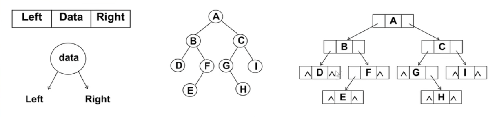
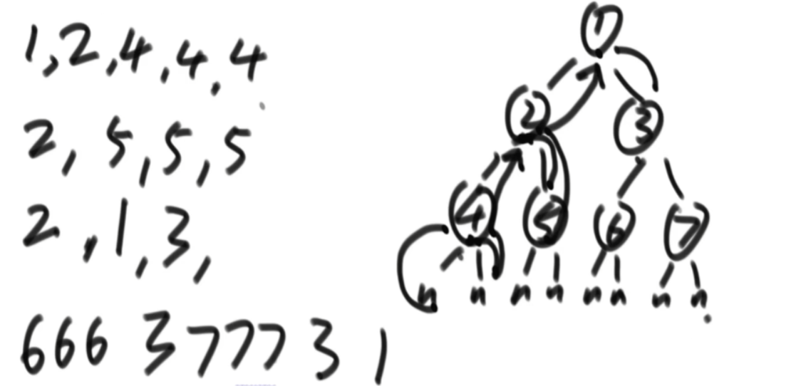
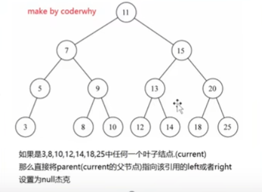
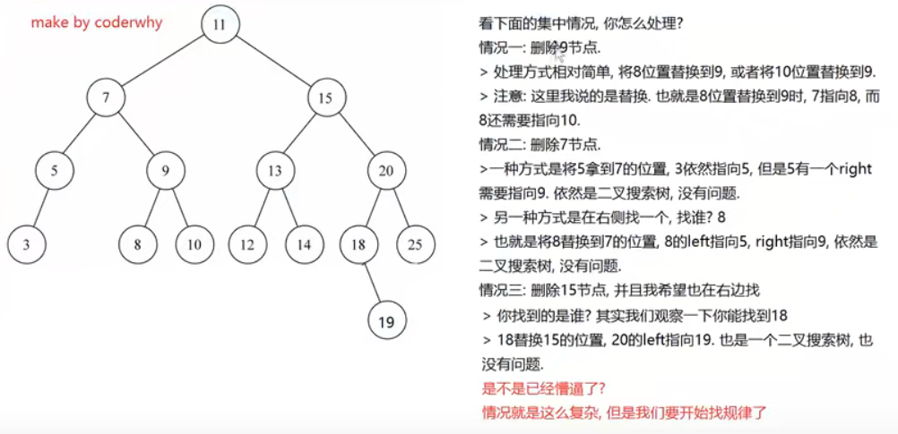
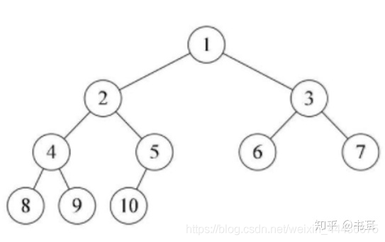

---
title: 数据结构---二叉树
date: 2022-12-15
tags:
 - js
categories:
 -  算法
---     
##  数据结构---二叉树   

###  二叉树的特性         
1.  二叉树基本知识    
    + 第i层的最大节点数为`2^(i-1)`,i>=1   
    + 深度为k的最大节点总数为`2^k - 1`,k>=1  等比数列求和   
    + 对任何非空二叉树，n0表示叶节点个数，n2表示度（子节点个数）为2的非叶节点个数，则`n0=n2+1`          
### 二叉树的存储    
1.  使用数组表示可以存储完全二叉树，此时左子节点为父节点的索引的两倍，右子节点为2倍+1，非完全二叉树来用数组存储会造成很大的空间浪费         
2.  使用链表表示          
           

### 二叉搜索树的封装    
1. 封装BinarySearchTree(BST)的构造函数   
2. 还需要封装一个用于保存每一个节点的类Node   
3. 该类包含三个属性：节点对应的key，指向的左子树，指向的右子树    
4.  对于BinarySearchTree,只需要保存根节点即可，因为其他节点都可以通过根节点找到       
5.  代码实现    
    ```js   
            function BinarySearchTree(){
              function Node(key){
                this.key = key
                this.left = null
                this.right = null
              } 
              //根属性
              this.root = null  
              //方法  
              //1.插入数据insert  
              BinarySearchTree.prototype.insert = function(key){
                //1.创建节点  
                let newNode = new Node(key) 
                //2.判断根节点是否有值  
                if(this.root == null){
                  this.root = newNode
                }else{
                  this.insertNode(this.root,newNode)
                }
                //递归内部方法
              BinarySearchTree.prototype.insertNode = function(node,newNode){
                if(newNode.key < node.key){//向左查找
                  if(node.left == null){
                    node.left = newNode
                  }else{
                    this.insertNode(node.left,newNode)
                  }
                }else{//向右查找
                  if(node.right == null){
                    node.right = newNode
                  }else{
                    this.insertNode(node.right,newNode)
                  }
                }
              }
              }
            }
            let bst = new BinarySearchTree()
    ```    

### 二叉树的遍历
1. 二叉树遍历     
         
    + 对于上图的遍历顺序      
    + 递归序：124442555213666377731   
    + 先序遍历:对于每个子节点都是按照**中--左--右**的顺序遍历---1245367     <font color='red'>**对于递归序，第一次来到节点执行打印**</font>     
    + 中序遍历: **左--中--右**（4251637）   <font color='red'>**对于递归序，第二次来到节点执行打印**</font>          
    + 后序遍历: **左--右--中**（4526731）  <font color='red'>**对于递归序，第三次来到节点执行打印**</font>            

2. 先序遍历   
    1.  递归版本    
        ```js   
                  //1.先序遍历    
            BinarySearchTree.prototype.preOrderTraversal = function(handler){
              this.preOrderTraversalNode(this.root,handler)
            }   
            BinarySearchTree.prototype.preOrderTraversalNode = function(node,handler){
              if(node != null){
              // 1.处理经过的节点    
                handler(node.key)
              //2.处理经过节点的左子节点   
                this.preOrderTraversalNode(node.left,handler)
              //3.处理经过节点的右子节点
                this.preOrderTraversalNode(node.right,handler)
              }
            }   
                let res = ''  //测试函数
                bst.preOrderTraversal(function(key){
                  res += key +' '
                })
        ```       
    2.  非递归版本     
        1. 把头结点压入栈中
        2. 从栈中弹出一个节点设为current  打印处理current   
        3. 先压current的右节点，再压current的左节点入栈（如果有的话）   
        4. 重复2 -- 3 过程      
        5. 代码     
              ```js   
                  let stack = []
                  let root
                    if (bst.root != null) {
                    stack.push(bst.root)
                    while (stack.length) { 
                      root = stack.pop()
                      console.log(root.key) //打印
                      if (root.right != null) {
                        stack.push(root.right)
                      }
                      if (root.left != null) {
                        stack.push(root.left)
                      }
                    }
                  }     
              ```
 
2. 中序遍历      
  1.  递归版本      
      ```js   
                //2.中序遍历    
          BinarySearchTree.prototype.midOrderTraversal = function(handler){
            this.midOrderTraversalNode(this.root,handler)
          }   
          BinarySearchTree.prototype.midOrderTraversalNode = function(node,handler){
            if(node != null){
            //1.处理经过节点的左子节点   
              this.midOrderTraversalNode(node.left,handler)
            //  2.处理经过的节点    
              handler(node.key)
            //3.处理经过节点的右子节点
              this.midOrderTraversalNode(node.right,handler)
            }
          }       
      ```   
  2. 非递归版本
        1. 先把整个树左边界进栈     
        2. 弹出就打印并设为current，并判断其是否有右节点，有的话将其全部的左边界全部进栈    
        3. 重复2     
            ```js       
                    let stack = []
                    let root
                    if (bst.root != null) {
                      stack.push(bst.root)
                      //有左压左   
                      let root = bst.root
                      while (stack.length) {
                        while (root.left) {
                          stack.push(root.left)
                          root = root.left
                        }
                        root = stack.pop() //左子树没有了则弹出
                        console.log(root.key) //打印
                        if (root.right) {//弹出的节点如果有右子树则重复
                          root = root.right
                          stack.push(root)
                        }
                      }
                    }
            ```        

3. 后序遍历         
    1. 递归版本   
        ```js       
                  //2.后序遍历    
            BinarySearchTree.prototype.postOrderTraversal = function (handler) {
              this.postOrderTraversalNode(this.root, handler)
            }
            BinarySearchTree.prototype.postOrderTraversalNode = function (node, handler) {
              if (node != null) {
                //1.处理经过节点的左子节点   
                this.postOrderTraversalNode(node.left, handler)
                //2.处理经过节点的右子节点
                this.postOrderTraversalNode(node.right, handler)
                // 3.处理经过的节点    
                handler(node.key)
              }
            }
        ```   
    2. 非递归版本      
        1. 准备两个栈，把头结点压入第一个栈中   
        2. 从栈中弹出一个节点设为current 把current放入第二个栈     
        3. 先压current左节点，再压current右节点入第一个栈
        4. 重复2-3    
        5. 打印第二个栈       
            ```js     
                  let stack1 = []
                  let stack2 = []
                  let root
                  if (bst.root != null) {
                    stack1.push(bst.root) //1. 准备两个栈，把头结点压入第一个栈中 
                    let root = bst.root
                    while (stack1.length) {
                      root = stack1.pop()
                      stack2.push(root.key)//2. 从栈中弹出一个节点cur 放入第二个栈  
                      if(root.left){
                        stack1.push(root.left)
                      }
                      if(root.right) {
                        stack1.push(root.right)
                      } 
                    }
                  }
                  console.log(stack2)
            ```       

4. 深度遍历---先序遍历---dfs   
5. 宽度遍历---层次遍历---bfs    
    + 利用队列，头结点入队列，即将出队的节点设为current   
    + 将current的左右节点依次入队，current出队    
    + 反复操作 

### 二叉树删除操作      
1. 步骤   
    1. 先找到要删除的节点，如果没有找到，则不需要删除   
    2. 分情况讨论   
        1. 删除叶子节点   
        2. 删除只有一个子节点的节点   
        3. 删除有两个子节点的节点   

2.  情况一：没有子节点    
    + 这种情况比较简单，我们需要检测current的left和right是否都为null    
    + 都为null之后还要检测一个东西，就是是否current就是根，如果都为null且为根，则相当于清空二叉树   
    + 否则就把父节点的left或right设置为null即可   
           
        ```js   
                  //删除某一个key
            BinarySearchTree.prototype.remove = function (key) {
              //1.寻找要删除的节点
              //1.1定义变量，保存一些信息
              let current = this.root
              let parent = null
              let isLeft = true
              //1.2开始寻找删除的节点
              while (current.key != key) {
                parent = current
                if (key < current.key) {
                  isLeft = true
                  current = current.left
                } else {
                  isLeft = false
                  current = current.right
                }
                //没有找到对应节点
                if (current == null) return false
              }

              //2. 根据情况删除   
              //2.1删除的节点是叶子节点   
              if (current.left == null && current.right == null) {
                if (current == this.root) {
                  this.root = null
                } else if (isLeft) {
                  parent.left = null
                } else {
                  parent.right = null
                }
              }
              //2.1删除的节点有一个子节点   
              else if (current.left == null) {
                if (current == this.root) {
                  this.root = current.right
                } else if (isLeft) {
                  parent.left = current.right
                } else {
                  parent.right = current.right
                }
              } else if (current.right == null) {
                if (current == this.root) {
                  this.root = current.left
                } else if (isLeft) {
                  parent.left = current.left
                } else {
                  parent.right = current.left
                }
              }
              //2.1删除的节点有两个子节点
              else{
                //找最接近current的节点
                //比current小一点点的节点，叫做current节点的前驱
                //比current大一点点的节点，叫做current节点的后继
                //找到删除节点右子树的最大值，或左子树的最小值来替换
                // 1. 获取后继节点
                let successor = this.getSuccssor(current)
                //2.判断是否为根节点
                if(current == this.root){
                  this.root = successor
                }else if(isLeft){
                  parent.left =successor
                }else{
                  parent.right =successor
                }
                //3.将删除节点的左子树 = current.left
                successor.left = current.left
              }
            }

            BinarySearchTree.prototype.getSuccssor = function(delNode){
              //1.定义变量，保存找到的后继
              let successor =delNode
              let current =delNode.right
              let successorParent = delNode
              //2.循环查找
              while(current != null){
                successorParent = successor
                successor = current 
                current = current.left
              }
              //3.判断寻找的后继节点是否直接就是delNode的right节点
              if(successor != delNode.right){
                successorParent.left = successor.right
              }
              return successor
            }     
        ```       
      

### 二叉树的分类       
1. 完全二叉树     
    + 叶节点只能出现在最下层和次下层，并且最下面一层的结点都集中在该层最左边的若干位置的二叉树      
    + 只允许最后一层有空缺结点且空缺在右边，即叶子结点只能在层次最大的两层上出现；      
    + 对任一结点，如果其右子树的深度为j，则其左子树的深度必为j或j+1。 即度为1的点只有1个或0个      
    + 第i个节点的左孩子节点为`2*i+1` 右孩子节点为`2*i+2`，父节点为`(i-1)/2` 
            
    + 如何判断一个一个二叉树是否是完全二叉树      
        1. 宽度遍历       
        2. 任一结点出现有右无左情况，直接false   
        3. 在1条件不违规下，如果遇到第一个左右子节点不全，后续必须皆为叶节点    
        4. 代码     
            ```js   
                function isCBT(head) {
                  if (head == null) {
                    return true
                  }
                  let queue = []
                  //是否遇到过左右两个孩子不双全的节点
                  let leaf = false
                  let l = null
                  let r = null
                  queue.push(head)
                  while (queue.length) {
                    head = queue.shift()
                    l = head.left
                    r = head.right
                    //如果遇到了不双全的节点之后，又发现当前节点不是叶节点
                    if ((leaf && (l != null || r != null)) || (l == null && r != null)) {
                      return false
                    }
                    if (l != null) {
                      queue.push(l)
                    }
                    if (r != null) {
                      queue.push(r)
                    }
                    //不双全节点
                    if (l == null || r == null) {
                      leaf = true
                    }
                  }
                  return true
                }     
            ```       

2. 满二叉树     
    + 除最后一层无任何子节点外，每一层上的所有结点都有两个子结点二叉树      
    + 一个层数为k 的满二叉树总结点数为：(2^k)-1。因此满二叉树的结点树一定是奇数个     
    + 第i层上的结点数为：2^(i-1)      
    + 一个层数为k的满二叉树的叶子结点个数（也就是最后一层）：2^(k-1)            
    + 判断是否为满二叉树      
          1. 遍历深度，遍历节点个数，满足(2^k)-1        

3. 搜索二叉树（排序树）BST(Binary Search Tree)     
    1.  非空左子树的所有键值小于其根节点的键值        
    2.  非空右子树的所有键值大于其根节点的键值        
    3.  左右子树都是搜索二叉树     
    4.  不会出现重复的键值        
    5. **中序遍历如果是升序的那就是搜索二叉树**         
    ```js   
          function isValidBST(root) {
            let stack = []
            let min = -Infinity
            while (stack.length || root) {
              while (root) {
                stack.push(root)
                root = root.left //左侧入栈
              }
              root = stack.pop()
              // 如果中序遍历得到的节点的值小于等于前一个min，说明不是二叉搜索树
              if (root.val <= min) return false
              min = root.val
              root = root.right // 注意这个切换很重要
            }
            return true
          }       
    ```

4. 平衡二叉树     
    + 对于任何一个子树，左右树的高度差不超过1   

5. 递归套路   
    1. 平衡二叉树     
        1. 分析要求   
            + 左树必须平衡    
            + 右树必须平衡    
            + 左高、右高差值不超过1   
        2. 根据需求索取信息   
            + 左树提供是否是平衡，以及高度    
            + 右树提供是否是平衡，以及高度    
        3. 递归结构体确定       
            ```js   
                var isBalanced = function(root) {
                  //获取深度
                  function getHeight(root){
                    if(!root) return 0;
                    return Math.max(getHeight(root.left),getHeight(root.right))+1;
                  }
                  
                  if(!root) return true;
                  //平衡二叉树的判断条件
                  return isBalanced(root.left) && isBalanced(root.right)
                  && Math.abs(getHeight(root.left)-getHeight(root.right))<=1;
                };    
            ```   
    2. 搜索二叉树   
          1. 分析要求
              + 左树是搜索二叉树
              + 右树是搜索二叉树    
              + 左边最大值 < 根节点
              + 右边最小值 > 根节点   
          2. 需求整合   
              + 是否是搜索二叉树    
              + 最大值    
              + 最小值    
          3. 递归体确定