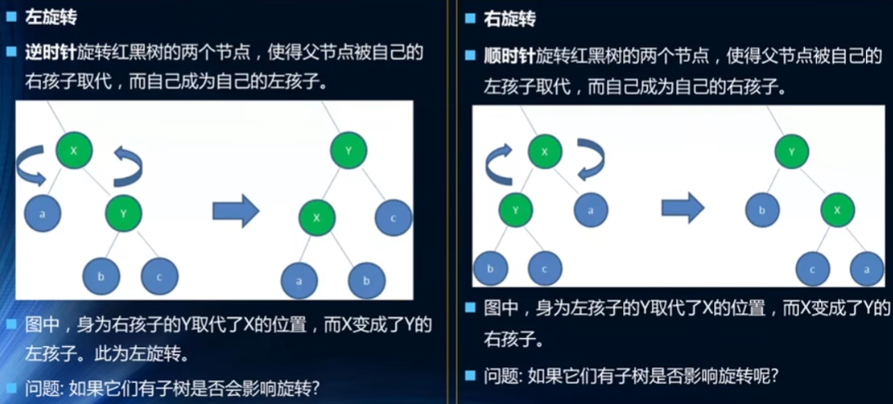

---
title: 红黑树
date: 2022-12-16
tags:
 - js
categories:
 -  算法
---     

##    红黑树      

###   红黑树/AVL树/二叉搜索树   

1. 二叉搜索树的优势就是利用二分实现logn的搜索效率，但是有一些情况，二叉搜索树会因为数据的问题导致失衡，变成左右两子树深度差过大的情况，这样查找效率就大大降低了，退化成了链表形式---On的时间复杂度  

2.  平衡树，avl树的出现解决了这种问题，他的规则是保证左右子树深度差不会大于1，如果出现大于1的情况，需要旋转来维持树的平衡     

3.  红黑树其实最大的好处就是利用变色来代替了复杂的旋转逻辑，他的规则如下    
    1.  节点是红色或黑色，根节点是黑色    
    2.  每个叶子节点都设置为黑色的null节点    
    3.  每个红色节点的两个子节点都是黑色的，不会出现连续的红色节点    
    4.  从任一节点到每个叶子节点的所有路径都包含相同数目的黑色节点    
4. 红黑树的约束特性，从根到叶子的最长路径，不会超过最短可能路径的两倍     

###   红黑树的规则      
1.  变色    
    + 首先，插入的节点一般都是红色节点   
        +  因为在插入黑色节点的时候，必然会使得路径黑色节点增加，很难调整    
        +  插入红色节点可能不需要调整，出现红红相连的情况也可以通过颜色调换和旋转来调整   
2. 旋转   
         

3.  插入操作规则    
   + 设要插入的节点为N，其父节点为P   
   + 其祖父节点为G，其父亲的兄弟节点为U，（即P和U是同一节点的子节点）   
      1. 情况1：   
        + 新节点N位于树的根上,没有父节点    
        + 这种情况下，我们直接将红色变换成黑色即可,这样满足性质2    
      2.  情况二    
        + 新节点的父节点P是黑色.    
        + 性质4没有失效(新节点是红色的)，,性质5也没有任何问题   
        + 尽管新节点N有两个黑色的叶子节点nil,但是心节点N是红色的,所以通过它的路径中黑色节点的个数依然相同满足性质5
 
