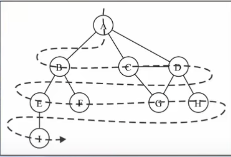
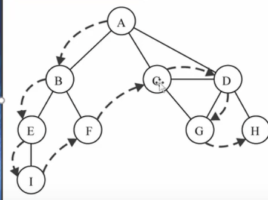

---
title: 数据结构---图
date: 2022-12-17
tags:
 - js
categories:
 -  算法
---       

##    数据结构---图   

### 图的封装    
  + 基于邻接矩阵表示图的实现
      ```js   
          /* 基于邻接矩阵实现的无向图类 */
          class GraphAdjMat {
              vertices; // 顶点列表，元素代表“顶点值”，索引代表“顶点索引”
              adjMat; // 邻接矩阵，行列索引对应“顶点索引”
              /* 构造函数 */
              constructor(vertices, edges) {
                  this.vertices = [];
                  this.adjMat = [];
                  // 添加顶点
                  for (const val of vertices) {
                      this.addVertex(val);
                  }
                  // 添加边
                  // 请注意，edges 元素代表顶点索引，即对应 vertices 元素索引
                  for (const e of edges) {
                      this.addEdge(e[0], e[1]);
                  }
              }
              /* 获取顶点数量 */
              size() {
                  return this.vertices.length;
              }
              /* 添加顶点 */
              addVertex(val) {
                  const n = this.size();
                  // 向顶点列表中添加新顶点的值
                  this.vertices.push(val);
                  // 在邻接矩阵中添加一行
                  const newRow = [];
                  for (let j = 0; j < n; j++) {
                      newRow.push(0);
                  }
                  this.adjMat.push(newRow);
                  // 在邻接矩阵中添加一列
                  for (const row of this.adjMat) {
                      row.push(0);
                  }
              }
              /* 删除顶点 */
              removeVertex(index) {
                  if (index >= this.size()) {
                      throw new RangeError('Index Out Of Bounds Exception');
                  }
                  // 在顶点列表中移除索引 index 的顶点
                  this.vertices.splice(index, 1);
                  // 在邻接矩阵中删除索引 index 的行
                  this.adjMat.splice(index, 1);
                  // 在邻接矩阵中删除索引 index 的列
                  for (const row of this.adjMat) {
                      row.splice(index, 1);
                  }
              }
              /* 添加边 */
              // 参数 i, j 对应 vertices 元素索引
              addEdge(i, j) {
                  // 索引越界与相等处理
                  if (i < 0 || j < 0 || i >= this.size() || j >= this.size() || i === j) {
                      throw new RangeError('Index Out Of Bounds Exception');
                  }
                  // 在无向图中，邻接矩阵沿主对角线对称，即满足 (i, j) === (j, i)
                  this.adjMat[i][j] = 1;
                  this.adjMat[j][i] = 1;
              }
              /* 删除边 */
              // 参数 i, j 对应 vertices 元素索引
              removeEdge(i, j) {
                  // 索引越界与相等处理
                  if (i < 0 || j < 0 || i >= this.size() || j >= this.size() || i === j) {
                      throw new RangeError('Index Out Of Bounds Exception');
                  }
                  this.adjMat[i][j] = 0;
                  this.adjMat[j][i] = 0;
              }
              /* 打印邻接矩阵 */
              print() {
                  console.log('顶点列表 = ', this.vertices);
                  console.log('邻接矩阵 =', this.adjMat);
              }
          }  
      ```  
  + 基于邻接表的实现
      ```js
        /* 基于邻接表实现的无向图类 */
        class GraphAdjList {
            // 邻接表，key: 顶点，value：该顶点的所有邻接顶点
            adjList;
            /* 构造方法 */
            constructor(edges) {
                this.adjList = new Map();
                // 添加所有顶点和边
                for (const edge of edges) {
                    this.addVertex(edge[0]);
                    this.addVertex(edge[1]);
                    this.addEdge(edge[0], edge[1]);
                }
            }
            /* 获取顶点数量 */
            size() {
                return this.adjList.size;
            }
            /* 添加边 */
            addEdge(vet1, vet2) {
                if (
                    !this.adjList.has(vet1) ||
                    !this.adjList.has(vet2) ||
                    vet1 === vet2
                ) {
                    throw new Error('Illegal Argument Exception');
                }
                // 添加边 vet1 - vet2
                this.adjList.get(vet1).push(vet2);
                this.adjList.get(vet2).push(vet1);
            }
            /* 删除边 */
            removeEdge(vet1, vet2) {
                if (
                    !this.adjList.has(vet1) ||
                    !this.adjList.has(vet2) ||
                    vet1 === vet2
                ) {
                    throw new Error('Illegal Argument Exception');
                }
                // 删除边 vet1 - vet2
                this.adjList.get(vet1).splice(this.adjList.get(vet1).indexOf(vet2), 1);
                this.adjList.get(vet2).splice(this.adjList.get(vet2).indexOf(vet1), 1);
            }
            /* 添加顶点 */
            addVertex(vet) {
                if (this.adjList.has(vet)) return;
                // 在邻接表中添加一个新链表
                this.adjList.set(vet, []);
            }
            /* 删除顶点 */
            removeVertex(vet) {
                if (!this.adjList.has(vet)) {
                    throw new Error('Illegal Argument Exception');
                }
                // 在邻接表中删除顶点 vet 对应的链表
                this.adjList.delete(vet);
                // 遍历其他顶点的链表，删除所有包含 vet 的边
                for (const set of this.adjList.values()) {
                    const index = set.indexOf(vet);
                    if (index > -1) {
                        set.splice(index, 1);
                    }
                }
            }
            /* 打印邻接表 */
            print() {
                console.log('邻接表 =');
                for (const [key, value] of this.adjList) {
                    const tmp = [];
                    for (const vertex of value) {
                        tmp.push(vertex.val);
                    }
                    console.log(key.val + ': ' + tmp.join());
                }
            }
        }
      ``` 
###   图的遍历      
1.  图的遍历思想    
    + 图的遍历思想是和树的遍历思想是一样的    
    + 图的遍历意味着需要将图中每个顶点访问一遍，并且不能有重复的访问    

2. 有两种算法可以对图进行遍历   
    + 广度优先搜索（Breadth-First Search） BFS    
    + 深度优先搜索（Depth-First Search）  DFS   
    + 两种遍历算法，都需要明确指定第一个被访问的顶点    

3. 两种算法的思想   
    + BFS： 基于队列，入队的顶点先被搜索    
    + DFS： 基于栈或使用递归，通过将顶点存入栈中，顶点是沿着路径被探索的，存在新的相邻顶点就去访问      

4. 为了记录顶点是否被访问过，我们使用三种颜色来反应他们的状态   
    + 白色：表示该顶点还没有被访问    
    + 灰色：表示该顶点被访问过，但并未被探索过    
    + 黑色：表示该顶点被访问过且被完全探索过    

### 广度优先搜索    
1.  广度优先搜索算法的思路    
    + 广度优先算法会从指定的第一个顶点开始遍历图，先访问其所有的相邻点，就像一次访问图的一层            
    + 换句话说，就是先宽后深的访问顶点    
2.  图解BFS   
       
3.  广度优先搜索的实现    
    1. 创建一个队列   
    2.  将V标注为被发现的（灰色），并将V推入队列Q   
    3.  如果Q非空，执行下面的步骤   
        + 将V从Q中取出队列    
        + 将V标注为被发现的灰色   
        + 将v所有的未被访问的领接点（白色），加入队列   
        + 将v置为黑色   
    4.  代码:   
        ```js   
            // 使用邻接表来表示图，以便获取指定顶点的所有邻接顶点
            function graphBFS(graph, startVet) {
                // 顶点遍历序列
                const res = [];
                // 哈希表，用于记录已被访问过的顶点
                const visited = new Set();
                visited.add(startVet);
                // 队列用于实现 BFS
                const que = [startVet];
                // 以顶点 vet 为起点，循环直至访问完所有顶点
                while (que.length) {
                    const vet = que.shift(); // 队首顶点出队
                    res.push(vet); // 记录访问顶点
                    // 遍历该顶点的所有邻接顶点
                    for (const adjVet of graph.adjList.get(vet) ?? []) {
                        if (visited.has(adjVet)) {
                            continue; // 跳过已被访问过的顶点
                        }
                        que.push(adjVet); // 只入队未访问的顶点
                        visited.add(adjVet); // 标记该顶点已被访问
                    }
                }
                // 返回顶点遍历序列
                return res;
            } 
        ```   

### 深度优先搜索    
1.  深度优先搜索的思路:   
    +   深度优先搜索算法将会从第一个指定的顶点开始遍历图,沿着路径知道这条路径最后被访问了   
    +   接着原路回退并探索底一条路径        
2.  图解DFS   
       
3.  深度优先搜索算法的实现:     
    + 广度优先搜索算法我们使用的是队列,这里可以使用栈完成,也可以使用递归    
    + 方便代码书写,我们还是使用递归(递归本质上就是函数栈的调用)   
4.  代码    
    ```js   
        // 使用邻接表来表示图，以便获取指定顶点的所有邻接顶点
        function dfs(graph, visited, res, vet) {
            res.push(vet); // 记录访问顶点
            visited.add(vet); // 标记该顶点已被访问
            // 遍历该顶点的所有邻接顶点
            for (const adjVet of graph.adjList.get(vet)) {
                if (visited.has(adjVet)) {
                    continue; // 跳过已被访问过的顶点
                }
                // 递归访问邻接顶点
                dfs(graph, visited, res, adjVet);
            }
        }
        
        // 使用邻接表来表示图，以便获取指定顶点的所有邻接顶点
        function graphDFS(graph, startVet) {
            // 顶点遍历序列
            const res = [];
            // 哈希表，用于记录已被访问过的顶点
            const visited = new Set();
            dfs(graph, visited, res, startVet);
            return res;
        }  
    ```   
### 遍历框架    
1. 图其实就是一个高级点的多叉树   
    ```js   
        var visited = []; //如果包含环，遍历框架就要一个 visited 数组进行辅助
        var onPath = []; // 记录从起点到当前节点的路径

        /* 图遍历框架 */
        function traverse(graph, s) {
            if (visited[s]) return;
            // 经过节点 s，标记为已遍历
            visited[s] = true;
            // 做选择：标记节点 s 在路径上
            onPath[s] = true;
            for (var i = 0; i < graph.neighbors(s).length; i++) {
                var neighbor = graph.neighbors(s)[i];
                traverse(graph, neighbor);
            }
            // 撤销选择：节点 s 离开路径
            onPath[s] = false;
        }
    ``` 
### 环检测算法    
1. 看到依赖问题，首先想到的就是把问题转化成「有向图」这种数据结构，只要图中存在环，那就说明存在循环依赖
    ```js   
        var canFinish = function(numCourses, prerequisites) {
        // 记录一次递归堆栈中的节点
        var onPath = new Array(numCourses).fill(false);
        // 记录遍历过的节点，防止走回头路
        var visited = new Array(numCourses).fill(false);
        // 记录图中是否有环
        var hasCycle = false;
        function traverse(graph, s) {
            if (onPath[s]) {
                // 出现环
                hasCycle = true;
            }     
            if (visited[s] || hasCycle) {
                // 如果已经找到了环，也不用再遍历了
                return;
            }
            // 前序代码位置
            visited[s] = true;
            onPath[s] = true;
            graph[s].forEach(t => traverse(graph, t));
            // 后序代码位置
            onPath[s] = false;
        }
        for (var i = 0; i < numCourses; i++) {
            // 遍历图中的所有节点
            traverse(graph, i);
        }
        // 只要没有循环依赖可以完成所有课程
        return !hasCycle;
    };
    ```

