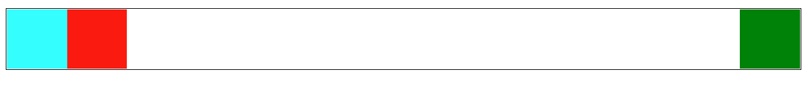
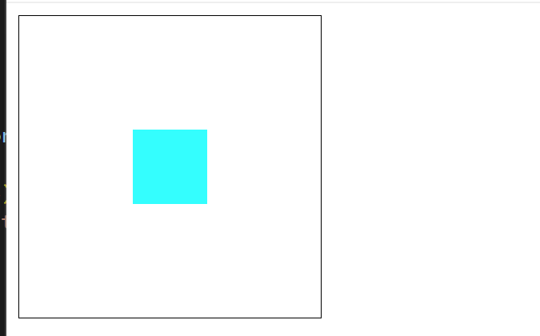

---
title: web布局
date: 2023-11-18
tags:
 - css
categories:
 -  css小知识
--- 

## Flex布局

### Flex布局的基础使用
1. 一些注意事项
    + 当一个元素变成了 Flex 容器之后，它的子元素，包括其伪元素 `::before` 、`::after` 和 文本节点 都将成为 **Flex 项目** 。
    + 注意，Flex 容器两轴的起点和终端同样受 `flex-direction` 、`writing-mode` 或 `direction` 属性值的影响。
    + **在 Flex 项目上使用** **`margin: auto`，会致使 Flex 项目上的** **`align-self`** **属性失效**。

2. **Flexbox 中空间是如何分配的？**
    + **计算 Flex 容器内的可用空间** 。Flex 容器的可用空间指的是 Flex 容器的主轴尺寸（Main Size）减去其 **内距（`padding`） ** 、 **边框宽度（`border-width`）** 、**间距（`gap`）** 和 **Flex 项目的外边距（`margin`）** 。

###  flex实现自适应网格布局

1. code
    ```jsx
        <div className={style.colorPalette}>
            {colorPaletteArr.map((item, index) => {
                return <div
                className={`${[0, 1].includes(index) ? style.specialItem : style.nomarlItem} ${style.colorItem}`}
                style={{
                  backgroundColor: item.color,
                }}
                key={index}>
                {[0, 1].includes(index) ? item.name : ''}
              </div>
            })}
          </div>
    ```

2. css
    ```css
        .colorPalette{
          background-color: #fff;
          border-radius: 8px;
          display: flex;
          flex-wrap: wrap;
        }


        .colorItem{
          display: flex;
          align-items: center;
          justify-content: center;
          position: relative;
          color: #646464;
          font-size: 12px;
          height: 20px;
          border-radius: 4px;
          margin: 5px;
        }
        .nomarlItem{
          flex: 1 0 calc(25% - 10px); /* 每行最多4个元素，占据宽度的25%减去margin */
        }
        .specialItem{
          flex: 1 0 calc(50% - 10px);
        }
    ```

## 合理使用flex + margin 实现布局方案   
1. 案例一   
    
    ```html   
          <style>
            .box {
              display: flex;
              border: 1px solid black;
            }
            .item {
              width: 50px;
              height: 50px;
              background-color: aqua;
            }
            .box :nth-child(3) {
              margin-left: auto;   /*意思就是第三个子元素吃掉左侧的剩余空间  magin设置auto就是吃掉剩余空间*/
            }
          </style>
          <body>
            <div class="box">
              <div class="item" style="background-color: aqua;"></div>
              <div class="item" style="background-color: red;"></div>
              <div class="item" style="background-color: green;"></div>
            </div>
          </body>
    ```   
2. 案例二：垂直水平居中   
    
    ```html   
          <style>
            .box {
              display: flex;
              border: 1px solid black;
              width: 200px;
              height: 200px;
            }
            .item {
              width: 50px;
              height: 50px;
              background-color: aqua;
              margin: auto;   /*意思就是吃掉四周剩余空间  magin设置auto就是吃掉剩余空间*/
            }
          </style>
          <body>
            <div class="box">
              <div class="item" style="background-color: aqua;"></div>
            </div>
          </body>
    ```     
3. 案例三：适配类网格布局   
    
    ```html   
          <style>
            .box {
              display: flex;
              border: 1px solid black;
              flex-wrap: wrap;
            }
            .item {
              /* 利用变量控制维护  方便做不同屏幕适配每行几个的响应式布局*/
              --n: 7;
              --gap: calc((100% - 50px * var(--n)) / var(--n) / 2);
              width: 50px;
              height: 50px;
              background-color: aqua;
              /*父元素 - 总的子元素宽度 = 剩余空间  剩余空间分7份再平分给左右*/
              margin: 10px var(--gap);
            }
            @media screen and (min-width: 450px) {
              .item {
                --n: 5;
              }
            }
          </style>
          <body>
            <div class="box">
              <div class="item" style="background-color: aqua;"></div>
              <div class="item" style="background-color: red;"></div>
              <div class="item" style="background-color: green;"></div>
              <div class="item" style="background-color: rgb(60, 5, 9);"></div>
              <div class="item" style="background-color: rgb(156, 116, 50);"></div>
              <div class="item" style="background-color: rgb(41, 46, 88);"></div>
              <div class="item" style="background-color: rgb(12, 6, 65);"></div>
              <div class="item" style="background-color: rgb(245, 134, 8);"></div>
              <div class="item" style="background-color: rgb(36, 199, 239);"></div>
              <div class="item" style="background-color: rgb(143, 22, 76);"></div>
              <div class="item" style="background-color: rgb(2, 9, 199);"></div>
            </div>
          </body>
    ```


