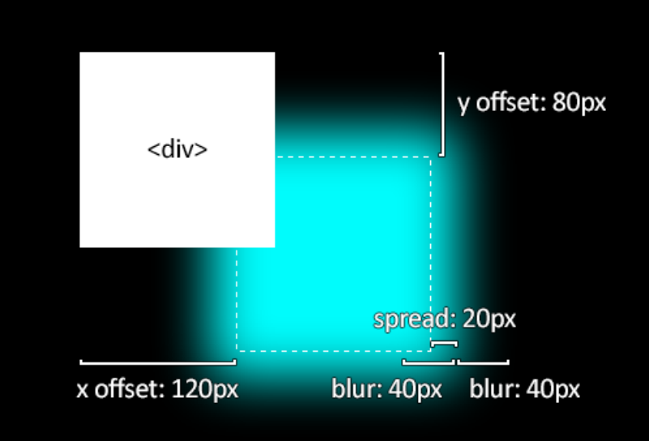

---
title: 重学css系列 - border & background 
date: 2024-3-18
tags:
 - css
categories:
 -  css小知识
--- 

## border 核心技巧学习

### border-radius

```css
  {
      border-radius: 50%;
      border-radius: 10px 50px 50px 20px;
      border-radius: 10px 20px 30px 40px / 10px 20px 30px 40px;  /* 先水平方向，后垂直方向 */
  }
```

### box-shadow

+ 可以同时设置多个阴影，先设置的在z方向最上层
```css
  {
    box-shadow: inset 0px 0px 50px #fff,
                inset 10px 0px 80px #f0f,
                inset -10px 0px 80px #0ff,
                inset 10px 0px 300px #f0f,
                inset -10px 0px 300px #0ff,
                0px 0px 50px #fff,
                -10px 0px 80px #f0f,
                10px 0px 80px #0ff ;
  }
```

### border-image
书写方式：border-image : border-image-source | [border-image-slice , border-image-width , borderimage-outset ] | border-image-repeat
  + border-image-source: 用于指定边框图像的来源，可以是图片地址，也可以是渐变值，还可以是颜色值
  + border-image-slice: 用于指定边框图像的大小，如图按照top right bottom left顺序依次指定，将图片分成9宫格，边上的8个格子来填充
  + border-image-width: 用于指定边框图像的宽度，可以指定四个值，分别对应top right bottom left
  + border-image-outset: 用于指定边框图像的偏移量，可以指定四个值，分别对应top right bottom left
  + border-image-repeat: 用于指定边框图像的重复方式，可选值有 repeat | round | stretch
