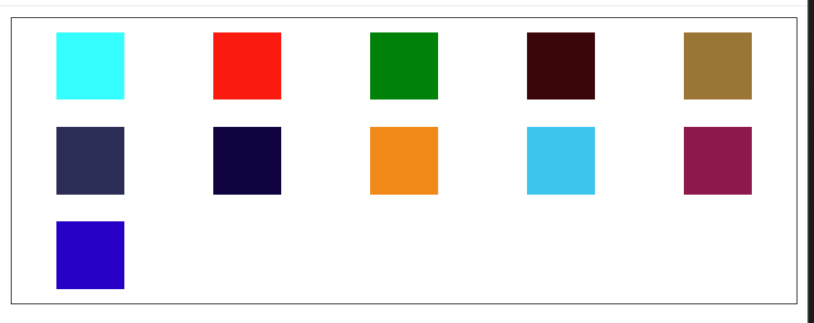

---
title: flex + margin 布局
date: 2023-4-18
tags:
 - css
categories:
 -  css-demo
---       

## 合理使用flex + margin 实现布局方案   
1. 案例一   
    
    ```html   
          <style>
            .box {
              display: flex;
              border: 1px solid black;
            }
            .item {
              width: 50px;
              height: 50px;
              background-color: aqua;
            }
            .box :nth-child(3) {
              margin-left: auto;   /*意思就是第三个子元素吃掉左侧的剩余空间  magin设置auto就是吃掉剩余空间*/
            }
          </style>
          <body>
            <div class="box">
              <div class="item" style="background-color: aqua;"></div>
              <div class="item" style="background-color: red;"></div>
              <div class="item" style="background-color: green;"></div>
            </div>
          </body>
    ```   
2. 案例二：垂直水平居中   
    
    ```html   
          <style>
            .box {
              display: flex;
              border: 1px solid black;
              width: 200px;
              height: 200px;
            }
            .item {
              width: 50px;
              height: 50px;
              background-color: aqua;
              margin: auto;   /*意思就是吃掉四周剩余空间  magin设置auto就是吃掉剩余空间*/
            }
          </style>
          <body>
            <div class="box">
              <div class="item" style="background-color: aqua;"></div>
            </div>
          </body>
    ```     
3. 案例三：适配类网格布局   
    
    ```html   
          <style>
            .box {
              display: flex;
              border: 1px solid black;
              flex-wrap: wrap;
            }
            .item {
              /* 利用变量控制维护  方便做不同屏幕适配每行几个的响应式布局*/
              --n: 7;
              --gap: calc((100% - 50px * var(--n)) / var(--n) / 2);
              width: 50px;
              height: 50px;
              background-color: aqua;
              /*父元素 - 总的子元素宽度 = 剩余空间  剩余空间分7份再平分给左右*/
              margin: 10px var(--gap);
            }
            @media screen and (min-width: 450px) {
              .item {
                --n: 5;
              }
            }
          </style>
          <body>
            <div class="box">
              <div class="item" style="background-color: aqua;"></div>
              <div class="item" style="background-color: red;"></div>
              <div class="item" style="background-color: green;"></div>
              <div class="item" style="background-color: rgb(60, 5, 9);"></div>
              <div class="item" style="background-color: rgb(156, 116, 50);"></div>
              <div class="item" style="background-color: rgb(41, 46, 88);"></div>
              <div class="item" style="background-color: rgb(12, 6, 65);"></div>
              <div class="item" style="background-color: rgb(245, 134, 8);"></div>
              <div class="item" style="background-color: rgb(36, 199, 239);"></div>
              <div class="item" style="background-color: rgb(143, 22, 76);"></div>
              <div class="item" style="background-color: rgb(2, 9, 199);"></div>
            </div>
          </body>
    ```
