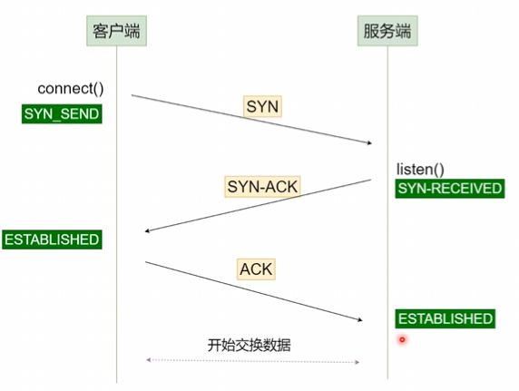
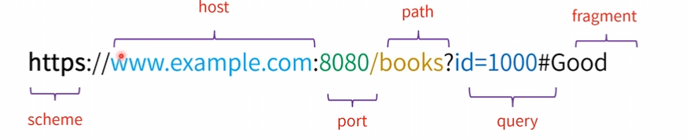
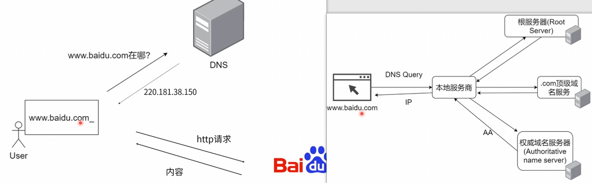
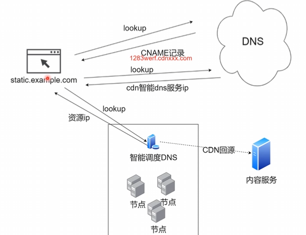

## 计算机与网络

### 互联网协议群
1. 类似于OSI模型，一种网络协议的概念模型
  - 应用层：提供应用间通信能力（http协议）
  - 传输层：提供主机到主机（host-to-host）的通信能力（TCP/UDP协议），端口号代表的是应用
  - 网络层：提供地址到地址的通信能力（IP协议）
  - 链接层：提供设备到设备的通信能力（多种底层网络协议Ethernet，Wi-Fi）
  - 物理层
2. TCP/IP协议
  + 三次握手
    - 流程图
    
    - 为什么需要三次握手：计算机对话和人对话的区别
  + 处理数据接收发送顺序问题 
    - 消息的绝对顺序用（SEQ,ACK）这一对元组描述
        - SEQ（Sequence）:这个消息发送前一共发送了多少字节
        - ACK（AcKnowledge）:这个消息发送前一共收到了多少字节
  + 中断连接也需要四次挥手，服务端反馈，这样才能保持可靠性，以免客户端还有发送到服务端但没有收到/服务端发送回客户端，客户端没有收到的消息。

### DNS和CDN

1. 统一资源定位符（URL）
  也被称作网址，用于定位互联网上的资源
  

2. DNS(Domain Name System)域名系统
  
  + DNS资源记录（Resource Record）
    - A记录（最常见）：定义主机的IP地址
    - AAAA记录：定义主机的IPv6地址
    - CNAME记录（Canonical Name Record）：定义域名的别名
    - MX记录：定义邮件服务器
    - NS记录：定义提供dns信息的服务器
    - TXT记录：定义文本信息
    - SOA记录：定义在多个ns服务器中哪个是主服务器

  + DNS查询工具（实操）
    - dig（DNS lookup utility）：用来查询dns的小工具
    - nslookup：交互式查询域名服务工具
    - host（DNS lookup utility）

  + 本地host修改(实操)
    - Window/Linux/Mac等host文件修改
    - Switchhost工具

3. 内容分发网络（Content Delivery Network）
  + 基于地理位置的分布式代理服务器/数据中心
    - 提高可用性
    - 提升性能
    - 提升体验
    

### HTTP协议
1. HTTP协议
  + 超文本传输协议(Hyper Text Transfer Protocol)
  + 处理客户端和服务端之间的通信
  + http请求/http返回
  + 网页/json/xml/提交表单……
  + 纯文本+无状态（Stateless）
    - 应用层协议（下面可以是TCP/IP）信息纯文本传输
    - 无状态
      - 每次请求独立
      - 请求间互不影响
    - 浏览器提供了手段维护状态(Cookie, Session, * Storage等)

2. HTTP设计考虑因素
  1. 基础因素
    + 带宽
      - 基础网络(线路、设备等)
    + 延迟
      - 浏览器
      - DNS查询
      - 建立连接(TCP三次握手)

  2. 缓存与带宽优化
    + 缓存
      - (http1.0)提供缓存机制如IF-Modified-Since等基础缓存控制策略
      - (http1.1)提供E-Tag等高级缓存策略
    + 带宽优化
      - (http1.1)利用range头获取文件的某个部分
      - (http1.1)利用长连接让多个请求在一个TCP连接上排队
      - (http2.0)利用多路复用技术同时传输多个请求

  3. 压缩/安全性
    + 压缩
      - 主流web服务器如nginx/express等都提供gzip压缩功能
      - (htto2.0)采用二进制传输，头部使用HPACK算法压缩
    + HTTPS
      - 在HTTP和TCP/IP之间增加TSL/SSL层
      - 数据传输加密(非对称+对称加密)

3. HTTPS
  + 安全超文本传输协议(Hyper Text Transfer Protocol Secure)
  + 数据加密传输
    - 防止各种攻击手段(信息泄露、篡改等)
  + SSL/TSL(Secure Socket Layer/Transport Layer Secure)
    - SSL-安全套接层
    - TSL-传输层安全性协议
    - 需要再客户端安装证书

4. cURL
  + curl -I url  ：获取header

