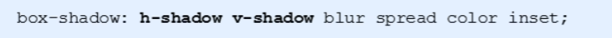
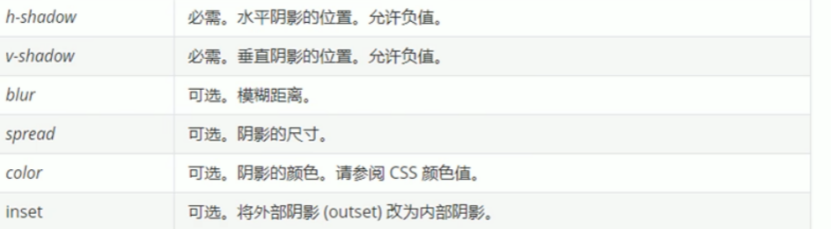
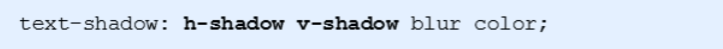

---
title: css学习笔记(二)--网页布局部分--盒子模型
date: 2021-01-03
tags:
 - css
categories:
 -  笔记
---    
## 网页布局--盒子模型  

1. **盒子模型**  
    + Css将页面中的所有元素都设置为了一个矩形的盒子  
    + 将元素设置为矩形的盒子后，对页面的布局就变成将不同的盒子摆放到不同的位置  
    + 每一个盒子都由一下几个部分组成:  
      + 内容区`（content) ` 
      + 内边距`（padding)`  
      + 边框 ` （border) `  
      + 外边距`（margin)`  
2. **边框**  
    **边框的大小会影响到整个盒子的大小**  
      + `border-width`:默认值，一般都是3个像素  
      + `border-width`可以用来指定四个方向的边框的宽度（四个值:上右下左）  
      + `border-color`可以分别指定四个边的边框规则和`border-width`一样  
                      也可以省略不写，如果省略了则自动使用`color`的颜色值  
      + `border-style`指定边框的样式 `solid`表示实线,`dotted`点状虚线,`dashed`虚线,`double`双线,默认值是`none`表示没有边框  
      + `border`简写属性，通过该属性可以同时设置边框所有的相关样式，并且没有顺序要求  
    **表格的细线边框** 
      + `border-collapse`属性控制浏览器绘制表格边框的方式。它控制相邻单元格的边框。  
      + `border-collapse:collapse;`示相邻边框合并在一起    
3. **内边距**  
    1. padding影响了盒子实际大小。  
    2. 如果盒子已经有了宽度和高度，此时再指定内边框，会撑大盒子。  
    3. 背景颜色会延伸到内边距上  
    + **解决方案**  
        + 如果盒子本身没有指定`width`或者`height`，就不会撑大盒子，给100%也会撑大  
4. **外边距**  
    1. 外边距不会影响盒子可见框的大小-但是外边距会影响盒子的位置  
    2. 元素在页面中是按照自左向右的顺序排列的  
      + 所以默认情况下如果我们设置的左和上外边距则会移动元素自身 
      + 而设置下和右外边距会移动其他元素  
    3. `margin`会影响到盒子实际占用空间  
    4. **外边距合并**  
      使用`margin`定义块元素的垂直外边距时，可能会出现外边距的合并  
      1. 相邻块元素垂直外边距的合并（一般都是有利的）  
        + 相邻的垂直方向外边距会发生重叠现象  
        + 兄弟元素间的相邻垂直外边距会取两者之间的较大值  
      2. **嵌套块元素垂直外边距的塌陷**  
        + 对于两个嵌套关系(父子关系）的块元素，父元素有上外边距同时子元素也有上外边距，此时父元素会塌陷较大的外边距值  
      3. **解决方案**  
        1. 可以为父元素定义上边框。  
        2. 可以为父元素定义上内边距  
        3. 可以为父元素添加overflow:hidden。  
        4. 还有其他方法，比如浮动、固定，绝对定位的盒子不会有塌陷问题。  
        5. 注意∶**行内元素**为了照顾**兼容性**，尽量**只设置左右内外边距**，不要设置上下内外边距。但是转换为块级和行内块元素就可以了  
5. **盒子大小**  
    默认情况下，盒子可见框的大小由内容区、内边距和边框共同决定  
    + `box-sizing`用来设置盒子尺寸的计算方式（设置`width`和`height`的作用)  
       + `content-box`默认值，宽度和高度用来设置**内容区的大小**  
       + `border-box`宽度和高度用来设置整个盒子**可见框的大小**  
    + **如果盒子模型我们改为了box-sizing: border-box，那padding和border就不会撑大盒子了(前提padding和border不会超过width宽度)**  
6. **元素的水平方向的布局**  
    元素在其父元素中水平方向的位置由以下几个属性共同决定  
    `margin-left、border-left、padding-left、width、padding-right、border-right、margin-right` 
    当我们开启了绝对定位后:水平方向的布局等式就需要添加`left`和`right`两个值  
    一个元素在其父元素中，水平布局必须要满足以下的等式  
    **上述属性之和= 其父元素内容区的宽度（必须满足）**  
    如果相加结果使等式不成立，则称为**过渡约束**，则**等式会自动调整**  
    如果9个值中没有`auto`则调整`right`值，如果有`auto`，则调整`auto`的值  
      + 可设置`auto`的值：`margin width left right`  
      + 因为`left`和 `right`的值默认是`auto`，所以如果不知道`left`和`right`,则等式不满足时，会自动调整这两个值  
7. **垂直方向布局**  
    默认情况下父元素的高度被内容撑开,子元素是在父元素的内容区中排列的  
    如果子元素的大小超过了父元素，则子元素会从父元素中溢出使用`overflow`属性来设置父元素如何处理溢出的子元素  
      + `visible`，默认值子元素会从父元素中溢出，在父元素外部的位置显示  
      + `hidden`,溢出内容将会被裁剪不会显示  
      + `scroll`,生成两个滚动条，通过滚动条来查看完整的内容  
      + `auto`,根据需要生成滚动条  
8. **行内元素的盒模型**  
   + 行内元素不支持设置宽度和高度  
   + 行内元素可以设置`padding`，但是垂直方向`padding`不会影响页面的布局  
   + 行内元素可以设置`border`，垂直方向的`border`不会影响页面的布局  
   + 行内元素可以设置`margin`，垂直方向的`margin`不会影响布局  
  + **`display`用来设置元素显示的类型**  
    + `inline`将元素设置为行内元素`block` 将元素设置为块元素  
    + `inline-block`将元素设置为行内块元素  
    + `table`将元素设置为一个表格  
    + `none`元素不在页面中显示  
  + **visibility用来设置元素的显示状态**  
    + `visible`默认值，元素在页面中正常显示  
    + `hidden`元素在页面中隐藏不显示，但是依然占据页面的位置  
9. **轮廓、阴影 圆角**  
  1. 圆角  
    `border-radius`属性用于设置元素的外边框圆角   
      +  `border-radius : length;`（参数值可以为数值或百分比的形式）  
      +  如果是正方形，想要设置为一个圆，把数值修改为高度或者宽度的一半即可，或者直接写为50%  
      + 如果是个矩形,设置为高度的一半就可以做  
      + 该属性是一个简写属性，可以跟四个值，分别代表左上角、右上角、右下角、左下角,分开写: `border-top-left-radius、border-top-right-radius、border-bottom-right-radius和border-bottom-left-radius`  
  2. 阴影  
      
      
    1. 默认的是外阴影(`outset)`,但是不可以写这个单词,否则导致阴影无效  
    2. 盒子阴影不占用空间，不会影响其他盒子排列  
  3. 文字阴影  
      

