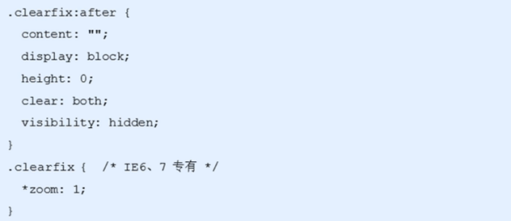
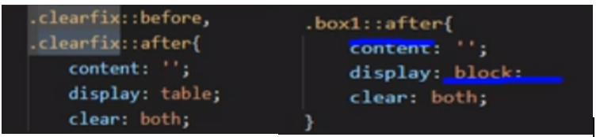

---
title: css学习笔记(二)--网页布局部分--浮动
date: 2021-01-04
tags:
 - css
categories:
 -  笔记
---    
## 网页布局--浮动  
1. 传统网页布局的三种方式  
    + 网页布局的本质——用CSS来摆放盒子。把盒子摆放到相应位置CSS提供了三种传统布局方式(简单说,就是盒子如何进行排列顺序)∶  
      普通流(标准流)、浮动、定位  
    + **标准流**  
      所谓的标准流:就是标签按照规定好默认方式排列.  
      1. 块级元素会独占一行，从上向下顺序排列。  
        常用元素:`div、hr、p、h1~h6、ul、ol、dl、form、table `  
      2. 行内元素会按照顺序，从左到右顺序排列，碰到父元素边缘则自动换行。  
        常用元素: `span、a、i、em`等  
      以上都是标准流布局，我们前面学习的就是标准流，**标准流是最基本的布局方式**。  
      这三种布局方式都是用来摆放盒子的，盒子摆放到合适位置，布局自然就完成了。  
      注意∶实际开发中，一个页面基本包含了三种布局方式，后面移动端学习新的布局方式。  
2. 什么是浮动  
    `float`属性用于创建浮动框，将其移动到一边，直到左边缘或右边缘触及包含块或另一个浮动框的边缘。  
3. 为什么需要浮动  
    + 总结∶有很多的布局效果，标准流没有办法完成，此时就可以利用浮动完成布局。因为浮动可以改变元素标签默认的排列方式.  
    + 浮动最典型的应用:可以让多个块级元素一行内排列显示。  
    + 网页布局第一准则∶多个块级元素纵向排列找标准流，多个块级元素横向排列找浮动。  
4. 浮动元素会具有行内块元素特性。  
    + 任何元素都可浮动。不管原先是什么元素，添加浮动之后有行内块元素相似的特性。  
    + 如果块级盒子没有设置宽度，默认宽度和父级一样宽，但是添加浮动后，它的大小根据内容来决定  
    + 浮动的盒子中间是没有缝隙 的，是紧挨着一起的,行内元素同理  
    + **为了约束浮动元素位置,我们网页布局一般采取的策略是:**  
      + 先用标准流的父元素排列上下位置,之后内部子元素采取浮动排列左右位置.符合网页布局第一准侧.  
      + 网页布局第二准则:先设置盒子大小,之后设置盒子的位置.  
5. 为什么需要清除浮动?  
    由于父级盒子很多情况下，不方便给高度，但是子盒子浮动又不占有位置，最后父级盒子高度为0时，就会影响下面的标准流盒子。  
6. 清除浮动的本质  
    + 清除浮动的本质是清除浮动元素造成的影响  
    + 如果父盒子本身有高度，则不需要清除浮动  
    + 清除浮动之后，父级就会根据浮动的子盒子自动检测高度。父级有了高度，就不会影响下面的标准流了  
7. 清除浮动策略（**开启元素的BFC**）  
    闭合浮动.只让浮动在父盒子内部影响,不影响父盒子外面的其他盒子.  
8. **清除浮动方法**  
    1. 额外标签法也称为隔墙法，是W3C推荐的做法。  
      + 额外标签法会在浮动元素末尾添加一个空的标签。例如`

，`或者其他标签(如` `等）。  
      + 优点︰通俗易懂，书写方便  
      + 缺点︰添加许多无意义的标签，结构化较差  
      + **注意∶要求这个新的空标签必须是块级元素**  
    2. 父级添加`overflow`属性  
      + 可以给父级添加`overflow`属性，将其属性值设置为`hidden、auto或 scroll `  
      + 子不教,父之过,注意是给父元素添加代码  
      + 优点∶代码简洁  
      + 缺点︰无法显示溢出的部分  
    3. 父级添加`after`伪元素  
      + `:after`方式是额外标签法的升级版。也是给父元素添加  
      + 优点∶没有增加标签，结构更简单  
      + 缺点∶照顾低版本浏览器  
        
    4. 父级添加双伪元素  
      + `clearfix`这个样式可以同时解决**高度塌陷和外边距重叠** 的问题，当你在遇到这些问题时，直接使用  
        

    
