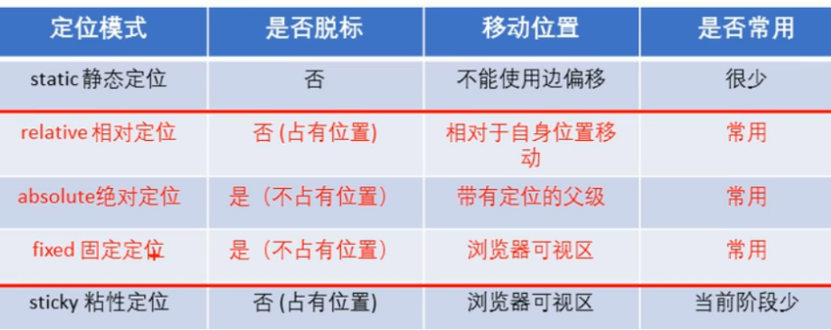

---
title: css学习笔记(二)--网页布局部分--定位
date: 2021-01-05
tags:
 - css
categories:
 -  笔记
---     
## 网页布局--定位  
    **通过定位可以将元素摆放到页面的任意位置-使用position属性来设置定位**  
1. 相对定位（`relative` )  
    + 相对定位是元素在移动位置的时候，是相对于它原来的位置来说的(自恋型)。  
    + 相对定位的特点∶(务必记住)  
     1. 它是相对于自己原来的位置来移动的(移动位置的时候参照点是自己原来的位置)。  
     2. 原来在标准流的位置继续占有，后面的盒子仍然以标准流的方式对待它。(不脱标，继续保留原来位置)  
      因此，相对定位并没有脱标。它最典型的应用是给绝对定位当爹的。。。  
2. 绝对定位（`absolute`）  
    + 绝对定位的特点;  
        1. 开启绝对定位后,如果不设置偏移量元素的位置不会发生变化  
        2. 开启绝对定位后，元素会从文档流中脱离  
        3. 绝对定位会改变元素的性质，行内变成块，块的宽高被内容撑开  
        4. 绝对定位会使元素提升一个层级  
        5. 绝对定位元素是相对于其包含块进行定位的  
     + 包含块：包含块就是离当前元素最近的祖先块元素  
     + 绝对定位的包含块:  
        + 包含块就是离它**最近的开启了定位**的祖先元素  
        + 如果所有的祖先元素都没有开启定位则**根元素**就是它的包含块  
        + html（根元素、初始包含块)  
3. **子绝父相的由来**  
    + **子级是绝对定位的话，父级要用相对定位**  
        1. 子级绝对定位，不会占有位置，可以放到父盒子里面的任何一个地方，不会影响其他的兄弟盒子。  
        2. 父盒子需要加定位限制子盒子在父盒子内显示。  
        3. 父盒子布局时，需要占有位置，因此父亲只能是相对定位。  
    + 这就是子绝父相的由来，所以相对定位经常用来作为绝对定位的父级。
    + 总结∶因为父级需要占有位置，因此是相对定位，子盒子不需要占有位置，则是绝对定位当然，子绝父相不是永远不变的，如果父元素不需要占有位置，子绝父绝也会遇到。  
4. 固定定位（`fixed`）  
    + **固定定位一定要记得给宽度**  
    + 固定定位是元素固定于浏览器可视区的位置。主要使用场景∶可以在浏览器页面滚动时元素的位置不会改变  
    + 固定定位的特点︰(务必记住)  
        1. 以浏览器的可视窗口为参照点移动元素。跟父元素没有任何关系,不随滚动条滚动。  
        2. 固定定位不在占有原先的位置。
        3. 固定定位也是脱标的，其实固定定位也可以看做是一种特殊的绝对定位。
    + **固定定位小技巧∶固定在版心右侧位置。**  
    + 小算法︰  
        1. 让固定定位的盒子`left: 50%`.走到浏览器可视区（也可以看做版心）的一半位置。  
        2. 让固定定位的盒子`margin-left:`版心宽度的一半距离。多走版心宽度的一半位置就可以让固定定位的盒子贴着版心右侧对齐了。  
5. 粘滞定位  
    + 粘性定位可以被认为是相对定位和固定定位的混合。  
    + 选择器`{ position : sticky; top: 10px; }`  
    + 粘性定位的特点︰  
        1. 以浏览器的可视窗口为参照点移动元素（固定定位特点)  
        2. 粘性定位占有原先的位置（相对定位特点)  
        3. 必须添加` top. left、right、bottom`其中一个才有效  
    + 跟页面滚动搭配使用。兼容性较差，IE不支持。  
        
6. 定位的特殊特性  
    + 绝对定位和固定定位也和浮动类似  
        1. 行内元素添加绝对或者固定定位，可以直接设置高度和宽度。  
        2. 块级元素添加绝对或者固定定位，如果不给宽度或者高度，默认大小是内容大小。  
        3. 浮动元素、绝对定位(固定定位)元素的都不会触发外边距合并的问题。  
        4. 绝对定位（固定定位）会完全压住盒子  
          + 浮动元素不同，只会压住它下面标准流的盒子，但是不会压住下面标准流盒子里面的文字(图片)  
          + 但是绝对定位(固定定位）会压住下面标准流所有的内容。  
          + 浮动之所以不会压住这字，因为浮动产生的目的最初是为了做文字环绕效果的。  
7. 层级  
    + 在使用定位布局时，可能会出现盒子重叠的情况。此时，可以使用`z-index`来控制盒子的前后次序(z轴)  
      `z-index：1；`  
        1. 数值可以是正整数、负整数或0,默认是`auto`，数值越大，盒子越靠上  
        2. 如果属性值相同，则按照书写顺序，后来居上  
        3. 祖先的元素的层级再高也不会盖住后代元素  
        4. 数字后面不能加单位  
        5. 只有定位的盒子才有`z-index`属性   