---
title: css学习笔记(二)--网页布局部分--字体图标、精灵图等样式类
date: 2021-01-06
tags:
 - css
categories:
 -  笔记
---   
## 网页布局--字体图标、精灵图等样式类  
1. 字体  
  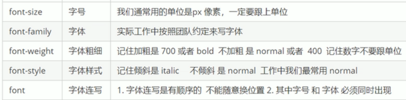  
  + `font:`字体大小/行高 字体族（行高可以省略不写如果不写使用默认值）  
  + 文本属性  
  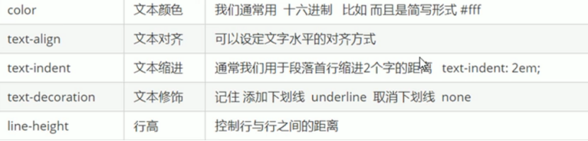  
  + `text-decoration`设置文本修饰  
      + `none`什么都没有  
      + `underline`下划线  
      + `line-through`删除线  
      + `overline` 上划线  
2. 精灵图  
    + 目的:为了有效地减少服务器接收和发送请求的次数，提高页面的加载速度  
    + 使用精灵图核心总结:  
        1. 精灵图主要针对于小的背景图片使用。  
        2. 主要借助于背景位置来实现---`background-position`。  
        3. 一般情况下精灵图都是负值。(千万注意网页中的坐标︰x轴右边走是正值，左边走是负值，y轴同理。)  
3. 字体图标  
    + 字体图标使用场景:主要用于显示网页中通用、常用的一些小图标  
    + 精灵图是有诸多优点的，但是缺点很明显。  
        1. 图片文件还是比较大的。  
        2. 图片本身放大和缩小会失真  
        3. 一旦图片制作完毕想要更换非常复杂。  
    + 此时，有一种技术的出现很好的解决了以上问题，就是字体图标`iconfont`.  
    + 字体图标可以为前端工程师提供一种方便高效的图标使用方式，<font color="red">展示的是图标，本质属于字体</font>。  
4. 字体图标的优点  
    1. 轻量级:一个图标字体要比一系列的图像要小。一旦字体加载了，图标就会马上渲染出来，减少了服务器请求  
    2. 灵活性:本质其实是文字，可以很随意的改变颜色、产生阴影、透明效果、旋转等  
    3. 兼容性:几乎支持所有的浏览器，请放心使用  
    4. 注意:字体图标<font color="red">不能替代精灵技术</font>，只是对工作中图标部分技术的<font color="red">提升和优化</font>。  
    5. 总结∶    
        + 如果遇到一些结构和样式比较简单的小图标，就用字体图标。  
        + 如果遇到一些结构和样式复杂一点的小图片，就用精灵图。  

      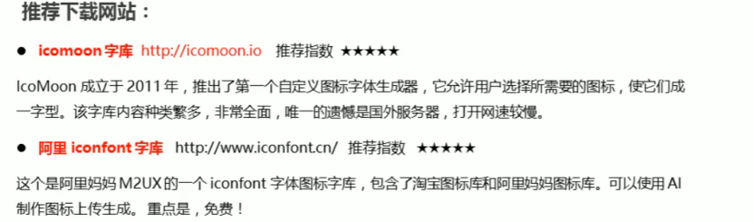  
    + 使用步骤  
        1. 把下载包里面的`fonts`文件夹放入页面根目录下  
        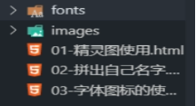  
        2. 在`CSS`样式中全局声明字体︰简单理解把这些字体文件通过`css`引入到我们页面中。（`style.css`中可以找到）  
        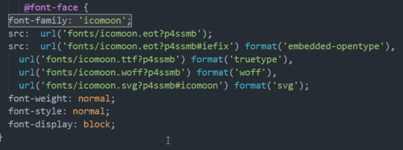  
        3. `html`标签内添加小图标。  
        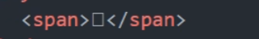  
        4. 指定字体  
        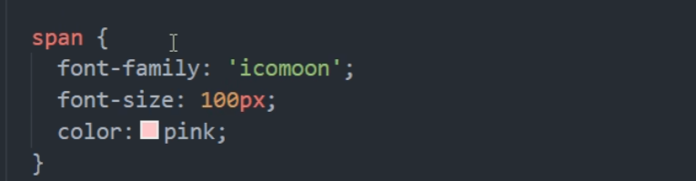  
        5. 字体图标的追加:  
          + 把压缩包里面的`selectionjson` 从新上传，然后选中自己想要新的图标，从新下载压缩包，并替换原来的文件即可。  
          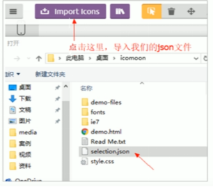    
5. css三角    
  ```css
  div{
    width:0;
    height:0;
    line-height:0;
    font-size:0;
    border:50px solid transparent;
    border-left-color:pink;
  }  
  ```     
  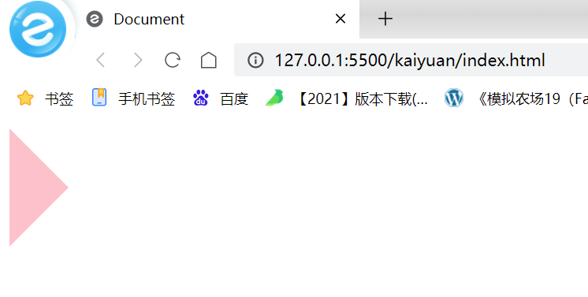 
  这个时候我们加入一个类似的应用场景延伸，很多网站都会出现这样的hover小三角  
  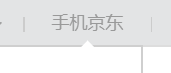  
  如果这里使用一个小三角就会出现没有三角边框的问题，那么我们可以采用用两个不一样颜色的三角(一个边框颜色，一个内容区颜色)重叠来营造边框的效果  
  ```html
  <style>
    .div1 {
      width: 0;
      height: 0;
      line-height: 0;
      font-size: 0;
      border: 50px solid transparent;
      border-left-color: black;
      position: relative;
    }

    .div2 {
      position: absolute;
      top: -50px;
      left: -51px;
      width: 0;
      height: 0;
      line-height: 0;
      font-size: 0;
      border: 50px solid transparent;
      border-left-color: pink;
    }
  </style>
</head>
<body>
  <div class="div1">
    <span class="div2"></span>
  </div>
</body>  
``` 
  
  这样我们就完成了一个带边框颜色的小三角了~~~~  

6. CSS用户界面样式  
    1. 鼠标样式`cursor`  `li {cursor: pointer; }`  
    设置或检索在对象上移动的鼠标指针采用何种系统预定义的光标形状。  
    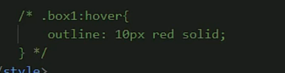  
    2. 轮廓线`outline`  
        + 给表单添加`outline:0;`或者`outline: none;`样式，就可以去掉默认的蓝色边框。  
        + 轮廓不会影响到可见框的大小，用法和`border`一模一样  
    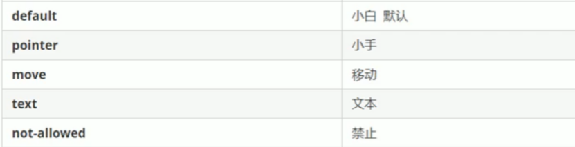   
    3. 防止拖拽文本域 `resize`  
      实际开发中，我们文本域右下角是不可以拖拽的。  
        `textarea{resize:none;}`   
7. 图片、表单和文字对齐  
      1. `vertical-align`设置元素垂直对齐的方式  
          + CSS的`vertical-align`属性使用场景∶经常用于设置图片或者表单(行内块元素)和文字垂直对齐。  
          + 官方解释∶用于设置一个元素的垂直对齐方式，但是它只针对于行内元素或者行内块元素有效。  
            `vertical-align : baseline / top / middle \ bottom`  
          + 图片、表单都属于行内块元素，默认的`vertical-align`是基线对齐。  
          + 设置`middle`可以和文字垂直居中对齐  
          + **<font color="red">解决图片底部默认空白缝隙问题</font>**  
              + bug:图片底侧会有一个空白缝隙，原因是行内块元素会和文字的基线对齐。主要解决方法有两种:  
                  1. 给图片添加`vertical-align:middle | topl bottom`等。（提倡使用的)  
                  2. 把图片转换为块级元素`display: block;`  
      2. `white-space`设置网页如何处理空白  
          + 一定要设置宽度，然后缺一不可  
8. 溢出的文字省略号显示  
      1. 单行文本溢出显示省略号—必须满足三个条件  
      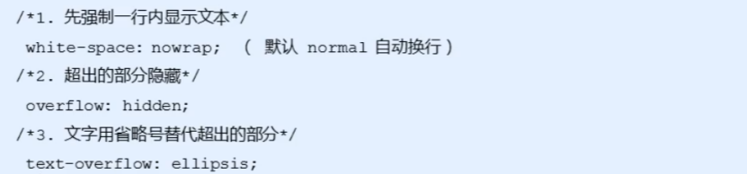  
      2. 多行文本溢出显示省略号  
        + 多行文本溢出显示省略号，有较大兼容性问题，适合于`webKit`浏览器或移动端(移动端大部分是`webkit`内核)  
      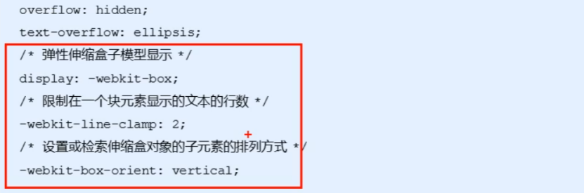  
        + **更推荐让后台人员来做这个效果，因为后台人员可以设置显示多少个字，操作更简单。**    
9. 常见的布局技巧  
    1. `margin`负值运用（浮动盒子实现边框细线）  
      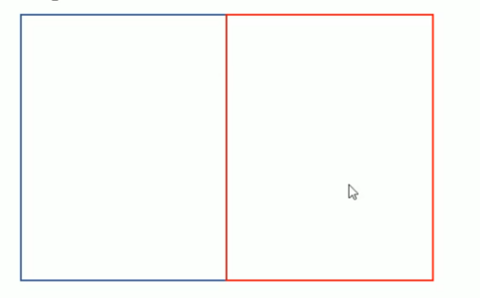  
        1. 让每个盒子`margin`往左侧移动`-1px` 正好压住相邻盒子边框  
        2. 鼠标经过某个盒子的时候，提高当前盒子的层级即可(如果没有有定位，则加相对定位（保留位置），如果有定位，则加`z-index`)  
        ```css  
        /*ul Li:hover {
          1．如果盒子没有定位，则鼠标经过添加相对定位即可position: reLative;
        border: 1px solid blue;
        }*/
        ul li:hover {
        /* 2.|如果Li都有定位，则利用z-index提高层级*/
        z-index: 1;
        border: 1px solid blue;
        }
        ```  
    2. 文字围绕浮动元素  
        巧妙运用浮动元素不会压住文字的特性  
    3. 行内块巧妙运用  
    4. CSS三角强化  
      ```css 
        div{
        width: 0;
        height : 0;
        border-color: transparent red transparent transparent;
        border-style: solid;
        border-width: 22px 8px 0 0 ;}
      ```  
10. CSS初始化  
    + 不同浏览器对有些标签的默认值是不同的，为了消除不同浏览器对HTML文本呈现的差异，照顾刘览器的兼容，我们需要对CSS初始化  
    + 简单理解:CSS初始化是指重设浏览器的样式。(也称为CSS reset )每个网页都必须首先进行CSS初始化。  
11. Unicode编码字体∶  
    + 把中文字体的名称用相应的Unicode编码来代替，这样就可以有效的避免浏览器解释CSS代码时候出现乱码的问题。  
      1. 黑体\9ED1\4F53宋体\5B8B\4F53  
      2. 微软雅黑\5FAE\8F6F\96C59ED1  
12. 布局示例  
    1. 头部制作  
    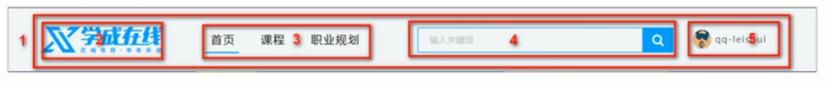   
      + 导航栏注意点:  
        **<font color="red">实际开发中，我们不会直接用链接a而是用li包含链接(li+a)的做法。</font>**  
        1.  `li+a`语义更清晰，一看这就是有条理的列表型内容  
        2. 如果直接用`a`，搜索引擎容易辨别为有堆砌关键字嫌疑(故意堆砌关键字容易被搜索引擎有降权的风险），从而影响网站排名  
        3. 注意:  
            1. 让导航栏一行显示,给`li` 加浮动,因为`li`是块级元素,需要一行显示.  
            2. 这个`nav`导航栏可以不给宽度,将来可以继续添加其余文字  
            3. 因为导航栏里面文字不一样多,所以最好给链接`a`左右`padding`撑开盒子,而不指定宽度  
    2. 底部制作  
    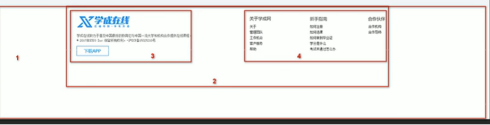  
        1. 1号盒子是通栏大盒子，底部`footer`给高度，底色是白色  
        2. 2号盒子版心水平居中  
        3. 3号盒子版权`copyright`左对齐  
        4. 4号盒子链接组`links` 右对齐  


    
