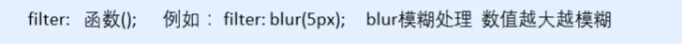
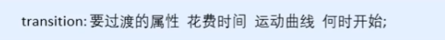
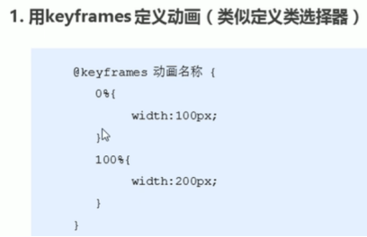
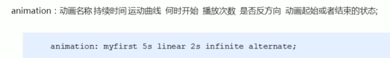
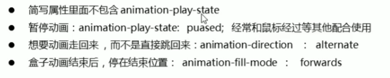
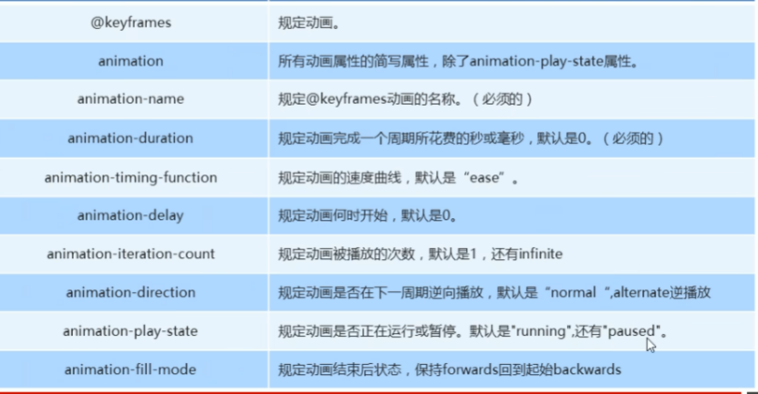
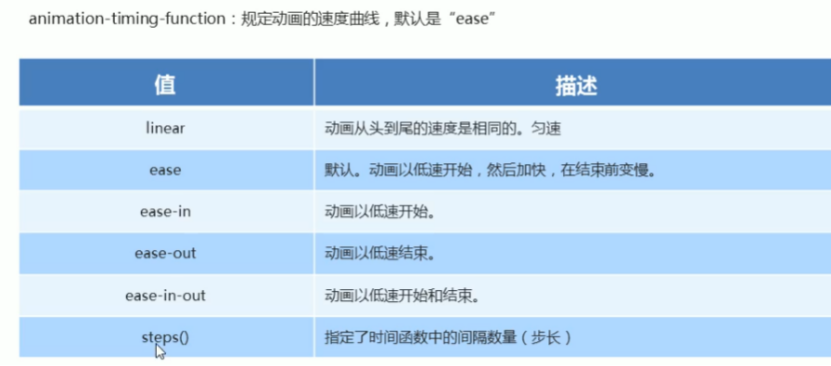
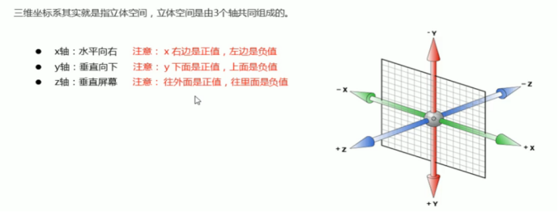
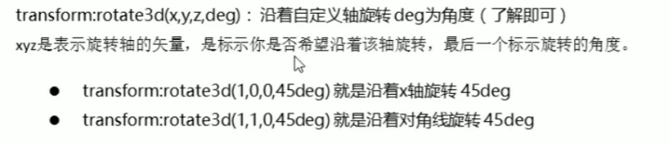
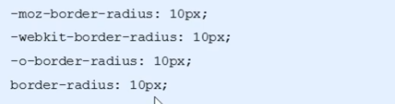

---
title: css学习笔记(三)--CSS3新特性
date: 2021-01-07
tags:
 - css
categories:
 -  笔记
---    
##  CSS3新特性  
1. CSS3滤镜`filter`  
      
2. CSS3 `calc`函数:  
    ```css
    {width:calc(100% - 80px)}  
    ```  
    + 运算符前后必须留空格  
3. 过渡  
      
    1. 属性︰想要变化的css属性，宽度高度背景颜色内外边距都可以。如果想要所有的属性都变化过渡，写一个`all`就可以。  
    2. 花费时间:单位是秒（必须写单位）比如0.5s  
    3. 运动曲线︰默认是`ease`(可以省略)  
    4. 何时开始︰单位是秒(必须写单位)可以设置延迟触发时间默认是0s（可以省略)  
    5. **<font color="red">记住过渡的使用口诀:谁做过渡给谁加</font>**  
4. 2D转换  
    1. 转换`transform`我们简单理解就是变形有2D和3D之分  
    2. 2D移动`translate(x, y)`最大的优势是<font color="red">不影响其他盒子</font>，里面参数用%，是相对于自身宽度和高度来计算的，对<font color="red">行内标签</font>没有效果  
    3. 可以分开写比如`translateX(x)`和`translateY(y)`  
    4. 2D旋转`rotate(度数)`可以实现旋转元素度数的单位是`deg`  
    5. 2D缩放`sacle(xy)`里面参数是数字不跟单位<font color="red">可以是小数</font>最大的优势不影响其他盒子  
    6. 设置转换中心点`transform-origin : x y;`参数可以百分比、像素或者是方位名词  
    7. 当我们进行综合写法，同时有位移和其他属性的时候，记得要将位移放到最前  
        1. 同时使用多个转换，其格式为:` transform:translate() rotate() scale()..`等  
        2. 其顺序会影响转换的效果。(先旋转会改变坐标轴方向)  
        3. **当我们同时有位移和其他属性的时候，记得要将位移放到最前**  
    8.   
        + 是否显示元素的背面  `backface-visibility: hidden;`   
        + 产为元素设置透明效果   `opacity: 0.7;`  
5. 动画  
    1. 先定义动画  
          
    2. 再调用动画  
          
        
        
        
6. 3D转换  
      
    1. `Perspective:`在2D平面产生近大远小视觉立体  
        + 如果想要在网页产生3D效果需要透视（理解成3D物体投影在2D平面内)。  
        + 模拟人类的视觉位置，可认为安排一只眼睛去看  
        + 透视我们也称为视距∶视距就是人的眼睛到屏幕的距离  
        + 距离视觉点越近的在电脑平面成像越大，越远成像越小  
        + 透视的单位是像素  
    2. **透视写在被观察元素的父盒子上面的**  
        + d∶就是视距，视距就是一个距离人的眼睛到屏幕的距离。  
        + z∶就是z轴，物体距离屏幕的距离，z轴越大(正值）我们看到的物体就越大。  
    3. 3D旋转`rotate3d`  
        + 旋转轴适用于**左手法则**  
          
7. 呈现`transfrom-style`  
   控制子元素是否开启三维立体环境  
    + `transform-style:` flat子元素不开启3d立体空间默认  
    + `transform-style: preserve-3d;`子元素开启立体空间  
    + 代码写给父级，但是影响的是子盒子, **同时有旋转和移动的时候，注意保持中心点位置**  
8. 浏览器私有前缀  
    + `-moz-∶`代表`firefox`浏览器私有属性  
    + `-ms-:`代表`ie`浏览器私有属性  
    + `-webkit-:`代表`safari、chrome`私有属性  
    + `-o-∶`代表`Opera`私有属性  
    

  


