---
title: css学习笔记(四)--移动Web
date: 2021-01-08
tags:
 - css
categories:
 -  笔记
---   
##   移动Web  
1. 视口  
    1. 视口就是浏览器显示页面内容的屏幕区域视口分为布局视口、视觉视口和理想视口  
    2. 我们移动端布局想要的是理想视口就是手机屏幕有多宽，我们的布局视口就有多宽  
    3. 想要理想视口，我们需要给我们的移动端友面添加meta视口标签  
2. `meta`视口标签  
    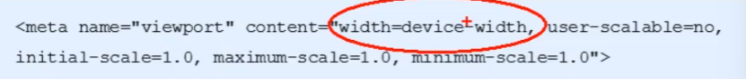  
    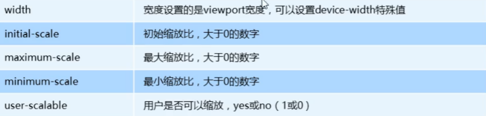  
    + 视口宽度和设备保持一致、视口的默认缩放比例1.0、不允许用户自行缩放、最大允许的缩放比例1.0、最小允许的缩放比例1.0  
    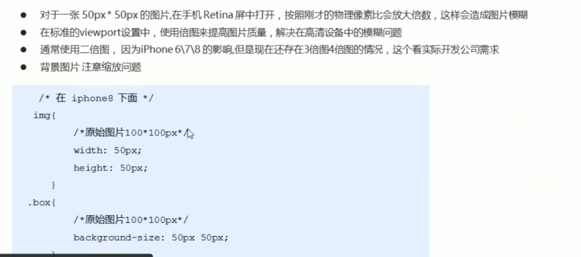  
3. 背景缩放`background-size`  
    + `background-size:`背景图片宽度背景图片高度;   
    + 单位︰长度|百分比|`cover`|`contain`;  
          + `cover`把背景图像扩展至足够大，以使背景图像完全覆盖背景区域。  
          + `contain`把图像图像扩展至最大尺寸，以使其宽度和高度完全适应内容区域  
4. 一些特殊样式  
    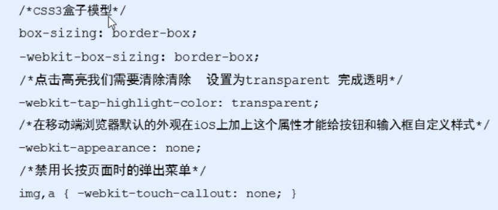  
5. 常见移动端布局   
    1. **流式布局(百分比布局)** 也称非固定像素布局    
        + 通过盒子的宽度设置成百分比来根据屏幕的宽度来进行伸缩，不受固定像素的限制，内容向两侧填充。流式布局方式是移动web开发使用的比较常见的布局方式  
    2. **<font color="red">flex弹性布局(强烈推荐)</font>**  
        1. 布局原理   
          当我们为父盒子设为`flex`布局以后，子元素的`float、clear`和`vertical-align`属性将失效。伸缩布局=弹性布局=伸缩盒布局=弹性盒布局=`flex`布局  
          + 就是通过给父盒子添加`flex`属性，来控制子盒子的位置和排列方式  
          + 常见父项属性  
              1. `flex-direction`设定主轴方向  
              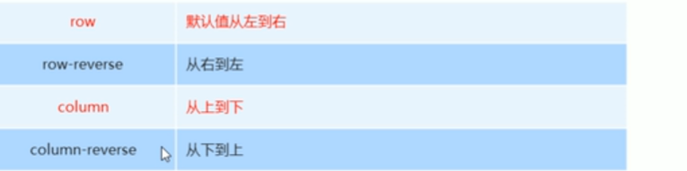  
              2. `justify-content`设置主轴上的子元素排列方式  
              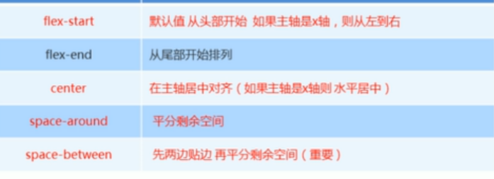  
              3. `flex-wrap`设置子元素是否换行  
              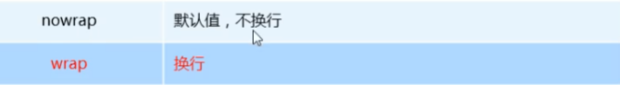  
              4. `align-items :`设置侧轴上的子元素的排列方式(单行)  
              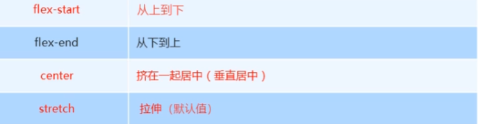  
              5. `align-content :`设置侧轴上的子元素的排列方式(多行)混合布局（一定要换行）  
              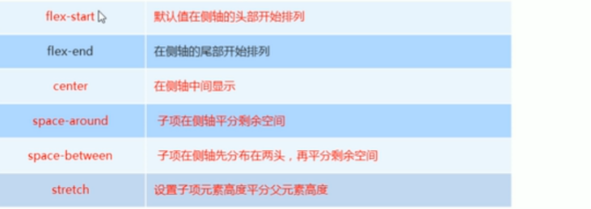  
              6. `flex-flow`属性是`flex-direction`和`flex-wrap`属性的复合属性  
          + 子项常见属性  
              1. `flex`子项目在分配剩余空间时占的份数  
              2. `align-self` 控制子项自己在侧轴上的排列方式  
              3. `order`属性定义项目的排列顺序，数值越小，排列越靠前，默认为0。  
              4. `flex-grow`指定弹性元素的伸展的系数  
                  + 当父元素有多余空间的时,子元素如何伸展-父元素的剩徐空间,会按照比例进行分配  
              5. `flex-shrink`指定弹性元素的收缩系数  
                  + 当父元素中的空间不足以容纳所有的子元素时,如果对子元素进行收缩  
6. 背景渐变  
    1. 线性渐变  
        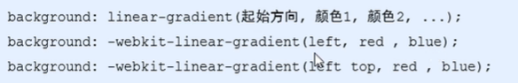  
        + 背景渐变必须添加浏览器私有前缀  
        + 起始方向可以是︰方位名词或者度数，如果省略默认就是`top`  
7. `rem`适配方案  
    1. `rem`基础  
        + `em`是相对于父元素的字体大小来计算的  
        + `rem`是相对于根元素的字体大小来计算  
        + `rem`的优点就是可以通过修改`html`里面的文字大小来改变页面中元素的大小   
    2. 媒体查询  
        ```css
        @media mediatype and |not | only (media feature) {
            css-code;
          }  
        ```  
        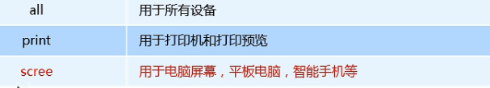  
        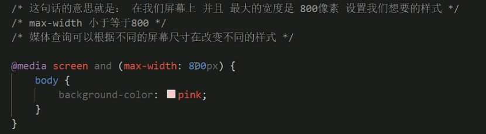  
        **<font color="red">从小到大写需求可以使代码更加简洁</font>**  
    3. 响应式页面兼容移动端（其次)  
        + 媒体查询  
        + `Bootstarp`  
8. Less  
    Less是一门CSS扩展语言，也成为CSS预处理器。:它扩展了CSS的动态特性。  
    1. Less变量  
        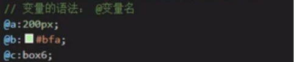  
    2. 类名  
        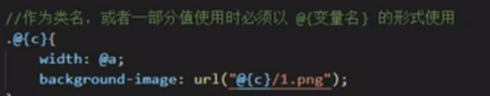  
    3. 如果遇见（交集|伪类|伪元素选择器）  
      内层选择器的前面没有`&`符号，（`&`符号可以理解成外层父元素）则它被解析为父选择器的后代;如果有`&`符号，它就被解析为父元素自身或父元素的伪类  
    4. Less运算  
        + 运算符的左右两侧必须**敲一个空格隔开**  
        + **运算符中间左右有个空格隔开`1px+ 5`** 
        + 对于两个不同的单位的值之间的运算，运算结果的值取**第一个值的单位**  
        + 如果两个值之间只有一个值有单位，则运算结果就取该单位  
        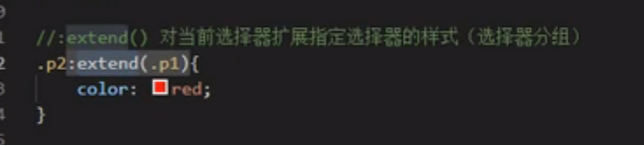   
        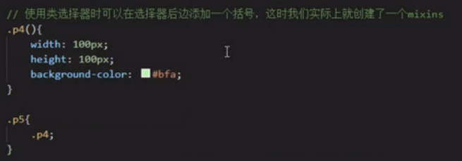   
9. 响应式布局  
      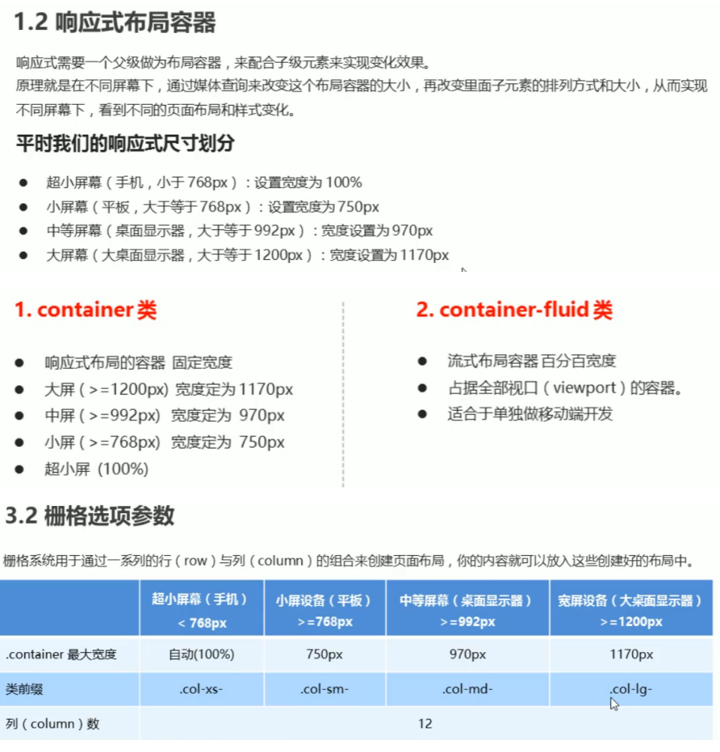
      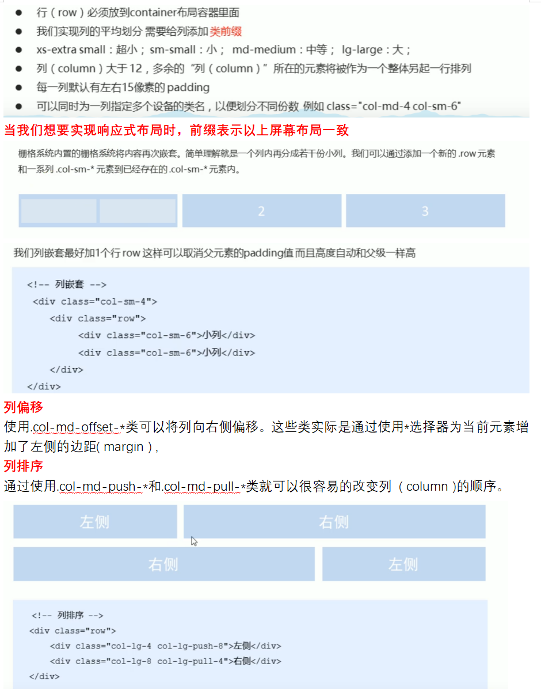
      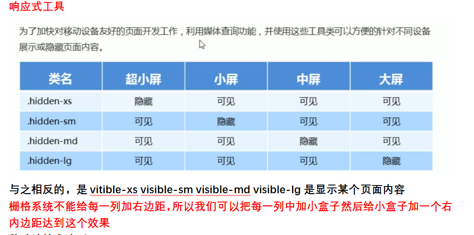  
    + 移动端技术选型  
          + 流式布局(百分比布局)
          + `flex`弹性布局(推荐)
          + `rem`适配布局（推荐)
          + 响应式布局  
10. VW和VH  
    + `vw/vh`是一个相对单位  
    + `100vw = 1`个视口宽度    `100vh = 1`个视口高度  
    + **百分比是相对于父元素来说的，而vw和vh总是针对于当前视口来说的。**  
      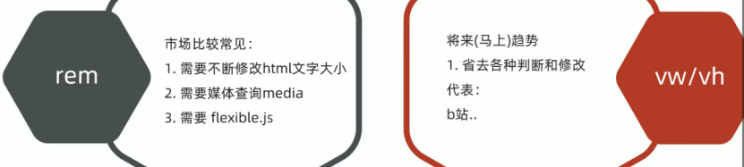  
    + 网页中字体大小最小是`12px`，不能设置一个比12像素还小的字体,如果我们设置了一个小于`12px`的字体，则字体自动设置为12

 

