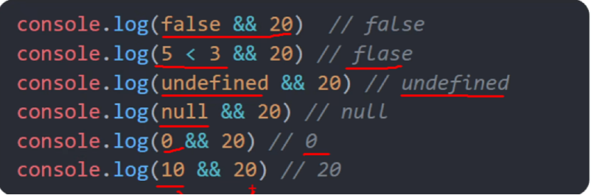
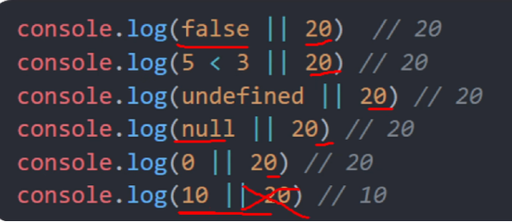
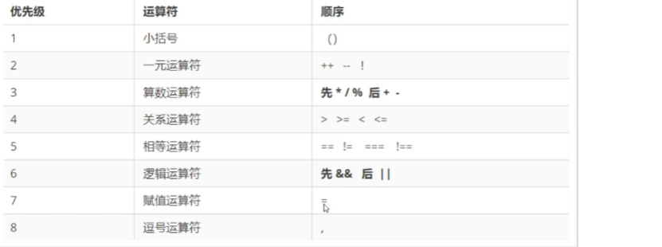
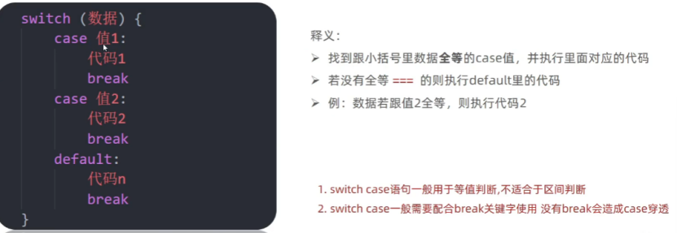
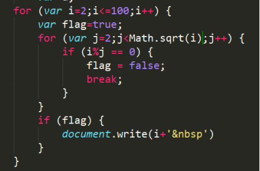
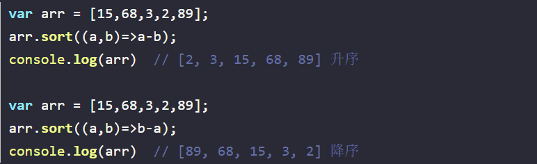
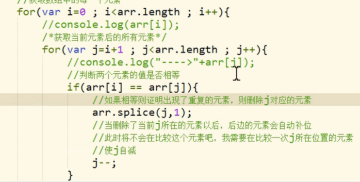
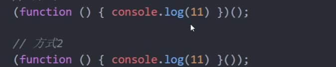

---
title: JS学习笔记(一)--JS基础
date: 2021-01-09
tags:
 - js
categories:
 -  笔记
---    
##   JS基础  
1. JS基础认识  
    1. JavaScript是什么?  
        JavaScript是一门编程语言，可以实现**网页特效，表单验证，数据交互**  
    2. JavaScript的注释?  
        + 单行注释 ` //  `
        + 多行注释 `/* */`  
    3. JavaScript的结束符?  
        分号`;`可以加也可以不加，可以按照团队约定，注意换行默认为结束符  
    4. Javascript输入输出语句?  
        + 输入: `prompt()`  （`+prompt（" "）`可以转换出数值）  
        + 输出: `alert()`  `document.write()`  `console.log()`  
2. 变量和字面量  
    1. 字面量，都是一些不可改变的值，数字、字符串、数组、对象等等  
        变量是计算机存储数据的<font color="red">“容器”</font>，而不是数据  
        可以用`let、var`来声明变量，**注意同一个变量不能用`let`多次声明**  
    2. 变量的本质  
        内存:计算机中存储数据的地方，相当于一个空间   
        变量:是程序在内存中申请的一块用来存放数据的小空间  
    3. 命名规则与规范  
        1. 规则:  
            + 不能用**关键字**,（有特殊含义的字符，`JavaScript`内置的一些英语词汇。例如: `let、var、if、for`等）  
            + 只能用**下划线、字母、数字、$**组成，且**数字不能开头**    
            + 字母**严格区分大小写**，如Age和age是不同的变量  
        2. 规范:  
            + 起名要有意义  
            + 遵守**小驼峰命名法**，第一个单词首字母小写，后面每个单词首字母大写。例: `userName`   
3. 数据类型  
    + 基本数据类型：`number、string、boolean、undefined、null、Symbol、BigInt`   
    + 引用数据类型：`object、function、array`  
    1. 数字类型:正数、负数、小数；  
        + `NaN`是一个特殊的数字，表示`Not A Number`，用`typeof`检查`NaN`会返回`number`  
        + `Number.MAX_VALUE`、`Number.MIN VALUE`表示数字的最值  
        + 尽量不要再JS中进行精度较高的运算  
    2. 字符串类型：通过单引号('')、双引号(""）或反引号(``)包裹的数据都叫字符串  
        + **模板字符串**  
        ```js  
        document.write('大家好，我叫' + name + ',今年' + age + '岁')
        ```   
        用反引号包裹内容，`${}`包住变量   
        ```js  
        document.write(`大家好我叫${name}，今年${age}岁`)  
        ```  
    3. 布尔值  
        + 使用`typeof`检查一个布尔值时，会返回`boolean`  
        + 它有两个值 `true`和`false`，表示肯定的数据用`true`(真)，表示否定的数据用`false`(假)。  
    3. `Null` 和`Undefined`  
        + 只声明，未给变量赋值时，它的值就是`undefined`，使用`typeof`检查时也会返回`undefined`  
        + `Null`类型的值只有一个，就是`null`，这个值专门用来表示一个为空的对象  
        + 使用`typeof`检查一个`null`值时，会返回`object`  
4. 类型转换  
    + JavaScript是弱数据类型: JavaScript也不知道变量属于那种类型，赋值了才清楚。  
    + 坑:使用表单、prompt 获取过来的数据默认是字符串类型，此时不能直接进行加法运算。  
    1. 隐式转换  
        1. `+`号两边只要有一个是字符串，都会把另外一个转成字符串  
        2. 除了`+`以外的算术运算符比如`– * /`等都会把数据转成数字类型  
        3. 作为正号解析时可以把数据转成数字类型  
        4. 我们只需要为任意的数据类型`+`一个`""`即可将其转换为`String`  
    2. 显式转换  
        + **<font color="red">转换成数字</font>**  
            1. **使用`Number()`函数**  
                + 字符串-->数字  
                    1. 如果是纯数字的字符串，则直接将其转换为数字  
                    2. 如果字符串中有非数字的内容，则转换为`NaN`  
                    3. 如果字符串是一个空串或者是一个全是空格的字符串，则转换为`0`  
                + 布尔-->数字  
                    + `true`转成`1` `false`转成`0`  
                + `null` -->数字`0`  
                + `undefined`-->数字`NaN`  
            2. **这种方式专门用来对付字符串**  
                + `parseInt()`把一个字符串转换为一个整数  
                + `parseFloat()`把一个字符串转换为一个浮点数  
                + 如果对非`String`使用`parseInt()`或`parseFloat()`它会先将其转换为`String`然后在操作  
                + **<font color="red">可以在`parseInt()`中传递第二个参数，表示以此进制看待传入进来的参数</font>**    
        + **<font color="red">转换成字符串</font>**  
            1. **调用`String()`函数**  -- 并将被转换的数据作为参数传递给函数  
                + 对于`Number`和`Boolean`实际上就是调用的`toString()`方法  
                + 但是对于`null`和`undefined`，它会将`null`直接转换为`"null"`,将`undefined`直接转换为`"undefined”`  
            2. **调用被转换数据类型的`toString()`方法**  
                + 该方法不会影响到原变量，它会将转换的结果返回  
                + 但是注意:null和undefined这两个值没有toString()方法,   
                + **<font color="red">可以传一个参数2，表示转换成2进制结果 </font>**  
        +  **<font color="red">转换成`boolean`</font>**   
            1. **使用`Boolean()`函数**  
                + 数字--->布尔 : 除了`0`和`NaN`，其余的都是`true`  
                + 字符串--->布尔 : 除了空串，其余的都是`true`  
                + `null`和`undefined`都会转换为`false`  
                + 对象也会转换为`true`  
5. 运算符  
    1. `typeof`就是运算符，它将该值的类型**以字符串的形式**返回  
    2. 一元运算符：自增和自减  自减同理  
        + **无论是a++ 还是++a，都会立即使原变量的值自增1**  
        + **<font color="red">a++的值</font> = 原变量的值（<font color="red">自增前</font>的值)**  
        + **<font color="red">++a的值</font> = 新值（<font color="red">自增后</font>的值)**  
    3. 比较运算符（结果只有`true`和`false`）  
        1. 对于非数值进行比较时，会将其转换为数字然后在比较  
        2. 如果符号两侧的值都是字符串时，不会将其转换为数字进行比较，而会分别比较字符串中字符的Unicode编码，比较字符编码时是一位一位进行比较  
            + **注意:在比较两个字符串型的数字时，一定一定一定要转型**  
            + 在字符串中使用转义字符输入`Unicode`编码  `\u四位编码`  
            + 在网页中使用`Unicode`编码，&#编码;这里的编码需要的是10进制  
        3. 相等运算符  
            + `=`是赋值  
            + `==`是判断，只要值相等，不要求数据类型即返回`true`，会**进行类型转换** （`!=`同理）  
            + `===`是全等要求值和数据类型都一样返回的才是`true`   （`!==`同理）  
    4. 逻辑运算符  
        **&&属于短路的与，如果第一个值为false，则不会看第二个值**  
        1. **<font color="red">与运算：第一个为false，返回第一个；第一个为true，必然返回第二个</font>**  
          
        **||属于短路的或，如果第一个值为true，则不会检查第二个值**  
        2. **<font color="red">或运算：第一个为true，返回第一个；第一个为false，必然返回第二个</font>**  
          
        3. **<font color="red">非运算：！！a可以将任意数据类型转换为布尔值</font>**  
    5. 运算符的优先级  
          
6. 分支语句  
        1. if语句  
            **若条件的结果不是布尔值，此时条件会发生隐式转换**  
        2. 三元运算符  
            **条件 ? 满足条件执行的代码 : 不满足条件执行的代码**  
            **但是这是个表达式，我们可以用一个变量来接收他的运算结果**  
        3. Switch语句  
              
7. 循环语句  
        1. `while`循环    
            ```js  
            while(){
                要重复执行的代码（循环体）
                }  
            ```  
            循环必备三要素：变量起始值、**终止条件（死循环）**、变量变化值  
        2. `break`和`continue`   
            + `continue`可以用来**跳过当次循环**，这轮循环的语句就不执行了  
            + `break`可以用来**退出`switch`或整个循环语句**  
            + 默认只会对离他**最近**的循环起作用  
            + 可以为循环语句创建一个`label`，来标识当前的循环`label:循环语句`  
            + **使用`break`语句时，可以在`break`后跟着一个`label`,这样`break`将会结束指定的循环**  
        3. `for`循环  
            ```js  
            for (起始条件;退出条件;变化量){
                循环语句
            }
            ```  
            **打印质数练习**  
              
8. 数组的基本使用  
    1. `arr.push()`方法将一个或多个元素添加到数组末尾，并**返回该数组的新长度(重点)**  
    2. `arr.unshift()`方法将一或多个元素添加到数组开头，并**返回该数组的新长度(索引改变)**  
    3. `arr.pop()`方法从数组中删除最后一个元素，并**返回该元素的值**  
    4. `arr.shift()`方法从数组中删除第一个元素，并且**返回该元素的值**  
    5. `arr.splice(起始索引，删几个，插入的新元素)`，会<font color="red">**改变原数组**</font>  
    6. `arr.slice(起始索引，结束索引)`可以从数组提取指定元素(<font color="red">左闭右开</font>)，并且封装到一个新数组中返回，**<font color="red">不会改变原数组</font>**，第二个参数可以省略不写,此时会截取从开始索引往后的所有元素,可如果索引传递一个负值，则从后往前计算(-1倒数第一个)  
    7. `concat()`可以连接两个或多个数组，并将新的数组返回，**<font color="red">不会改变原数组</font>**  
            `var result = arr.concat(arr2,arr3,"牛魔王","铁扇公主")`  
    8. `join()`可以将数组转换为一个字符串并作为结果返回，**<font color="red">不会对原数组产生影响</font>**.在`join()`中可以指定一个字符串作为参数，将成为数组中元素的连接符，默认`,`作为连接符  
    9. `reverse()`方法用来反转数组，该方法会<font color="red">直**接修改原数组**</font>  
    10. `sort()`用来对数组中的元素进行排序，**<font color="red">会影响原数组</font>**，默认按照`Unicode`编码进行排序  
              
        **数组去重**  
              
9. 函数  
    1. 函数是封装一些功能的代码块，可以实现代码复用，提高开发效率  
            函数声明: `function 函数名 ( ) {语句...}`  
    2. 函数的参数  
            形参可以理解为是在这个函数内声明的变量，但是没有赋值，实参可以理解为是给这个变量赋值，多余实参不会被赋值，没有对应实参的形参将是`undefined`  
    3. 函数的返回值  
        1. 特点：有值就返回值，无值就结束函数  
        2. **<font color="red">return后面不接数据</font>**或者<font color="red">**函数内不写return**</font>，函数的返回值是`undefined`  
                return能立即结束当前函数,所以**return后面的数据不要换行写**  
                **可以用return [ ]返回多个值**  
    4. `fn()`相当于使用的函数的返回值，`fn`相当于直接使用函数对象  
    5. 作用域  
            + 全局作用域。函数外部或者整个`script`有效  		全局变量  
            + 局部作用域。也称为函数作用域，函数内部有效   	     局部变量  
            + 块级作用域。`{}`内有效   						   块级变量  
            + 如果变量没有声明，直接赋值，也当**全局变量**看，但是**强烈不推荐**    
    + **变量的声明提前**  
            使用`var`关键字声明的变量，会在所有的代码执行之前被声明（但是不会赋值)﹐但是如果声明变量时不适用`var`关键字，则变量不会被声明提前  
    + **函数的声明提前**  
            使用函数声明形式创建的函数`function函数(){  }`,它会在所有的代码执行之前就被创建，所以我们可以在函数声明前来调用函数  
    6. 匿名函数     
            函数表达式  `let 变量 = function () {语句....}`  
        + 立即执行函数  
                  
            **<font color="red">立即执行函数最好在前面加分号，防止报错</font>**  
10. 对象  
    1. 对象属于一种无序的复合的数据类型  
        内置对象、宿主对象（bom、dom）、自定义对象  
    2. 对象声明  
        `Let 对象名 = {  属性名：属性值  ，  方法名：函数  }`  
    3. 属性访问  
        `person.name`  --- `person[‘name’]`  
        + 访问没有的属性返回`undefined`  
        + **在[  ]中可以直接传递一个变量(不加引号)，这样变量值是多少就会读取那个属性**  
    4. 删除对象的属性 --- `delete 对象.属性名`  
    5. `"属性名"  in  对象` 可以检查一个对象中是否含有指定属性  
    6. 遍历对象  
        ```js  
            for ( let  k  in  对象 ) {  
                console.log( obj [ k ] ) 
                }  
        ```  
    7.   
        1. 栈（操作系统）︰**简单数据类型存放到栈里面**  
        2. 堆（操作系统）∶**引用数据类型存放到堆里面, 由垃圾回收机制回收**  
        3. 当比较两个基本数据类型的值时，就是**比较值**。  
        4. 而比较两个引用数据类型时，它是**比较的对象的内存地址**  
    8. Math对象方法  
        ```js  
            Math.random() //生成0-1之间的随机数(包含0不包括1)  
            Math.ceil()  //向上取整  
            Math.floor() //向下取整
            Math.max() //找最大数
            Math.min() //找最小数
            Math.pow() //幂运算
            Math.abs() //绝对值  
            Math.round() //就近取整(0.5往大取整)  
            Math.floor(Math.random()*(M - N + 1)) + N  //生成N - M之间的随机数公式  
        ```  
    


