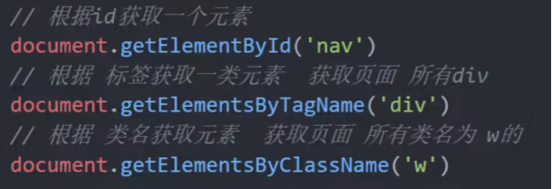
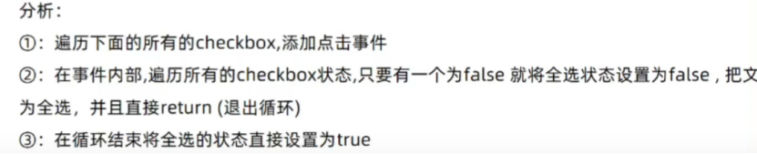
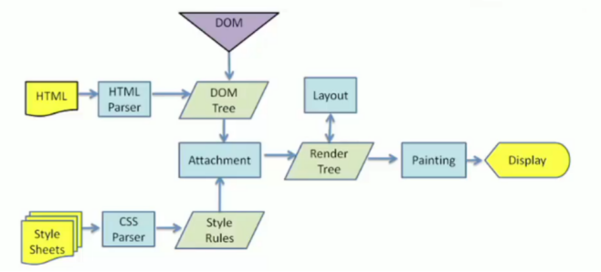
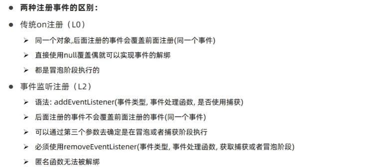
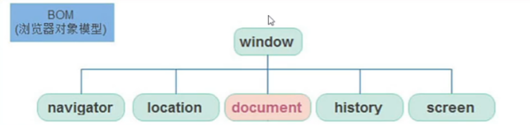
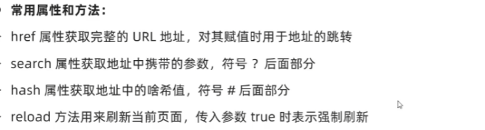
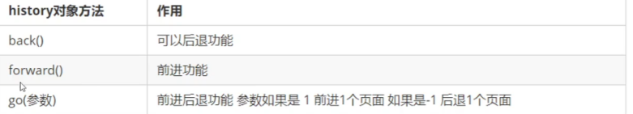
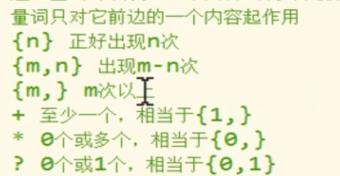
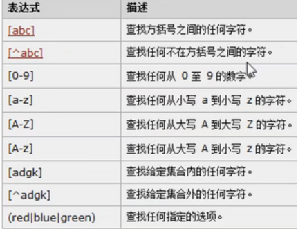
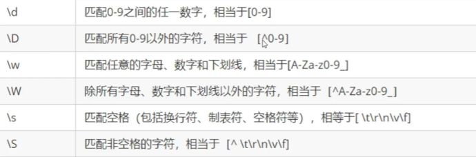

---
title: JS学习笔记(二)--webAPI进阶--DOM、BOM
date: 2021-01-10
tags:
 - js
categories:
 -  笔记
---  
## webAPI进阶--DOM、BOM  
### Day 1  
1. web api的基本认知  
    1. 作用和分类  
        作用:就是使用`JS`去操作`html`和浏览器  
        分类:`DOM`(文档对象模型)、`BOM`（浏览器对象模型)  
    2. 什么是DOM  --- 操作网页内容，可以开发网页内容特效和实现用户交互  
    3. DOM树：将HTML文档以树状结构直观的表现出来，称之为文档树或DOM树  
        作用:文档树直观的体现了标签与标签之间的关系  
    4. DOM对象：浏览器根据html标签生成的JS对象（DOM对象)  
2. 获取DOM对象  
    1. 根据CSS选择器来获取DOM元素(重点)  
        1. 选择匹配的第一个元素  
          `document. querySelector (  )`  
          + 参数：包含一个或多个有效的CSS选择器字符串  
          + 返回值: CSS选择器匹配的第一个元素。如果没有匹配到，则返回`null`。  
        2. 获取多个元素  
          `document.querySelectorAll (  )`  
          + 返回值: CSS选择器匹配的`NodeList对象(伪数组）`，可以遍历但没有`pop()`等方法  
    2. 其他获取DOM元素方法（了解)  
          
3. 设置/修改DOM元素内容  
    1. `document.write()`  
        + 只能将文本内容追加到`</body>`前面的位置  
        + 文本中包含的**标签会被解析**  
    2. 元素`innerText`属性  
        + 将文本内容添加/更新到任意标签位置  
        + 文本中包含的**标签不会被解析**  
    3. 元素`.innerHTML`属性  
        + 将文本内容添加/更新到任意标签位置  
        + 文本中包含的**标签会被解析**  
4. 设置/修改DOM元素属性  
    1. 设置/修改元素常用属性  
        + 直接  `对象.属性名 = 新值`  
        + 最常见的属性比如: `href、title、src`等  
    2. 设置/修改元素样式属性  
        + 通过`style`属性操作CSS  
            + `'-'`连接符改成小驼峰命名,这是行内样式，记得单位  
        + 操作类名(`className`)操作CSS  
            + `元素 . className = '类名'`  
        + 如果修改的样式较多，通过style属性修改比较繁琐，我们可以借助css类名的形式。  
            + 缺陷：会覆盖之前的类名  
        + **<font color="red">通过classList操作类控制CSS（三个方法）</font>**   
            ```js  
            元素.classList.add('类名')   //增加一个类
            元素.classList.remove('类名')   //移除一个类
            元素.classList.toggle('类名')   //切换一个类
            元素.classList.contains('类名')  //判断是否含此类
            ```  
    3. 设置/修改表单元素属性  
        + 设置:`DOM对象.属性名 = 新值`  
        + 表单属性中添加就有效果,移除就没有效果,一律使用布尔值表示,如果为`true`代表添加了该属性,如果是`false`代表移除了该属性  
        + 比如: `disabled、checked、selected`  
    4. 获取自定义属性  
        + 名字以`data-name`设置，用`dataset`属性来取得   
5. 定时器-间歇函数  
    1. 开启定时器  
        `setInterval ( 函数，间隔时间 )`  
        + 返回值:返回一个非零数值，这个数字用来作为定时器的唯一标识  
    2. 关闭定时器  
        `clearInterval ( timer )`可以用来关闭一个定时器  
    3. **注意：在轮播图里面，点击一次按钮会开启一个定时器，一定要将在点击事件开始时先清除当前元素上的其他定时器**  
### Day 2  
1. 事件  
    1. 事件监听  
        + 事件是在编程时系统内发生的动作或者发生的事情  
        + 事件监听就是让程序检测是否有事件产生，一旦有事件触发，就立即调用一个函数做出响应，也称为注册事件  
            `元素.addEventListener('事件',要执行的函数)`  
        + 事件监听三要素:  
            + 事件源:哪个`dom`元素被事件触发了，要获取`dom`元素  
            + 事件:用什么方式触发，比如鼠标单击`click`、鼠标经过`mouseover`等  
            + 事件调用的函数:要做什么事  
    2. 拓展阅读-事件监听版本  
        1. DOM LO---`事件源.on事件= function() {}`  
        2. DOM L2---`事件源.addEventListener(事件，事件处理函数)`  
    3. 事件类型  
        + 鼠标事件：`click`鼠标点击 `mouseenter`鼠标经过 `mouseleave`鼠标离开  
        + 焦点事件：`focus`获得焦点 `blur`失去焦点  
        + 键盘事件：`Keydown`键盘按下触发  `Keyup`键盘抬起触发  
        + 文本事件：`input`用户输入事件、`change`事件（失去焦点时并且表单发生变化触发）  
    4. **全选框案例**  
            
          ```js  
          for (let i = 0; i < cks.Length; i++) {
            //绑定事件
            cks[i].addEventListener('click ', function () {
              //consoLe.Log(11)
              //只要点击任何一个小按钮，都要遍历所有的小按钮
              for (let j = 0; j < cks.length; j++) {
                //都来看看是不是有人没有选中
                if (cks[j].checked === false) {
                  //如果有false则退出循环结束函数
                  all.checked = false
                  return
                }
              }
              //当我们的循环结束，如果代码走到这里，说明没有
              all.checked = true
            })
          }     
          ```  
2. 高阶函数  
    1. 函数表达式：把函数当值来对待  
    2. 回调函数：如果将函数A做为参数传递给函数B时，我们称函数A为回调函数,例如：`setInterval（fn，1000）`  `fn`就是回调函数  
    3. **<font color="red">环境对象this</font>**  
        解析器在调用函数每次都会向函数内部传递进一个隐含的参数this, this指向的是一个对象，**<font color="red">定时器里面别用this，指向window</font>**   
        1. 以函数形式调用时，`this`永远都是`window`  
        2. 以方法的形式调用时，`this`是调用方法的对象  
        3. 以构造函数的形式调用时，`this`是新创建的那个对象  
        4. 使用`call`和`apply`调用时,`this`是指定的那个对象  
        5. 箭头函数中的`this`，指向定义函数上下文的`this`。  
    4. 编程思想  
        + 当前元素为A状态,其他元素为B状态使用  
            1. 干掉所有人（包括他自己）：使用`for`循环  
            2. 复活他自己：通过`this`或者下标找到自己或者对应的元素  
            ```js  
              //找到以前的active类，移除掉
              document.querySelector(".tab .active").classList.remove("active")
              // 当前的元素添加
              this.classList.add('active')
            ```  
### Day 3  
1. 节点操作  
    1. DOM节点-- DOM树里每一个内容都称之为节点  
        + 元素节点：所有的标签比如`body、div、html`是根节点  
        + 属性节点：·所有的属性比如`href`  
        + 文本节点：所有的文本  
        + 其他  
    2. 查找节点  
        + 父节点查找  
            + `parentNode`属性：返回最近一级的父节点，找不到返回为`null`  
        + 子节点查找  
            + `childNodes`：获得所有子节点、**包括文本节点（空格、换行)、注释节点等**  
            + `children(重点)`：仅获得所有元素节点；返回的还是一个**伪数组**  
        + 兄弟节点查找  
            + `previousElementSibling`属性：表示当前节点的前一个兄弟节点  
            + `nextElementSibling`属性：表示当前节点的后一个兄弟节点  
    3. 增加节点  
        + 创建元素节点方法--`document,createElement('标签名')`  
        + 创建文本节点方法---`document.createTextNode('')`  
    4. 追加节点：（**必须由父元素添加**）  
        + 在最后加新节点------`父节点 . appendChild (子节点)`  
        + 在指定位置加新节点--`父节点 . insertBefore (新节点,旧节点)`  
        + 替换旧结点----------`父节点 . replaceChild (新节点,旧节点)`  
        + **先给新节点添加内容，再追加给父节点**  
    5. 克隆节点  
        + `cloneNode（布尔值`：会克隆出一个跟原标签一样的元素  
            + 若为`true`（深拷贝），则代表克隆时会包含后代节点一起克隆  
            + 若为`false`（浅拷贝），则代表克隆时不包含后代节点，默认为`false`  
    6. 删除节点(**必须由父元素删除**)  
        + `父节点.removeChild(子节点)`;  
        + `子节点.parentNode.removeChild(子节点)`;  
    7. **<font color="red">使用innerHTML也可以完成DOM的增册改的相关操作</font>**  
        + `city.innerHTML += "<li>广州</li>";`  
        + `div span ul Li`标签︰设置文字内容  `元素.innerText`  
        + 表单`input`单选复选 `textarea select`  表单的`vaLue`  
        + 特殊的`button`是通过`inner`来设置  
2. 时间对象  
    1. 利用new关键字实例化时间  
        + 获得当前时间---`let date = new Date()`  
        + 获得指定时间---`let date = new Date(‘2021-8-29 18:30:00’)`  
    2. 时间对象方法  
        + `getDate()`  返回月份中的每一天  
        + `getDay()`  返回星期几(0-6)  
        + `getMonth()` 返回月份（0-11）  
        + `getFullYear()` 返回四位年份  
    3. 时间戳   
        + 指的是从格林威治标准时间的1970年1月1日0时0分0秒到现在的毫秒数  
        + `getTime()`方法 （需要实例化）  
        +  `+ new Date()` 利用正号的隐式转换 （需要实例化）  
        + `Date.now()`  
        + `new Date().tolocaleString()`  --- 可以生成一个标准时间(简易版)  
3. 重绘和回流  
    1. 浏览器是如何进行界面渲染的  
          
        + 解析（Parser)HTML，生成DOM树(DOM Tree)  
        + 同时解析(Parser)css，生成样式规则(Style Rules)  
        + 根据DOM树和样式规则，生成渲染树(Render Tree)  
        + 进行布局Layout(回流/重排):根据生成的渲染树，得到节点的几何信息（位置，大小)  
        + 进行绘制 Painting(重绘):根据计算和获取的信息进行整个页面的绘制  
        + Display:展示在页面上  
    2. 回流(重排)  
        当Render Tree 中部分或者全部元素的尺寸、结构、布局等发生改变时，浏览器就会重新渲染部分或全部文档的过程称为回流。  
        + 页面的首次刷新  
        + 浏览器的窗口大小发生改变  
        + 元素的大小或位置发生改变  
        + 改变字体的大小  
        + 内容的变化（如`:input`框的输入，图片的大小)  
        + 激活css伪类（如`::hover`)  
        + 脚本操作DOM（添加或者删除可见的DOM元素)  
        **简单理解影响到布局了，就会有回流**  
    3. 重绘  
        由于节点(元素)的样式的改变并不影响它在文档流中的位置和文档布局时(比如: `color、background-color,outline`等)，称为重绘  
        **<font color='red'>重绘不一定重排，重排一定会重绘</font>**  
    4. **<font color='red'>如何减少重排？</font>**  
        1. 分离读写操作  
        2. 样式集中改变 ：可以添加一个类，样式都在类中改变  
        3. 可以使用`absolute`脱离文档流  
        4. 使用 `display:none `，不使用 `visibility`，也不要改变 它的 `z-index`  
        5. 能用css3实现的就用css3实现。  
### Day 4  
1. 事件对象  
    1. 获取事件对象  
        `元素.addEventListener( 'click ' , function (e) {}) `  
        + **这个e就是事件对象，记录了事件触发的相关信息**  
    2. 事件对象常用属性  
        + `type`获取当前的事件类型  
        + `clientX / clientY`获取光标相对于浏览器可见窗口左上角的位置  
        + `offsetX / offsetY`获取光标相对于当前DOM元素左上角的位置  
        +  `pageX / pageY` 整个页面的文档坐标  
        + key用户按下的键盘键的值  (现在不提倡使用`keycode`)  
2. 事件流  
    + 事件流指的是事件完整执行过程中的流动路径  
          捕获阶段-->目标阶段-->冒泡阶段  
    + 捕获阶段触发事件，可以第三个参数设置`addEventListener( '' function(){}, true )`  
    + **事件冒泡**:当一个元素触发事件后，会依次向上调用所有父级元素的**同名事件**  
    + **阻止事件冒泡**   
          1. `e.stopPropagation()`  w3c标准 不支持IE  
          2. `e.cancelBubble = true`  不符合w3c标准  支持ie  
    + **阻止默认行为，比如链接点击不跳转，表单域的跳转**  
          + `e.preventDefault()`  
    + 鼠标经过事件:  
          + `mouseover`和`mouseout`会有冒泡效果  
          + `mouseenter` 和`mouseleave`**没有冒泡效果(推荐)**  
3. 两种注册事件  
      
4. 事件委托  
    + 事件委托是**给父级添加事件**而不是孩子添加事件，利用冒泡减少同一事件绑定的次数  
    + `e.target`来找到真正触发事件的对象  
### Day 5  
1. 滚动事件和加载事件  
    1. 滚动事件  
        + 监听整个页面滚动  
            1. `window.addEventListener( 'scroll', function () { })`  
            2. 给`window`或`document`添加`scroll`事件  
        + 监听某个元素的内部滚动直接给某个元素加即可  
    2. **加载事件**  
        1. `load`事件  
            + 外部资源加载完毕时触发的事件,监听整个页面资源给window 加  
        2. `DOMContentLoaded`  
            + 给`document` 加,当初始的`HTML`文档完全加载和解析完成之后,`DOMContentLoaded`事件被触发，而无需等待样式表、图像等完全加载  
2. 元素大小和位置  
    1. **scroll家族**  
        1. 获取宽高: `scrollWidth`和`scrollHeight`  
            + 获取<font color='red'>**元素的内容总宽高(不包含滚动条)**</font>,**返回值不带单位**  
        2. 获取位置: `scrollLeft`和`scrollTop`  
            + 获取可滚动元素内容往左、往上滚出去看不到的距离, **返回值不带单位**  
            + 监测html的滚动：`document.documentElement.scrollTop`  
            + 这两个属性是**可以修改**的  
    2. **offset家族**  
        1. 获取宽高: `offsetWidth`和`offsetHeight`  
            + 获取<font color='red'>**元素的自身宽高、包含元素自身设置的宽高**</font>、`padding. Border`  
        2. 获取位置:`offsetLeft`和`offsetTop`  **只读属性**  
            + 获取元素距离自己定位父级元素的左、上距离  
        3. `offsetParent`  
            + 可以用来获取当前元素的定位父元素  
    3. **client家族**   
        1. 获取宽高：`clientwidth`和`clientHeight`  
            + 获取<font color='red'>**元素的可视区域宽度和高度，不含边框和滚动条**</font>  
        2. 获取位置: `clientLeft`和`clientTop`  只读属性  
            + 获取左边框和上边框宽度  
    4. `resize`事件：会在窗口尺寸改变的时候触发事件:  
        + 检测屏幕宽度  
        ```js  
          window.addEventListener('resize', function(){
            let w = document.documentElement.clienWidth
            console.log(w)
          })
        ```  
    5. 滚动条检测  
        + **当满足`scrollHeight - scrollTop == clientHeight`说明垂直滚动条滚动到底了**  
        + **当满足`scrollwidth - scrollLeft == clientwidth`说明水平滚动条滚动到底**  
    6. 轮播图技巧  
        + **轮播图最后一张回到第一张**：`索引号 = 索引号 % 数组长度`  
        + **第一张回到最后一张**：`索引号 = (数组长度 + 索引号) % 数组长`   
### Day 6  
1. Window对象  
    1. BOM(浏览器对象模型)  
          
    2. 定时器-延时函数  
        `setTimeout(回调函数，等待的毫秒数)`   仅仅只执行一次  
        + 递归函数：自己调用自己的函数，一定要**加上退出条件**，以免死递归  
        + `setTimeout`结合递归函数，能模拟`setlnterval`重复执行  
    3. JS执行机制  
        + JavaScript语言的一大特点就是单线程，也就是说，同一个时间只能做一件事。作为浏览器脚本语言，JavaScript以主要用途是与用户互动，以及操作DOM。这决定了它只能是单线程，否则会带来很复杂的同步问题  
        + 同步任务:同步任务都在主线程上执行，形成一个执行栈  
        + 异步任务:JS的异步是通过回调函数实现的  
            1. 普通事件，如`click、resize`等  
            + 资源加载，如 `load、error`等  
            + 定时器，包括 `setInterval、setTimeout`等  
        + 由于主线程不断的重复获得任务、执行任务、再获取任务、再执行，所以这种机制被称为**事件循环**（`event loop`)  
    4. location对象  
          
    5. navigator对象  
        + 代表的当前浏览器的信息，通过该对象可以来识别不同的浏览器  
        + 一般我们只会使用`userAgent`来判断浏览器的信息, 或者`Activexobject`  
    6. histroy对象  
          
2. 本地存储  
    1. 本地存储特性  
        1. 数据存储在用户浏览器中  
        2. 设置、读取方便、甚至页面刷新不丢失数据  
        3. 容量较大，`sessionStorage`和`localStorage`约5M左右  
    2. `localStorage`  
        1. 生命周期永久生效，除非手动删除否则关闭页面也会存在  
        2. 可以多窗口(页面）共享（同一浏览器可以共享)  
        3. 以键值对的形式存储使用  
        ```js
           localStorage.setltem('键','值')  //存储数据
           localStorage.getltem('键')  //获取数据
           localStorage.removeltem(key)  //删除数据
        ```  
        4. **存储复杂数据类型存储**  
            + 本地只能存储字符串,无法存储复杂数据类型  
            1. `JSON.stringify(复杂数据类型)`  -- 将复杂数据转换成JSON字符串存储本地存储中  
            2. `JSON.parse(JSON字符串)`  -- 将JSON字符串转换成对象取出时候使用  
    3. `sessionStorage` (了解)  
        1. 生命周期为关闭浏览器窗口  
        2. 在同一个窗口(页面)下数据可以共享  
        3. 以键值对的形式存储使用  
        4. 用法跟localStorage基本相同  
        + 使用场景：多页表单填写，用户可能返回上一页修改；用户误刷新  
### Day 7  
1. 正则表达式  
    1. 正则表达式有什么作用?  
        + 表单验证（匹配) -- 过滤敏感词（替换)  -- 字符串中提取我们想要的部分（提取)  
    2. 定义  
        + `let 变量名=/表达式/匹配模式`    i 忽略大小写  g全局匹配模式  
        + `let变量名=new RegExp("正则表达式","匹配模式")`;  
    3. 检测方法  
        + `reg.test('待检测字符串')`  返回值为布尔值  
        + `reg.exec('字符串')`  返回一个数组  
    4. 元字符（特殊字符）  
        1. 边界符（表示位置，开头和结尾，必须用什么开头，用什么结尾)  
            1. `^`表示匹配行首的文本(以谁开始)  
            2. `$` 表示匹配行尾的文本(以谁结束)  
            3. 如果`^$`在一起，表示精确匹配  
        2. 量词（表示重复次数)   
              
        3. 字符类(比如`\d表示0~9`)   
              
        4.  .表示除了换行外的任意字符  
              
    5. **过滤敏感词**  
        ```js
            字符串.replace(/正则表达式/,'替换的文本')
        ```  
    6. `split()`  
        + 可以将一个字符串拆分为一个数组  
        + 方法中可以传一个正则表达式作为参数，这样将会根据正则表达式去拆分字符串  
    7. `search()`  
        + 可以搜索字符串中是否含有指定内容  
        + 如果搜索到指定内容，则会返回第一次出现的索引，如果没有搜索到返回-1  
        + 它可以接受一个正则表达式作为参数，然后会根据正则表达式去检索字符串  
        + `search()`只会查找第一个，即使设置全局匹配也没用  
    8. `match()`  
        + 可以根据正则表达式，从一个字符串中将符合条件的内容提取出来  
        + 默认情况下我们的match只会找到第一个符合要求的内容，找到以后就停止  
        + 我们可以设置正则表达式为全局匹配模式，这样就会匹配到所有的内容可以为一个正则表达式设置多个匹配模式，且顺序无所谓  
        + `match()`会将匹配到的内容**封装到一个数组中返回**，即使只查询到一个结果

