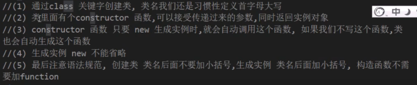
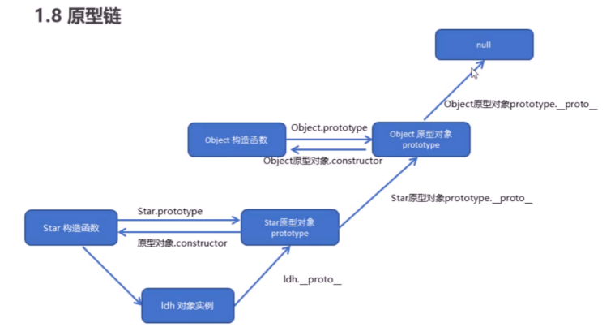
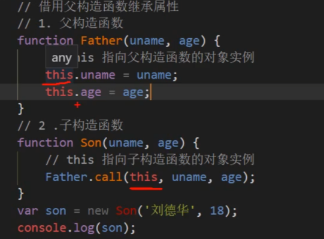
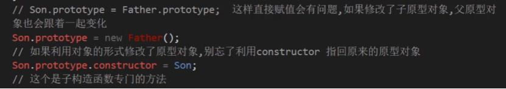

---
title: JS学习笔记(三)--面向对象+JS高级
date: 2021-01-11
tags:
 - js
categories:
 -  笔记
---   
##  面向对象+JS高级  
### Day 1  

1. 面向对象编程介绍  
    1. 面向过程 蛋炒饭  
        + 优点∶性能比面向对象高，适合跟硬件联系很紧密的东西，例如单片机就采用的面向过程编程  
        + 缺点∶没有面向对象易维护、易复用、易扩展  
    2. 面向对象(**继承性、多态性、封装性**) 盖浇饭  
        + 优点∶易维护、易复用、易扩展，由于面向对象有封装、继承、多态性的特性，可以设计出低耦合的系统，使系统更加灵活、更加易于维护  
        + 缺点︰性能比面向过程低  
2. ES6中的类和对象  
    1. 对象  
        + 对象是由属性和方法组成的，**对象特指某一个，通过类实例化一个具体的对象**  
    2. 类  
        + 类抽象了对象的公共部分，它泛指某一大类( class )  
    3. 面向对象的思维特点:  
        1. 抽取（抽象）对象共用的属性和行为组织(封装)成一个类(模板)  
        2. 对类进行实例化,获取类的对象  
            
        **类里面可以添加方法，不需要function关键词，多个方法之间不用逗号隔开**  
3. 类的继承  
    1. `class son extends Father {  } `子类继承父类的一些属性和方法  
    2. `super`关键字用于访问和调用对象父类上的函数。可以调用父类的构造函数，也可以调用父类的普通函数  
    3. 子类在构造函数中使用`super`,必须放到`this`前面(必须先调用父类的构造方法,在使用子类构造方法)  
    4. 在ES6中类没有变量提升，所以必须先定义类，才能通过类实例化对象  
    5. 类里面的共有的属性和方法一定要加this使用  
    6. `constructor`里面的`this`指向实例对象,方法里面的`this`指向这个方法的调用者  
### Day 2  
1. 构造函数  
    构造函数是一种特殊的函数，主要用来初始化对象，即为对象成员变量赋初始值，它总与`new`一起使用。我们可以把对象中一些公共的属性和方法抽取出来，然后封装到这个函数里面  
    + new在执行时会做四件事情:  
        1. 在内存中创建一个新的空对象。  
        2. 让this指向这个新的对象。  
        3. 执行构造函数里面的代码，给这个新对象添加属性和方法。  
        4. 返回这个新对象（所以构造函数里面不需要`return`)。  
    + 静态成员:在构造函数本身上添加的成员称为静态成员，只能由构造函数本身来访问·  
    + 实例成员:在构造函数内部创建的对象成员称为实例成员，只能由实例化的对象来访问  
    + 构造函数方法很好用，但是**存在浪费内存的问题**  
2. 原型  
    ES6之前通过构造函数+原型实现面向对象编程  
    1. 构造函数有原型对象`prototype`，默认指向**空`Object`对象**  
    2. 构造函数原型对象`prototype`里面有`constructor`指向构造函数本身  
    3. 构造函数可以通过原型对象添加方法  
    4. 构造函数创建的**实例对象有`__proto__`原型**指向构造函数的原型对象  
    5. **`__proto__`对象原型和原型对象`prototype`是等价的**  
    6. 对象原型(`__proto__`)和构造函数( `prototype` )原型对象里面都有一个属性`constructor`属性，`constructor`我们称为构造函数，因为它指回构造函数本身。  
    7. **如果我们修改了原来的原型对象,给原型对象赋值的是一个对象,则必须手动的利用`constructor`指回原来的构造函数**  
          
3. 组合继承  
    ES6之前并没有给我们提供`extends`继承。我们可以通过**构造函数+原型对象**模拟实现继承，被称为组合继承  
          
    + **如何从原型继承方法（<font color="red">两个要点</font>）**  
          
4. 类的本质  
    + **类的本质其实还是一个函数，我们也可以简单的认为类就是构造函数的另外一种写法**  
        1. 类有原型对象`prototype`  
        2. 类原型对象`prototype`里面有`constructor`指向类本身  
        3. 类可以通过原型对象添加方法  
        4. 所以ES6的类其实就是语法糖.    
5. ES5新增方法  
    1. `forEach`数组遍历  
        ```js
        arr.forEach(function (value,index,array) {
            console.log('每个数组元素' + value)
            console.log('每个数组元素的索引号' + index)
            console.log('数组本身' + array)
        })
        ```  
    2. `fiflter`方法  
        ```js  
        arr.fiflter(function(currentValue,index,arr))  
        ```  
        + `filter()`方法创建一个新的数组，新数组中的元素是通过检查指定数组中符合条件的所有元素,主要用于筛选数组  
        + **<font color="red">注意它直接返回一个新数组</font>**  
    3. `some`方法  
        + `some()`方法用于检测数组中的元素是否满足指定条件.通俗点查找数组中是否有满足条件的元素  
        + **<font color="red">注意它返回值是布尔值,如果查找到这个元素,就返回`true`，如果查找不到就返回`false`.</font>**  
        + 如果找到第一个满足条件的元素,则终止循环不在继续查找.  
        + **`Some`和`foreach`的区别**  
            1. 在`forEach`里面`return`不会终止迭代  
            2. 在`some`里面遇到 `return true`就是终止遍历迭代效率更高  
    4. `reduce`方法  
        +  `.reduce((累加的结果,当前循环项)=>( {  }，初始值)`  
        ```js
            const result = arr.filter(item =>item.state).reduce((amt,item)=>{
                return amt += item.price * item,count
            },0)
        ```  
    5. `trim()` 去除字符串前后的空白。  
    6. `Object.defineProperty`定义新属性或修改原有属性  
        ```js  
            Object.defineProperty(obj,'num',{
                value:1000
            }) 
            //>>第三个参数以对象书写    
            value:设置属性的值默认为undefined  
            writable:值是否可以重写。true | false 默认为false  
            enumerable:目标属性是否可以被枚举。true | false默认为false  
            configurable:目标属性是否可以被删除或是否可以再次修改特性true | false 默认为false
        ```   
    7. `Object.keys（）`  
        + 用于获取对象自身所有的属性，**返回一个由属性名（一层）组成的数组**   
### Day 3  
1. 函数的定义和调用方式  
    1. 函数声明方式`function`关键字(命名函数)  
    2. 函数表达式(匿名函数)  
    3. `new Function（'参数1’,’参数2’,’函数体’）`  
        + 所有函数都是`Function`的实例(对象)  
        + 所有的函数都是对象  
2. **call、apply和bind**  
    ```js
        fn.call(obj，'参数1'，'参数2')  
        fn.apply（obj，['参数1'，'参数2']） //与call的不同点是参数用伪数组传递  
            Math.max.apply（Math，arr）//可以用来求数组中的最值  
        fn.bind(obj，'参数1'，'参数2') //与call不同是他不会调用函数，返回原函数的拷贝  
    ```  
    ```js  
        var btns = document.querySelectorAll('button')
        for(var i = 0;i<btns.length;i++){
            btns[i].onclick = function(){
                this.disabled = true
                setTimeout(() => {
                    this.disabled = false
                }.bind(this),2000);
            }
        }  
    ```  
3. 严格模式  
    1. 为脚本开启严格模式  
        + `use strict `   //`'use strict'` 放在一个立即执行函数里第一行  
    2. 为函数开启严格模式  
        + 在某个函数里面第一行添加 `'use strict'`  
        + 严格模式语法变化  
            1. 我们的变量名必须先声明再使用  
            2. 我们不能随意删除已经声明好的变量  
            3. **严格模式下全局作用域中函数中的`this`是`undefined`**  
            4. 严格模式下,如果构造函数不加`new`调用,`this`会报错.  
            5. 定时器`this` 还是指向`window`  
            6. .函数不能有重名的参数  
            7. 不允许在非函数的代码块内声明函数。  
4. 高阶函数  
    + 高阶函数是对其他函数进行操作的函数，它**接收函数作为参数**或将**函数作为返回值**  
5. 闭包  
    + 闭包( closure )指有权**访问另一个函数作用域中变量**的函数。  
        1. 理解一:闭包是嵌套的内部函数(绝大部分人)  
        2. 理解二:包含被引用变量(函数)的对象(极少数人)  
    + 闭包的作用：  
        1. 闭包作为返回值，函数运行完成变量却不会被销毁。(延长了局部变量的生命周期)  
        2. 让函数外部可以操作(读与)到函数内部的数据(变量/函数)  
        3. 可以用来实现模块化或封装代码。  
6. 递归  
    + **函数内部自己调用自己，这个函数就是递归函数**  
    + **<font color="red">递归函数必须加退出条件</font>**  
    ```js  
        function fn(n) {  //利用递归求解 n！
            if(n == 1){  //递归退出条件
                return 1
            }
            return n * fn(n-1)
        }
    ```  
7. 浅拷贝和深拷贝  
    1. 浅拷贝只是拷贝一层,更深层次对象级别的只拷贝引用.  
        1. `Object.assign(o,obj)`;  
        2. `for in`  
    2. 深拷贝拷贝多层,每一级别的数据都会拷贝.  
        1. 递归（先判断数组在判断对象）  
            ```js  
                function deepClone(obj = {}){
                    //obj是null或者不是数组或者对象，直接返回
                    //注意此处typeof的是小写的object，null判断用的==而不是===
                    if(typeof obj !== 'object' || obj == null ){
                        return obj
                    } else {
                        let result
                        if(obj instanceof Array){
                            result = []
                        }else {
                            result = {}
                            for (let key in obj){
                                //保证key不是原型上的属性
                                if(obj.hasOwnProperty(key)){
                                    result[key] = deepClone(obj[key])
                                }
                            }
                        }
                        return result
                    }
                }
            ```
        2. `JSON`转字符串-->`JSON`转对象  
            ```js
                let newStr = JSON.stringfy(obj)
                let newObj = JSON.parse(newStr)
                return newObj  
            ```  
8. `let`和`const`  
    1. let不能重复定义变量，var可以重复定义变量。  
    2. let有块级作用域，var没有块级作用域。  
    3. let没有变量提升，但有暂时性死区  
    4. const是设置常量，也就是不能改变。const定义的数值字符串的时候值不能改变。  
    5. const定义的对象的时候，对象不能改变，但是对象的属性值可以改变。  
    + 对比  
        1. 使用var声明的变量，其作用域为该语句所在的函数内，且存在变量提升现象。  
        2. 使用let声明的变量，其作用域为该语句所在的代码块内，不存在变量提升。  
        3. 使用const声明的是常量，在后面出现的代码中不能再修改该常量的值。  
9. 数组解构  
    1. 数组解构允许我们按照一一对应的关系从数组中提取值  
    2. `let [a, b, c, d, e] = arr;`  
10. 对象解构  
    1. `let { name, age ) = person ;`  
    2. `let { name:Myname , age:Myage} = person;`  
11. 箭头函数  
    1. 一般会定义一个变量接收 `const fn =  ( ) => {  }`  
    2. **函数体中只有一句代码，且代码的执行结果就是返回值，可以省略大括号**  
        `const sum = (num1 , num2) => num1 + num2 ;`  
    3. 如果形参只有一个，可以省略小括号  
        `const fn = v => v;`  
    4. 箭头函数中可以形参用`…args`来接收不定数量的实参  
        `const sum = (…args) => { } `  
    5. `…s2`可以接收剩余所有解构属性  
        `let [s1, ...s2] = students `  
    6. 在调用函数时，浏览器每次都会传递进两个隐含的参数:  
        1. 函数的上下文对象this  
        2. 封装实参的对象arguments  
            + arguments是一个类数组对象,它也可以通过索引来操作数据，也可以获取长度  
            +  arguments.length可以用来获取实参的长度  
            + 我们即使不定义形参，也可以通过arguments来使用实参，只不过比较麻烦,arguments[0]表示第一个实参，arguments[1]表示第二个实参  
            + 它里边有一个属性叫做callee, 对应当前正在指向的函数的对象  
12. 扩展运算符  
    1. 扩展运算符可以将数组或者对象转为用逗号分隔的参数序列。  
    2. 扩展运算符可以应用于合并数组。  
        `let ary3 = [ ...ary1 , ...ary2];`  
        `ary1.push ( ...ary2) ;`  
    3. 将类数组或可遍历对象转换为真正的数组  `oDivs = [...oDivs];`  
13. array扩展方法  
    1. 构造函数方法: Array.from()  
        + 将类数组或可遍历对象转换为真正的数组  
        ```js  
            let arr2 = Array.from(arrayLike) ;  //   [ 'a','b','c']   
        ```  
        + 方法还可以接受第二个参数，作用类似于数组的map方法，用来对每个元素进行处理,将处理后的值放入返回的数组.  
        ```js  
            let newAry = Array.from(aryLike, item => item * 2)  
        ```  
    2. 实例方法:find()  
        + 用于找出第一个符合条件的数组成员，如果没有找到返回undefined  
        ```js  
             let target = ary.find ( (item,index)=>item.id == 2);  
        ```  
    3. 实例方法: findIndex()  
        + 用于找出第一个符合条件的数组成员的位置，如果没有找到返回-1  
        ```js  
            let index = ary.findIndex ( (value， index) => value > 9);
        ```  
    4. 实例方法: includes()  
        + 表示某个数组是否包含给定的值，返回布尔值。  
        ```js  
            [1，2，3].includes(2)  //  true  
        ```  
14. String的扩展方法  
    1. 实例方法: startsWith()和endsWith()  
        ```js  
            startsWith()://表示参数字符串是否在原字符串的头部，返回布尔值
            endsWith()://表示参数字符串是否在原字符串的尾部，返回布尔值  
        ```  
    2. 实例方法: repeat()  
        + repeat方法表示将原字符串重复n次，返回一个新字符串。  
        ```js  
            'x'.repeat (3)   //  "xxx"  
        ```  
    3. indexof()和lastIndexOf();  
        + 检索一个字符串中是否含有指定内容, 如果字符串中含有该内容，则会返回其第一次出现的索引,如果没有找到指定的内容，则返回-1  
        + 可以指定一个第二个参数，指定开始查找的位置  
    4. split（）  
        + 可以将一个字符串拆分为一个数组  
        + 需要一个字符串作为参数，将会根据该字符串去拆分数组, 如果传递一个空串作为参数，则会将每个字符都拆分为数组中的一个元素  
15. 使用instanceof可以检查一个对象是否是一个类的实例  
    + 对象instanceof构造函数  
    + 如果是，则返回true，否则返回false  
    + 所有的对象都是Object的后代，  
    + 所以任何对象和Object在instanceof检查时都会返回true  
16. set数据结构  
    1. ES6提供了新的数据结构Set。它是类数组，成员的值都是唯一的。  
    2. Set本身是一个构造函数，用来生成Set 数据结构。`const s = new Set () ;`  
    3. Set函数可以接受一个数组作为参数，用来初始化。 `const set = new set ( [1,2,3,4,4]);`  
    4. **利用set数据结构做数组去重**  
        ```js  
            const s3 = new Set([ "a","a","b","b"]);  
            const ary = [...s3];  //['a','b']  
        ```  
    5. 实例方法  
        ```js  
            add(value)://添加某个值，返回Set结构本身  
            delete(value)://删除某个值，返回一个布尔值，表示删除是否成功  
            has(value)://返回一个布尔值，表示该值是否为Set的成员  
            clear()://清除所有成员，没有返回值  
        ```  
17. 垃圾回收（GC)  
    1. 就像人生活的时间长了会产生垃圾一样，程序运行过程中也会产生垃圾,这些垃圾积攒过多以后，会导致程序运行的速度过慢，所以我们需要一个垃圾回收的机制，来处理程序运行过程中产生垃圾.  
    2. 当一个对象没有任何的变量或属性对它进行引用，此时我们将永远无法操作该对象，此时这种对象就是一个垃圾，这种对象过多会占用大量的内存空间，导致程序运行变慢，所以这种垃圾必须进行清理。  
    3. 在JS中拥有自动的垃圾回收机制，会自动将这些垃圾对象从内存中销毁，我们不需要也不能进行垃圾回收的操作  
    4. **我们需要做的只是要将不再使用的对象设置null即可**


 


