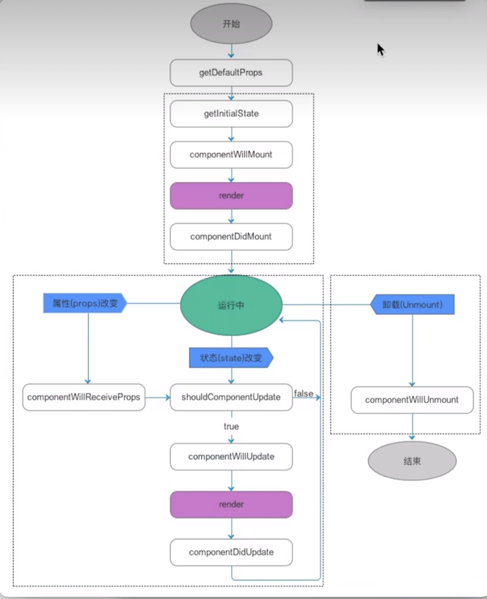

---
title: React学习笔记
date: 2023-5-8
tags:
 - React
categories:
 -  笔记
---     

##  React学习笔记   

### **项目搭建**    
1. 安装脚手架:`npm i create-react-app -g` mac前面要设置sudo   
2. 检查安装情况：`create-react-app --version`   
3. 基于脚手架创建React工程化项目:`create-react-app 项目名称`,项目名称遵循npm命名规范  `数字 小写字母  _`    
4. **React项目中默认安装**    
    + `react` 框架核心    
    + `react-dom` 视图渲染的核心，基于react构建webapp（html页面）
    + `react-native` 构建和渲染app的    
    + `react-scripts`:脚手架为了让项目目录看起来干净一些，把webpack打包的规则及相关的插件/loader等都隐藏到了`node_modules`目录下，`react-scripts`就是脚手架中自己对打包命令的一种封装，基于它打包，会调用`node_modules`中的webpack来进行打包        
    + `web-vitals`:性能检测工具   
    + `eslintConfig`：  
          + 对webpack中ESlint词法检测的相关配置   
          + 词法错误---不符合标准规范   
          + 符合标准，代码本身不会报错，但是不符合ESlint的检测规范    
    + `browserslist`：基于browserslist规范，设置浏览器的兼容情况    
          1. 对`postcss-loader + autoprefixer`生效，会给CSS3设置相关的前缀   
          2. 对`babel-loader`生效，会把ES6编译成ES5         
          3. 无法处理ES6内置API的兼容，我们需要`@babel/polyfill`对常见内置的API重写了     
          4. 脚手架中内置兼容处理`react-app-polyfill`
5. **`scripts`命令**    
      + `start` ：开发环境--在本地启动web服务器，预览打包内容   
      + `build` ：生产环境--打包部署，打包的内容输出到dist目录中    
      + `test` ：单元测试   
      + `eject` : 暴露`webpack`配置规则，修改默认打包规则           

6. **处理跨域**       
      + 安装`http-proxy-middleware`       
      + `src/setupProxy.js`         
        ```js       
                  //处理跨域问题  跨域代理
                  const {createProxyMiddleware} = require('http-proxy-middleware')
                  module.exports = function(app){
                  app.use(
                  createProxyMiddleware('/jian',{
                        target:'https://www.jianshu.com/asimov',
                        changeOrigin:true,
                        ws:true,
                        pathRewrite:{"^/jian" : ''}
                  })
                  );
                  app.use(
                  createProxyMiddleware('/zhi',{
                        target:'https://news-at.zhihu.com/api/4',
                        changeOrigin:true,
                        ws:true,
                        pathRewrite:{"^/zhi" : ''}
                  })
                  )
                  }      
        ```         

### **React基础**      

1. **MVC与MVVM**            
      1. React采用的是MVC体系，Vue采取的是MVVM体系           
      2. MVC：model数据层 + view视图层 + controller控制层 （单向数据驱动视图）   
            + 我们需要按照专业的语法去构建视图（页面）：react中是基于jsx语法来构建视图的        
            + 构建数据层：但凡在视图中，需要'动态'处理的（获取需要变化的，不论是样式还是内容），我们都要有对应的数据模型           
            + 控制层：当我们在视图中进行某些操作时，修改了相关数据，react会根据最新的数据重新渲染      
      3. MVVM：model数据层 + view视图层 + viewModel数据/视图监听层 （双向数据驱动视图）      

2. **JSX构建视图的基本知识（javascript and xml）**  
      1. vscode如何支持JSX语法（格式化、快捷提示）
          + 右下角修改成jsx语言格式       
          + 后缀名改成jsx
      2. 在HTML中嵌入"js表达式"，需要使用`{}单胡子语法`
      3. 在`ReactDOM.createRoot()`的时候，不能直接把`HTML/body`作为根容器，需要指定一个额外的盒子，例如`#root`          
      4. 每个构建的视图中，只能有一个根节点           
            + react提供了一个特殊的空文档标记标签`<>React.Fragment</>`        
      5. **<font color='red'>胡子语法中嵌入不同的值，所呈现的特点</font>**          
            1. `number/string`：直接渲染值            
            2. `Boolean/null/undefined/Symbol/Bigint`:渲染内容是空            
            3. 对象：一般不支持渲染，也有特殊情况           
                  + JSX虚拟DOM对象`{React.createElement('button',null,'提交')}`                  
                  + 给元素设置style行内样式，要求必须写成一个对象格式       
            4. 数组对象：把数组每一项分别拿出来渲染，**<font color='red'>并不是变为字符串渲染，中间没有逗号</font>**
            5. 函数对象：不支持在`{}`中渲染，但是可以作为函数组件，用`<Component/>`方式渲染           
      6. **给元素设置样式**         
            1. 行内样式：需要基于**胡子语法 + 对象格式**处理            
                ```jsx
                      <h2 style={{
                        color:'red',
                        fontSize:'18px' //样式属性要基于驼峰命名法处理
                      }}>{text}</h2>      
                ```           
            2. 设置样式类名：需要把`class`替换为`className`       
                  ```jsx        
                        <h2 className='title'></h2>    
                  ```         
      7. 需求案例       
            1. 需求一：基于数据的值，来判断元素的显示隐藏         
                  ```jsx
                        {/* 控制元素的display样式，元素渲染出来了 */}
                        <button style={{
                        display:flag?'block':'none'
                        }}>按钮1</button>

                        {/* 控制元素渲染或者不渲染 */}
                        {!flag ? <button>按钮2</button> :null}
                  ```         
            2. 需求二: 从服务器获取了一组列表数据，循环动态绑定相关的内容           
                  ```jsx         
                        <h2 className='title'>今日新闻</h2>
                        <ul className='news-box'>
                        {list.stories.map((item,index)=>{
                        /*循环创建的元素设置key属性，优DOM-diff*/ 
                        return   <li key={item.id}>
                              <em>{index + 1}</em>
                              &nbsp;&nbsp;
                        <span>欢迎大家学习{item.title}</span>
                        </li>
                        })}
                        </ul>
                  ```         
            3. 扩展需求：没有数组，就想单独循环五次         
                  ```jsx  
                        //需要使用fill，将稀疏数组填充成密集数组
                        {new Array(5).fill(null).map((_,index) => {return <button key={index}>
                                    按钮{index + 1}
                                    </button>
                        })}          
                  ```         

3. **JSX底层渲染机制**        
      1. 把我们编写的JSX语法，基于`babel-preset-react-app`为`React.createElement(...)`这种格式！
           + 只要是元素节点，必然会基于`createElement`进行处理          
           + `React.createElement(ele,props,...children)`         
                  + `ele`:元素标签名（或组件）
                  + `props`：元素的属性集合对象（如果没有设置过任何属性则为`null`）     
                  + `children`：第三个往后都是当前元素的子节点 
      2. 再把`createElement`执行创建出虚拟DOM对象（virtualDOM，也有称之为：jsx元素、jsx对象、ReactChild对象...）
            ```js
                  export function createElement(ele,props,...children) {
                        let virtualDOM = {
                              $$typeof:Symbol('react.element'),
                              key:null,
                              ref:null,
                              type:null,
                              props:{}
                        }
                        let len = children.length
                        virtualDOM.type = ele
                        if(props != null){
                              virtualDOM.props = {
                              ...props
                              }
                        }
                        if(len === 1) virtualDOM.props.children = children[0]
                        if(len > 1) virtualDOM.props.children = children
                        return virtualDOM
                  }
            ```
      3. 把构建的虚拟DOM渲染为真实DOM（基于`ReactDOM`中的`render`方法）       
            + v16
              ```jsx 
                        ReactDOM.render(
                              <>...</>,
                              document.getElementById('root')
                        )
              ```
            + v18
              ```jsx 
                        const root = ReactDOM.createRoot(document.getElementById('root'))
                        root.render(
                              <>...</>,
                        )
              ```
      4. 第一次渲染页面是直接从Vdom-->真实dom，并且把`oldVdom`缓存起来，后期视图更新的时候，需要经过一个新老Vdom的 `dom--diff`的对比，计算出补丁包`Patch`（两次视图差异的部分），把patch补丁包进行渲染      


## **React组件**

### 函数组件

1. **基本使用**         
     + 创建：在src目录中，创建一个xxx.jsx的文件，就是要创建一个组件，我们在此文件中，**创建一个函数，让函数返回jsx视图（或者jsx元素，VDOM对象），这就是创建一个函数组件**           
     + 调用：基于ES6Module规范，导入创建的组件
     + **双闭合调用区别：我们可以传递子节点，传递给函数的props中，有一个children属性存储这些子节点**
     + 调用组件的时候，我们可以传递各种属性，**如果属性值不是字符串，需要用胡子语法嵌套**
     + **底层渲染的主要区别就是，函数组件的type属性值不是字符串，而是一个函数，他会把函数执行，把Vdom中的props作为实参，传给了函数**

2. **属性props的处理**        
      1. 调用组件，传递进来的属性是‘只读’的，**对象是被冻结的**
      2. 关于对象的规则设置         
            + 冻结：**被冻结的对象不能修改成员值，不能删除现有成员，不能新增成员，不能给成员做劫持`Object.defineProperty`**
              ```js 
                  Object.freeze(obj) //冻结对象
                  Object.isFrozen(obj)  //检测是否被冻结      
              ```         
            + 密封：**可以修改成员值，不能新增，不能删除，不能劫持**
              ```js     
                  Object.seal(obj) //密封对象
                  Object.isSealed(obj)  //检测是否被密封     
              ```         
            + 扩展:**不可扩展的对象不能新增成员，其他都可以**
              ```js     
                  Object.preventExtensions(obj) //把对象设置为不可扩展
                  Object.isExtensible(obj)  //检测是否可扩展
              ```  
      3. 虽然不能修改props，但是可以做规则校验,**不影响使用，但是校验错误会抛出警告**                 
            ```js     
                  import PropTypes from 'prop-types'
                  const DemoOne = function Demo(props){
                        let {className,style,title} = props
                        return <div className={`demo-box ${className}`} style={style}>
                              我是DEMO-ONE
                              <div>{title}</div>
                        </div>
                  }
                  DemoOne.defaultProps = {//把函数当做对象，设置静态的私有属性方法，来设置校验规则
                        title:'默认值'
                  }
                  DemoOne.propTypes = {  //设置其他规则依赖官方插件prop-types
                        title:PropTypes.string.isRequired, //类型是字符串 必传
                        x:PropTypes.number  //类型是数字
                        y:PropTypes.oneOfType([//多种校验规则中的一个
                        PropTypes.number,
                        PropTypes.string    
                        ])
                  }
                  export default DemoOne  
            ```

3. **插槽机制**         
      1. 和属性作用是一致的：让组件具备更强的复用性         
      2. 传递数据用属性，传递结构用插槽，通过子节点用`children`来获取
            ```jsx
                  //父组件
                  <DemoOne className='demo1'  style={{
                        color:'red'
                        }} >
                        <span  slot='footer'>我是尾部2</span>
                        <span  >我是moren</span>
                        <span slot='header'>我是头部</span>
                        <span  slot='footer'>我是尾部1</span>
                  </DemoOne>
                  //子组件
                  import React from 'react'
                  const DemoOne = function Demo(props){
                        let {children} = props
                        //要对children的类型做处理
                        //可以基于React.Children对象中提供的方法，对props.children做处理
                        //count/forEach/map/toArray这些方法的内部，已经对children的各种形式做了处理
                        children = React.Children.toArray(children)
                        let headerSlot = [],
                        footerSlot = [],
                        defaultSlot =[]
                        children.forEach(child =>{
                        //传递进来的插槽信息，都是编译为Vdom对象，而不是传递的标签
                              console.log(child);
                              let {slot} = child.props
                              if(slot === 'header'){ //按照插槽名字 进行筛选不同的插槽信息
                                    headerSlot.push(child)
                              }else if(slot === 'footer'){
                                    footerSlot.push(child)
                              }else{
                                    defaultSlot.push(child)
                              }
                        })
                        return <div className='demo-box' >
                              {headerSlot}
                              <div>我是DEMO-ONE</div>
                              {footerSlot}
                              {defaultSlot}
                              </div>
                  }
            ```

4. **封装一个Dialog组件**           
      ```jsx
            import PropTypes from 'prop-types'
            import React from 'react'
            const Dialog = function Dialog(props) {
            let {title,content,children} = props
            children = React.Children.toArray(children)
            let submitSlot = [],defaultSlot=[]
            let count = React.Children.count(children)
            children.forEach(child =>{
            let {slot} = child.props
            if(slot === 'submit'){
                  submitSlot.push(child)
            }else{
                  defaultSlot.push(child)
            }
            console.log(child,submitSlot,defaultSlot);
            })
            return <div className='dialog-box'  style={{
                  border:'1px solid red',
                  padding:'10px',
                  width:300,
                  height:'300px'
            }}>
                  <p style={{
                  borderBottom:'1px solid #000',
                  }}>{title}</p>
                  <p>{content}</p>
                  {
                  count > 0 ? <><div>{submitSlot}</div> <div>{defaultSlot}</div></> :null
                  }
            </div>
            }
            //属性规则校验
            Dialog.defaultProps = {
            title:'提示'
            }
            Dialog.propTypes = {
            title:PropTypes.string,
            content:PropTypes.string.isRequired 
            }
            export default Dialog
            //父组件渲染
              root.render(
                  <>
                        <Dialog title='温馨提示' content='大家出门做好防护！'></Dialog>
                        <Dialog  content='这是一个没有标题的dialog'>
                        <button>确定</button>
                        <button>yes</button>
                        </Dialog>
                        <Dialog  content='这是一个提交弹窗'>
                        <button slot='submit'>提交</button>
                        </Dialog>
                  </>
            );
      ```

### **静态组件和动态组件**          

1. **区别**       
      + 函数是**静态组件**        
         + **第一次渲染组件，把函数执行，产生一个私有的上下文：EC(V)**，把解析出来的props（含children）传递进来，但是**被冻结了**，对函数返回的JSX元素（vdom）进行渲染
         + 当我们点击按钮时，会把绑定的小函数执行，修改上级上下文EC(V)中的变量，**私有变量值改变了，但是不会更新视图**      
         + 无法自更新，除非调用它的父组件更新了，那么相关的子组件也一定会更新「可能传递最新的属性值进来」
         + 函数组件具备：属性...「其他状态等内容几乎没有」
         + 优势：比类组件处理的机制简单，这样导致函数组件渲染速度更快！！
      + 类组件是**动态组件**：
         + 组件在第一渲染完毕后，除了父组件更新可以触发其更新外，我们还可以通过：`this.setState`修改状态 或者 `this.forceUpdate` 等方式，让组件实现“自更新”！！
         + 类组件具备：属性、状态、周期函数、ref...「几乎组件应该有的东西它都具备」
         + 优势：功能强大！！
      + Hooks组件「推荐」：具备了函数组件和类组件的各自优势，在函数组件的基础上，基于hooks函数，让函数组件也可以拥有状态、周期函数等，让函数组件也可以实现自更新「动态化」！！

2. **类组件**           
      1. 创建类组件：创建一个构造函数（类）
         + 要求必须继承`React.Component/PureComponent`这个类
         + 必须给当前类设置一个render的方法（放在其原型上）        
            ```js  
                  import React from 'react'     
                  class Sub extends React.Component{
                        render(){
                              return <></> //在render方法中，返回需要渲染的视图
                        }
                  }  
                  export default Sub
            ```
     
      2. class基本语法回顾          
            ```js       
                  class Parent {
                        //new的时候，执行的构造函数（需要接收传递进来的实参信息，才需要设置constructor）
                        constructor (x,y){
                              //this --> 创建的实例
                              this.total = x+y
                        }
                        // = 赋值--> 相当于this.num = 200-->创建的实例
                        num = 200
                        //箭头函数没有自己的this，所用到的this是宿主环境中的
                        getNum = ()=>{  
                              console.log(this.num);//this-->实例
                        }
                        //给Parent.prototype设置的公共方法，不可枚举
                        getNum2 (){
                              console.log(this,'原型');
                        }
                        //把构造函数当做一个普通对象，为其设置静态的私有属性方法 Parent.xxx
                        static avg = 100  
                        static average(){}
                  }
                  Parent.prototype.y = 200 //外部手动给原型上设置公共属性

                  /*基于extends实现继承  
                  1. 首先基于call继承 React.Component.call(this)  -->  this-->Parent类的实例P 

                  2.给创建的实例p设置四个私有属性  

                  3. 再基于原型继承 Parent.prototype.__proto__ === React.Component.prototype
                  实例-->Parent.prototype-->React.Component.prototype-->Object.prototype
                  继承forceUpdate isReactComponent setState方法

                  4.只要自己设置了constructor，则内部第一句话一定要执行super() 
                  */ 
                  class Parent extends React.Component{
                        constructor(n,m){
                              super() //等价于React.component.call()
                        }
                  } 
                    
                  function Component(props,context,updater){
                        this.props = props
                        this.context = context
                        this.refs = emptyObject
                        this.updater = updater || ReactNoopUpdateQueue
                  }
            ```
      
      3. render函数在渲染的时候，如果type是：
            + 字符串：创建一个标签
            + 普通函数：把函数执行，并且把props传递给函数，**每次执行会创造新的执行上下文，所以多个组件不影响**
            + 构造函数：把构造函数基于new执行，也会把解析出来的props传递过去，
                + **每次执行会创造新的实例，所以多个组件不影响**
                + 把类组件中的render函数执行，把返回的jsx渲染
      
      4. 调用类组件（new Vote({..})）开始，类组件内部发生的事情
            ```js
                  /*1. 规则校验 && 属性初始化
                      方案一：super(props)
                      方案二：不在constructor中处理或者不写constructor，React也会在内部把传递的props挂载到实例上，所以在其它函数中，只要保证this是实例，就可以基于this.props获取传递的属性
                        */
                  class Parent extends React.Component{
                        constructor(props){
                              super(props) //会把传递进来的属性挂载到this实例上
                              console.log(this.props)//获取到传递的属性
                        }
                        //属性规则校验
                        static defaultProps = {
                              num:0
                        }
                        static propTypes = {
                              title:PropTypes.string.isRequired
                        }
                  }    
                  /* 2.初始化状态 
                              1. 需要手动初始化，如果我们没有去做相关的处理，则默认会在实例上挂载一个state：null
                              state = {
                                    ...
                              }
                              2. 修改状态，视图更新
                                    1. this.state.xxx = xxx  只能修改状态，不能视图更新
                                    2. this.setState(partialState) 既可以修改状态，也可以让视图更新
                                    this.setState({
                                          xxx:xxx,
                                    })
                                    3. this.forceUpdate()强制更新
                  */     
            ```
      
      5. 类组件第一次渲染过程 && 视图更新过程
            ```js
                  /*
                  1. 第一次渲染过程
                        + 触发 `UNSAFE_componentWillMount`钩子函数:组件第一次渲染之前
                        + 为了不抛出黄色警告，可以暂时用`UNSAFE_componentWillMount`,React严格模式使用UNSAFE则会抛出红色警告           
                        + 触发`render`周期函数
                        + 触发`componentDidMount`钩子函数：第一次渲染完毕 
                  */
                 /*    
                 2. 组件更新的逻辑「第一种：组件内部的状态（state）被修改，组件会更新」       
                        + 触发`shouldComponentUpdate`，
                        特殊说明：this.forceUpdate()会跳过shouldComponentUpdate校验  
                        + 触发`UNSAFE_componentWillUpdate`
                        + 触发`render`
                        + 触发`componentDidUpdate`
                   组件更新的逻辑「第二种：父组件更新（props改变），触发的子组件更新」
                        + 触发 UNSAFE_componentWillReceiveProps 周期函数：接收最新属性之前
                        + ...
                  */
                 /*
                   3.组件卸载的逻辑
                        1. 触发 componentWillUnmount 周期函数：组件销毁之前
                        2. 销毁
                 */
                  render () {
                        console.log('render渲染')
                  }
                  UNSAFE_componentWillMount () {
                        console.log('componentWillMount:第一次渲染之前')
                  }
                  componentDidMount () {
                        console.log('componentDidMount:第一次渲染完毕')
                  }
                  shouldComponentUpdate (nextProps, nextState) {
                        //nextState:存储要修改的最新状态
                        //this.state：存储的还是修改前的状态，此时还未改变状态
                        console.log('shouldComponentUpdate,是否允许修改，更新之前', nextProps, nextState, this.state)
                        //此周期函数需要返回true(允许更新)/false(不允许更新)
                        return true
                  }
                  UNSAFE_componentWillUpdate () {
                        console.log('componentWillUpdate,状态还未修改，更新之前')
                  }
                  componentDidUpdate () {
                        console.log('componentDidUpdate,状态已经修改，更新完毕')
                  }
                  UNSAFE_componentWillReceiveProps (nextProps) {
                        console.log('componentWillReceiveProps,父组件修改特殊周期', this.props, nextProps)
                  }
            ```
      
      6. 父子组件生命周期顺序       
            + 父子组件嵌套，处理机制上遵循深度优先原则：父组件在操作中，遇到子组件，一定是把子组件处理完，父组件才能继续处理
            + 父组件第一次渲染
                  父 willMount --> 父 render「子 willMount --> 子 render --> 子didMount」 --> 父didMount 
            + 父组件更新：
                  父 shouldUpdate --> 父willUpdate --> 父 render 「子willReceiveProps --> 子 shouldUpdate --> 子willUpdate --> 子 render --> 子 didUpdate」--> 父 didUpdate
            + 父组件销毁：
                  父 willUnmount --> 处理中「子willUnmount --> 子销毁」--> 父销毁
            
      
      7. `PureComponent`和`Component`的区别
            + `PureComponent`会给类组件默认添加`shouldComponentUpdate`周期函数
                  1. 在此周期函数中，他对新老的属性进行浅比较     
                  2. 如果比较后发现属性和状态没有变，则返回false，也就不执行后续生命周期了      
            
      8. ref  
            + 受控组件：基于修改数据/状态，让视图更新，达到需要的效果
            + 非受控组件：基于ref获取dom元素，操作dom来实现需求
            + 基于ref获取DOM的语法        
                  1. 元素设置`ref='xxx'`,通过`this.refs.xxx`来获取            
                  2. 把ref属性设置为一个函数`ref =（x=>this.xxx = x）`，直接通过`this.xxx`来获取（推荐）
                  3. 基于`xxx = React.createRef()`创建一个对象-->`{current:null}`,设置`ref = {xxx}`,通过`this.xxx.current`来获取
            + 给元素标签设置ref获取对应的dom元素
            + **给类组件设置ref，获取的是当前组件的实例**
            + 给函数组件直接设置ref会报错，但是我们让其配合`React.forwardRef`实现ref的转发，可以获取函数子组件内部的某个元素
                ```js
                     const Child = React.forwardRef(function(props,ref){
                        return <button ref={ref}></button>
                     })
                     //父组件
                     render(){
                        return <Child ref={x=>this.child = x}></Child>
                     }
                     console.log(this.child)
                ```

### setState进阶        
1. 语法分析       
      ```js
            this.setState(partialState,callback)
            partialState:支持部分状态更改
            callback:在状态更改/视图更新完毕（componentDidUpdate）后触发执行，如果shouldComponentUpdate拦截更新，componentDidUpdate不会执行，但是callback依旧会执行！！！
            类似于$nextTick
      ```
2. 异步更新       
      + 在`React18`中，产生的私有上下文中，遇到`setState`,不会立即更新状态和视图，而是加入到更新队列`updaterQueue`中。
      + 当上下文中代码都处理完毕后，会让更新队列中的任务，统一渲染/更新一次（批处理）
      + 能够有效减少更新次数，降低性能消耗，有效管理代码执行的逻辑顺序