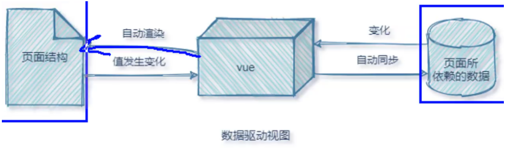

---
title: Vue学习笔记(一)--基础概念、基本指令
date: 2021-1-12
tags:
 - Vue
categories:
 -  笔记
---   
## Vue学习笔记(一)--基础概念、基本指令  
### 基础概念  
1. vue特性  
    1. **<font color='red'>数据驱动视图</font>**  
        + 数据的变化会驱动视图自动更新  
        + 好处:程序员只管把数据维护好，那么页面结构会被vue自动渲染出来!  
        + 注意:数据驱动视图是<font color='red'>**单向的数据绑定**</font>。  
    2. **<font color='red'>双向数据绑定</font>**  
        + 在网页中，form表单负责采集数据，Ajax负责提交数据。  
        + 好处:开发者**不再需要手动操作DOM元素**，来获取表单元素最新的值!  
            
2. MVVM  
    + MVVM是vue实现数据驱动视图和双向数据绑定的核心原理。MVVM指的是Model、View和ViewModel  
    + Model表示当前页面渲染时所依赖的数据源。  
    + View表示当前页面所渲染的DOM结构。  
    + ViewModel表示vue的实例，它是MVVM的核心。  
3. vue的基本使用  
    1. 导入vue.js 的script脚本文件  
    2. 在页面中声明一个将要被vue所控制的DOM区域  
    3. 创建vm 实例对象（vue 实例对象)  
###  常用指令  
1. 内容渲染指令  
    + `v-text`:会覆盖元素原有内容  
    + `v-html`:可以把带标签的字符串，渲染真正的html内容  
    + `{{ }}`: 插值表达式,内容占位符 (只能用在元素的内容节点,不能用于属性节点)  
    + 在插值语法和属性绑定里，可以使用JS表达式  
    ```js  
      {{number + 1}}
      {{ok ? "YES" :"NO"}}
      {{message.split("").reverse().join(' ')}}  
    ```  
2. 属性绑定指令  
    + `v-bind:属性名`	为元素的属性动态绑定值（可以简写成`:`）  
    ```js  
        //在使用v-bind属性绑定期间，如果绑定内容需要进行动态拼接，则字符串的外面应该包裹单引号，例如;
          <div :title="'box' + index">这是一个div</div>  
    ```  
3. 事件绑定指令  
    + `v-on:事件名称="事件处理函数(定义在methods中)"`，可以简写成`@ `  
    + 事件修饰符：		示例：`@click.prevent=''`  修饰符可以连续写  
    ```js  
        .prevent //阻止默认行为（例如:阻止a连接的跳转、阻止表单的提交等)
        .stop //阻止事件冒泡
        .capture//以捕获模式触发当前的事件处理函数
        .once //绑定的事件只触发1次
        .self //只有在event.target是当前元素自身时触发事件处理函数
        .passive://事件的默认行为立即执行，无需等待事件回调执行完毕:  
    ```  
    + 按键修饰符：    示例：`@keyup.enter=''`   
    ```js  
          delete //(“删除”和“退格”键)
          tab//(特殊，必须配合keydown去使用)
          //系统修饰健（用法特殊）:ctrl、alt、 shift、 meta
          (1).配合keyup使用:按下修饰健的同时，再按其他健，随后释放，事件才触发
          (2).配合keydown使用:正常触发事件。  
    ```  
4. 双向绑定指令（表单元素使用才有意义）  
    + `v-model=''` 用来辅助开发者在不操作DOM的前提下，快速获取表单的数据。  
    1. `<input type="text"/>`，则v-model收集的是value值，用户输入的就是value值。  
    2. `<input type="radio"/>`，则v-model收集的是value值，且要给标签配置value值。  
    3. `<input type="checkbox"/>`  
        1. 没有配置input的value属性，那么收集的就是checked（是布尔值)   
        2. 配置input的value属性:  
            1. v-model的初始值是非数组，那么收集的就是checked(是布尔值)  
            2. v-model的初始值是数组，那么收集的的就是value组成的数组  
    4. v-model的三个修饰符:  
    ```js  
      .lazy://失去焦点再收集数据
      .number://输入字符串转为有效的数字
      .trim://输入首尾空格过滤  
    ```  
5. 条件渲染指令（按需控制DOM的显示与隐藏）v-if / v-show 的区别  
    1. 实现原理不同:  
        + v-if 指令会动态地创建或移除DOM元素   
        + v-show指令会动态为元素添加或移除`style=" display: none;"`样式  
    2. 性能消耗不同:  
        + v-if有更高的切换开销，而v-show有更高的初始渲染开销。因此:  
        + 如果需要非常频繁地切换，则使用v-show较好  
        + 如果在运行时条件很少改变，则使用v-if 较好  
    3. v-if、v-else-if、v-else不需要加条件判断，三者可以配合使用  
6. 列表渲染指令 (基于一个数组来循环渲染一个列表结构)  
  ```js  
    v-for="(item,index)in xxx" :key="item.id"  
  ```  
      + 如果遍历对象则为`v-for="(value,k) in xxx"`  
      + 加key的作用： 
          1. 正确维护列表的状态  
          2. 复用现有的DOM元素，提升渲染的性能
      + **<font color='red'>key的注意事项:</font>**  
          1. key的值只能是**字符串**或**数字**类型  
          2. key的值**必须具有唯一性**（即:key的值不能重复)  
          3. 建议把**数据项id属性的值**作为key的值（因为id属性的值具有唯一性)  
          4. 使用**index的值**当作key的值**没有任何意义**（因为index的值不具有唯一性)  
          5. 建议使用v-for指令时要**指定key的值**（既**提升性能、又防止列表状态紊乱**)  
      + **<font color='red'>面试题:react. vue中的key有什么作用?(key的内部原理)</font>**  
          1. 虚拟DOM中key的作用:  
              + key是虚拟DOM对象的标识，当数据发生变化时，Vue会根据【新数据】生成【新的虚拟Ddl,随后Vue进行【新虚拟DOM】与【旧虚拟DOM】的差异比较，比较规则如下:  
          2. 对比规则:  
              1. 旧虚拟DOM中找到了与新虚拟DOM相同的key:  
                  + 若虚拟DOM中内容没变,直接使用之前的真实DOM!  
                  + 若虚拟DOM中内容变了，则生成新的真实DOM，随后替换掉页面中之前的真实DON.  
              2. 旧虚拟DOM中未找到与新虚拟DOM相同的key  
                  + 创建新的真实DOM，随后渲染到到页面。  
          3. 用index作为key可能会引发的问题:  
              1. 若对数据进行:逆序添加、逆序删除等破坏顺序操作:  
                  + 会产生没有必要的真实DOM更新==>界面效果没问题,但效率低。  
              2. 如果结构中还包含输入类的DOM:  
                  + 会产生错误DOM更新==〉界面有问题。  
          4. 开发中如何选择key? :  
              1. 最好使用每条数据的唯一标识作为key，比如id、手机号、身份证号、学号等唯一值。  
              2. 如果不存在对数据的逆序添加、逆序删除等破坏顺序操作，仅用于渲染列表用于展示，使用index作为key是没有问题的。  
7. 其他指令  
    1. `v-cloak`指令（没有值）  
        + 本质是一个特殊属性,Vue实例创建完毕并接管容器后，会删掉v-cloak属性。  
        + 使用css配合v-cloak可以解决网速慢时页面展示出`{{xxxx}}`的**页面闪烁问题**。  
    2. `v-once`指令（没有值）  
        + `v-once`所在节点在初次动态渲染后，就视为静态内容了。  
        + 以后数据的改变不会引起v-once所在结构的更新，可以用于优化性能。  
    3. `v-pre`指令（没有值）  
        + 跳过其所在节点的编译过程。  
        + 可利用它跳过:没有使用指令语法、没有使用插值语法的节点会加快编译。  
8. 自定义指令  
    1. 定义语法:  
        1. 局部指令:  
          ```js  
            new Vue({directives:{指令名:配置对象}})  
            new Vue({directives(){  }})  
          ```  
        2. 全局指令:  
          ```js  
            Vue.directive(指令名,配置对象)  
            Vue.directive(指令名,回调函数)  
          ```  
    2. 配置对象中常用的3个回调:  
        1. `.bind`:指令与元素成功绑定时调用。（**bind函数只调用1次**）  
        2. `.inserted`:指令所在元素被插入页面时调用。  
        3. `.update`:指令所在模板结构被重新解析时调用。  
    3. 备注:  
        1. 指令定义时不加`v-`，但使用时要加`v-`;  
        2. 指令名如果是多个单词，要使用kebab-case命名方式，不要用camelCase命名。  
        3. 回调中第一个形参**el**表示当前指令所**绑定到的那个真实DOM对象**，形参中的**第二个参数binding，来接收参数**  
        4. 如果**bind**和**update**函数中的**逻辑完全相同**，则**对象格式的指令**可以写成**函数格式**:  
### 注意事项  
  1. el属性是固定的写法，表示当前vm 实例要控制页面上的哪个区域  
  2. data对象就是要渲染到页面上的数据  
  3. methods的作用，就是定义事件的处理函数  
    + methods中的方法可以写成`add:function( ){ }`,也可以简写成`add( ){ }`,可以传参  
  4. vue提供了内置变量，名字叫做`$event`，它就是原生DOM的事件对象e,如果传参的话，注意写成`@click='add(n，$event)'`,如果不传参直接在methods中用e即可  
  5. 给checkbox绑定v-model时可以用<font color='red'>**for+id的组合**</font>提升用户体验，但是要注意这里要用<font color='red'>**动态拼接**</font>，不然只有第一行的checkbox生效  
### Vue监视数据的原理  
  + 用户data数据-->`_data`数据进行代理，并且给每一项数据进行包装，设置`getter、setter`-->数据在vm实例上可以直接找到-->当数据发生变化-->对应`setter`调用（数据劫持）-->形成虚拟DOM-->新旧DOM比对复用-->更新页面  
  1. vue会监视data中所有层次的数据。  
  2. 如何监测对象中的数据?  
      + 通过setter实现监视，且要在new Vue时就传入要监测的数据。  
          1. **<font color='red'>对象中后追加的属性，Vue默认不做响应式处理</font>**  
          2. 如需给后添加的属性做响应式，请使用如下API:  
          ```js  
              Vue.set(targe，propertyName/index，value)
              vm.$set(target，propertyName/index，value)  
          ```  
  3. 如何监测数组中的数据?  
      + 通过包裹数组更新元素的方法实现,本质就是做了两件事:  
          1. 调用原生对应的方法对数组进行更新。  
          2. 重新解析模板，进而更新页面。  
  4. 在Vue修改数组中的某个元素一定要用如下方法:  
      + **<font color='red'>直接对数组的索引操作，不会有响应式变化，但是对索引下的属性操作可以</font>**  
      ```js  
          使用这些API：push()、pop()、 shift()、unshift()、splice()、sort()、reverse()
          Vue.set()或vm.$set()  
      ```  
      + **<font color='red'>特别注意:Vue.set()和vm.$set()不能给vm或 vm的根数据对象添加属性!!!</font>**  
###  过滤器   
1. 基本使用  
    + 过滤器（Filters）是vue为开发者提供的功能，常用于文本的格式化。过滤器可以用在两个地方:**插值表达式**和**v-bind属性绑定**。(**返回过滤器函数的新值**)  
    + 过滤器应该被添加在**JavaScript表达式的尾部**，由管道符`|`进行调用  
    ```js  
        //在双花括号中通过"管道符"调用capitalize过滤器，对message的值进行格式化
         <p>{{ message | capitalize }}</p>  
    ```   
2. 过滤器的注意点：  
    1. 要定义到filters节点下，本质是—个函数  
    2. 在过滤器函数中，一定要有return值  
    3. 在过滤器的形参val中，就可以获取到"管道符"前面待处理的那个值  
    4. 如果全局过滤器和私有过滤器名字一致，按照"就近原则”，调用的是"私有过滤器”  
3. 私有过滤器：它只能在当前vm 实例所控制的el区域内使用。（filters节点下定义的）  
4. 全局过滤器：多个vue实例之间共享过滤器  
    ```js  
      // Vue.filter()方法接收两个参数:
      //第1个参数，是全局过滤器的"名字"
      //第2个参数，是全局过滤器的"处理函数"
      Vue.filter('capitalize',(str) =>{
      return str.charAt(0).toUpperCase() + str.slice(1) + '~~'})  
    ```  
5. 连续调用多个过滤器  
    ```js  
        //把 message的值，交给filterA 进行处理
        //把 filterA处理的结果，再交给filterB进行处理
        //最终把 filterB处理的结果，作为最终的值渲染到页面上
          {{ message | filterA | filterB }} 
    ```  
6. 过滤器传参  
    ```js  
        // arg1 和arg2是传递给filterA 的参数
        <p>i{ message l filterA( arg1, arg2) }</p>
        //过滤器处理函数的形参列表中:
        //第一个参数:永远都是"管道符“前面待处理的值
        //从第二个参数开始，才是调用过滤器时传递过来的arg1 和 arg2参数
        Vue.filter('filterA'，(msg，arg1,arg2) => {
          //过滤器的代码逻辑...
        })  
7. Dayjs的使用  
    ```js  
        //直接调用dayjs()得到的是当前时间ll dayjs(给定的日期时间)得到指定的日期
        const dtstr = dayjs(time) . format('YYYY-MM-DD HH: mm: ss')
        return dtstr  
    ```  
###  侦听器  
1. 可以通过new实例时用watch配置，也可以用`Vue.$watch(''，{对象配置})`  
2. 侦听器的格式  
    + **方法格式的侦听器**  
      ```js  
          watch: {
            function(newVaule，oldValue){ }//不能使用immediate和deep  
          }   
      ```  
    + **对象格式的侦听器**  
      ```js  
          watch: {
              name:{
                handler(newVaule，oldValue){

                }
              }
          }  
      ```  
      + 好处1:可以通过`immediate:true`选项，初始化时调用一次`handler`   
      + 好处2:可以通过`deep:true`选项，让侦听器深度监听对象中每个属性的变化! ! !   
      ```js  
        //如果要侦听的是对象的子属性的变化，则必须包裹一层单引号
        'info.username'(){}  
      ```  
      + **watch可以开启一些异步任务，里面的定时器<font color='red'>必须使用箭头函数</font>**  
###  计算属性  
1. 计算属性指的是通过一系列运算之后，最终得到一个属性值。这个动态计算出来的属性值可以被模板结构或 methods方法使用。  
2. 原理:底层借助了`objcet.defineproperty`方法提供的`getter`和`setter`.  
3. 所有的计算属性，都要定义到`computed`节点之下计算属性在定义的时候，要定义成**方法格式**  
4. 特点：  
    + 虽然计算属性在声明的时候被**定义为方法**，但是计算属性的**本质是一个属性**  
    + **计算属性会缓存计算的结果，只有计算属性依赖的数据变化时，才会重新进行运算**    
###  axios的基本使用  
1. 调用axios 方法得到的返回值是 Promise 对象  
2. axios在请求到数据之后，把真正的数据包装成了一个大对象  
 ```js  
    axios({
        methods:'GET',
        url:'http://liulongbin.top:3006/api/getbooks',
        params:{},//url中的查询参数
        data:{}, //post请求的参数
    }).then(function(result){})
    {config，data，headers，request，status，statusText:}  
 ```    
3. 如果调用某个方法的返回值是`Promise` 实例，则前面可以添加`await`!  
4. await只能用在被async“修饰”的方法中  
5. 利用解构赋值的思想直接获取  
    ```js  
        document.querySelector('#btnGet').addEventListener('click', async function () {
            //解构赋值的时候，使用:进行重命名
            const {data: res} =  await axios({
            method:'GET'，
            url: 'http://www.liulongbin.top:3006/api/getbooks'
            })
            console.log(res.data)
            })  
    ```  
6. `axios.get()`与`axios.post()`  
    ```js  
        const { data: res } = await axios.get('http://www.liulongbin.top:3006/api/getbooks'，{
            params: { id: 1 }
            })
            console.log(res)  
        // axios.post( 'url', { /* POST请求体数据*/ })
        const { data: res } = await axios. post('http://w.liulongbin.top:3006/api/post',{ 
            name: 'zs', gender: '女'
            })
            console.log(res)  
    ```  
7. axios挂载在原型上使用  
    1. 在main.js中`axios.defaults.baseURL ='请求根路径'`   全局配置axios请求根路径  
    2. 在main.js中 `Vue.prototype.$http = axios`  
    3. 今后,在每个.vue 组件中要发起请求,直接调用`this.$http.xxx`  
    4. 缺点：不利用API接口的复用


