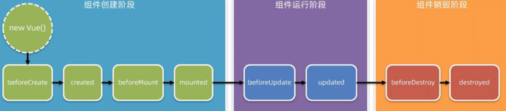
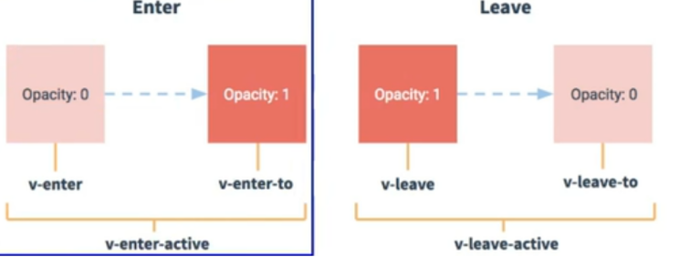

---
title: Vue学习笔记(二)--生命周期、组件化开发
date: 2021-1-13
tags:
 - Vue
categories:
 -  笔记
---   
## Vue学习笔记(二)--生命周期、组件化开发  
###  生命周期  
+  生命周期(Life Cycle）是指一个组件从创建→挂载→运行→销毁的整个阶段，强调的是一个时间段。  
+  注意:生命周期强调的是时间段，生命周期函数强调的是时间点。  
       
1. 组件创建阶段  
    + `beforeCreate`: 组件的props/data/methods尚未被创建，都处于<font color='red'>**不可用状态**</font>  
    + `created`: 组件的porps/data/methods已创建好，都处于<font color='red'>**可用的状态**</font> 。但是组件的<font color='red'>**模板结构尚未生成**</font>   这个阶段用来发起Ajax请求，获取数据  
    + 基于数据和模板,在内存中编译生成HTML结构（虚拟DOM）  
    + `beforeMount`: 呈现的是未经Vue编译的DOM结构，所有对DOM的操作不奏效  
    + 将内存中的虚拟DOM转为真实DOM插入页面  
    + `mounted`: 页面中呈现的是经过Vue编译的DOM，对DOM的操作均有效(尽可能避免)，至此初始化过程结束，一般在此进行:开启定时器、发送网络请求、订阅消息、绑定自定义事件、等初始化操作。  
2. 组件运行阶段（当数据改变时）  
    + `beforeUpdate`：此时:<font color='red'>**数据是新的，但页面是旧的**</font>，即:页面尚未和数据保持同步。  
    + 根据新数据，生成新的虚拟DOM，新旧虚拟DOM进行比较，最终完成页面更新，即:完成了Model View的更新  
    + `updated`：此时:<font color='red'>**数据是新的，页面也是新的**</font>，即:页面和数据保持同步。（新DOM）  
3. 组件销毁阶段  
    + `beforeDestroy`： vm中所有的: data、methods、指令等等，都处于可用状态，但是<font color='red'>**所有对数据的更新都不会生效，不会进入update**</font>，马上要执行销毁过程,一般在此阶段:关闭定时器、取消订阅消息、解绑自定义事件等收尾操作  
    + `destroy`: 组件已经被销毁，此组件在浏览器中对应的DOM结构已被完全移除!  
### Vue-cli（脚手架）的使用  
1. vue项目中src目录的构成:  
    + assets文件夹:存放项目中用到的静态资源文件，例如: css样式表、图片资源  
    + components文件夹:程序员封装的、可复用的组件，都要放到components目录下  
    + main.js 是项目的入口文件。整个项目的运行，要先执行main.js  
    +  App .vue是项目的根组件。  
2. vue项目的运行流程  
    + 在工程化的项目中,vue通过main.js把App.vue渲染到index.html的指定区域中!  
        + App.vue用来编写待渲染的模板结构  
        + index.html中需要预留一个el区域  
        + main.js把 App.vue渲染到了index.html所预留的区域中  
3. 组件和组件工程化  
    + 组件就是用来实现局部(特定)功能效果的代码集合  
    + 组件化开发指的是:根据封装的思想，把页面上可重用的UI结构封装为组件，从而方便项目的开发和维护。  
4. 注意事项  
    ```js  
      const school = Vue.extend(options) 可简写为: const school = options
      //一个重要的内置关系:
      VueComponent.prototype.__proto__=== Vue.prototype  
    ```  
    1. 关于不同版本的Vue:  
        1. vue.js与vue.runtime.xxx.js的区别:  
            + `vue.js`是完整版的Vue，包含:核心功能+模板解析器。  
            + `vue.runtime.xxx,js`是运行版的Vue，只包含:核心功能;没有模板解析器。  
        2. 因为`vue.runtime.xxx.js`没有模板解析器，所以不能使用template配置项，需要使用render函数接收到的createElement函数去指定具体内容。  
    2. 使用`vue inspect > output.js`可以查看到Vue脚手架的默认配置。  
    3. 使用`vue.config.js`可以对脚手架进行个性化定制，详情见: [](https://cli.vuejs.org/zh)  
5. mixin混入  
    1. 功能:可以把多个组件共用的配置提取成一个混入对象  
    2. 使用方式:  
        1. 第一步在mixin.js文件中定义混合，例如:  
          ```js 
            { data(){...},methods:{....} }  
          ```  
        2. 第二步在要使用的组件中引入，例如:  
          ```js  
            全局混入:Vue.mixin(xxx)  
            局部混入: mixins:['xxx']  
          ```  
6. 插件  
    1. 功能:用于增强Vue  
    2. 本质:包含install方法的一个对象，install的第一个参数是Vue，第二个以后的参数是插件使用者传递的数据。  
    3. 定义插件:  
        ```js  
            对象.install(Vue,options){
                Vue.filter(....)  // 1，添加全局过滤器  
                Vue.directive(....)  //2．添加全局指令
                Vue.mixin(....)  //3．配置全局混入(合)
                Vue.prototype.$myMethod = function () {...}   //4 . 添加实例方法
                Vue.prototype.$myProperty = xxXxX  
              }
            Vue.use()  //使用插件  
        ```  
###  组件使用!!!  
1. 私有子组件和全局组件  
    + 通过components注册的是私有子组件  
    + 在vue项目的main.js入口文件中，通过Vue.component()方法，可以注册全局组件  
      ```js  
        //导入需要全局注册的组件
        import Count from '@/components/Count.vue '
        //参数1。字符串格式，表示组件的"注册名称""
        //参数2。需要被全局注册的那个组件
        Vue.component('MyCount',Count)  
      ```  
2. **组件里的props(自定义属性)**  
    ```js  
        props:['name'] // 第一种方式（只接收）
        props:{name:{type:'',required: ,default:  }}  //第三种方式: (限制类型、限制必要性、指定默认值)
        > props是只读的，Vue底层会监测你对props的修改
        >需要修改，可以把 props的值转存到data中  
    ```  
3. 组件中的样式冲突问题  
    1. 导致组件之间样式冲突的根本原因是:单页面应用程序中，多个组件的样式都是<font color='red'>**基于唯一的index.html页面**</font> 呈现的  
    2. style节点的scoped属性：让样式在局部生效,防止冲突。  
    3. /deep/样式穿透  
        + 如果给当前组件的style节点添加了scoped属性，则<font color='red'>**当前组件的样式对其子组件是不生效**</font>的。如果想让某些样式对子组件生效，可以<font color='red'>**使用/deep/深度选择器**</font>。   
        ```js   
            /deep/ .title {
                color: blue; //加上 /deep/时，生成的选择器格式为[data-v-052242de] .title
            }  
        ```  
4. 组件之间的数据共享  
    1. **<font color='red'>父组件向子组件共享数据需要使用自定义属性,注意要绑定要传值的属性</font>**   
        ```js  
            <Left :mSg="message" :user="userinfo"></Left>  
        ```  
    2. **<font color='red'>子组件向父组件共享数据使用自定义事件</font>**  
        + 使用场景:A是父组件，B是子组件，B想给A传数据，那么就要在A中给B绑定自定义事件（事件的回调在A中)  
        1. 利用hack，父组件给子组件穿一个函数形式的props属性，在子组件触发传值  
        2. 在父组件中给子组件绑定一个自定义事件（实际是绑在了子组件的vc实例上），然后子组件在合适的时候利用this.$emit触发此事件，并把参数传给父组件  
        3. 在父组件中给子组件加ref，然后通过ref拿到子组件实例，并且可以再mounted时用$on给其注册自定义事件，并且穿一个回调函数来处理收到的参数,后续步骤同②，这样的好处是注册自定义事件的时候可以异步操作  
        4. **<font color='red'>注意: 回调要么配置在methods中，要么用箭头函数，直接写回调this指向父组件!</font>**   
        5. 触发自定义事件:   
            ```js  
                this.$emit('atguigu',数据)  
            ```    
        6. 解绑自定义事件:  
            ```js  
                 this.$off('atguigu') //解绑一个自定义事件
                 this.$off([''，''])//利用数组解绑多个自定义事件
                 this.$off()//解绑所有自定义事件  
            ```  
        7. 销毁组件实例  
            ```js  
                this.$destroy() //销毁当前组件实例，原生事件可以触发（但不会有响应式），自定义事件全都会失效  
            ```  
        8. 组件上可以绑定原生事件，需要native修饰符。`@click.native=''`，不然认作自定义事件  
    3. **<font color='red'>在vue2.x中，兄弟组件之间数据共享的方案是EventBus(事件总线)。</font>**  
        ```js  
            //1.安装全局事件总线，$bus就是当前应用的vm
            new vue({
              ...
              beforeCreate(){
              Vue.prototype.$bus = this 
              },
              ...  
              })  
            //2.接收数据:A组件想接收数据，则在A组件中给$bus绑定自定义事件，事件的回调留在A组件自身。
            methods(){
              demo(data){......}
              }
            mounted() {
              this.$bus.$on('xxxx',this.demo)
            }  
            //3.提供数据:
            this.$bus.$emit('xxxx',数据)  
            //4.最好在beforeDestroy钩子中，用$off去解绑当前组件所用到的事件  
        ```  
    4. **<font color='red'>消息订阅与发布(pubsub)</font>**  
        ```js  
            npm i pubsub-js  //安装pubsub
            import pubsub from 'pubsub-js'  
            //接收数据:A组件想接收数据，则在A组件中订阅消息，订阅的回调留在A组件自身。
            methods(){  
              demo(data){......}  
            }  
            mounted() {
              this.pid = pubsub.subscribe('xxx',this.demo)   ////订阅消息
            }  
            pubsub.publish('xxx',数据)  //提供数据:
            PubSub.unsubscribe(pid)   //最好在beforeDestroy钩子中，去取消订阅。  
        ```  
5. $refs引用  
    1. 被用来给元素或子组件注册引用信息(id的替代者)  
    2. 应用在htm1标签上获取的是真实DOM元素，应用在组件标签上是组件实例对象(vc)  
    3. 使用方式:  
        ```js  
          <h1 ref="xxx">.....</h1>或<School ref="xxx"></School>  //打标识  
          this.$refs.xxx   //获取  
        ```  
6. `inputVisible`：控制输入框和按钮的按需切换; 默认值为 false，表示默认展示按钮，隐藏输入框  
7. `this.$nextTick(cb)`方法  
    + 当某些代码需要延迟到dom更新完毕之后才执行时，可以使用组件的`$nextTick(cb)`方法，会把cb回调推迟到下一个DOM更新周期之后执行  
8. 动态组件  
    + 动态组件指的是<font color='red'>**动态切换组件的显示与隐藏**</font>  
    + vue提供了一个内置的`<component>`组件，<font color='red'>**专门用来实现动态组件的渲染**</font>  
        ```html  
            //2．通过is 属性，动态指定要渲染的组件
            <component :is="comName"></component>  
        ```  
    + 动态组件切换时默认会<font color='red'>**销毁原组件**</font>重新创建新组件  
    + 可以使用vue内置的`<keep-alive>`组件<font color='red'>**让不展示的路由组件保持挂载，不被销毁**</font>  
        ```html  
            <keep-alive>
                <component :is="comName"></component>
            </keep-alive>  
        ```  
    + **keep-alive对应的生命周期函数**  
        1. 当组件被<font color='red'>**缓存**</font>时，会自动触发组件的`deactivated`生命周期函数。  
        2. 当组件被<font color='red'>**激活**</font>时，会自动触发组件的`activated`生命周期函数  
    + **keep-alive的include属性**  
        1. `include`属性用来指定:只有名称匹配的组件会被缓存。多个组件之间用逗号分隔:  
        2. `exclude`属性指定：对应组件不会被缓存，两个属性只能用一个  
            ```html  
                <keep-alive include="Left,Right" exclude="">
                    <component ;is="comName"></component>
                </keep-alive>  
            ```  
    + 组件名称默认使用注册名，可以提供一个name属性给组件来使用  
        1. 注册名称是在使用标签时使用  
        2. name名称在调试工具和添加属性时使用  
###  插槽  
1. 插槽的基本使用  
    + 插槽（Slot) 让父组件可以向子组件指定位置插入html结构，也是一种组件间通信的方式，适用于父组件===>子组件  
    + 每一个slot插槽，都要有一个name名称,如果省略则默认名称叫做`default`  
    + 要渲染到对应插槽内，要用`v-slot:name`，并用template包裹(无意义标签)  
    + `v-slot：`的简写形式是`#`  
        ```html  
            <template v-slot:default>
              <p>这是在Left组件的内容区域，声明的p标签</p>
            </template>  
        ```  
2. 作用域插槽  
    + 在封装组件的过程中，可以为预留的`<slot>`插槽绑定`props`数据，这种带有`props`数据的`<slot>`叫做“作用域插槽”。  
        ```html  
            <!--下面的slot是一个作用域插槽-->
          <slot v-for="item in list" :user="item"></slot>  
        ```  
    + 作用域插槽对外提供的数据对象，可以使用解构赋值简化数据的接收过程  
        ```html  
            <template #default="{user}">
                <tr>
                <td>{{user.id}}</td>  
            </template>    
        ```  
###  路由  
1. 基本概念   
    + 前端路由指的是Hash地址与组件之间的对应关系。  
    + 用户点击了页面上的路由链接,导致了URL地址栏中的Hash值发生了变化  
    + 前端路由监听了到Hash地址的变化,把当前Hash地址对应的组件渲染都浏览器中  
    + 只要当前的 App 组件一被创建，就立即监听window对象的`onhashchange`事件  
2. 使用步骤  
    1. 在项目中安装`vue-router`  
      ```js    
        npm i vue-router@3.5.2 -S  
      ```  
    2. 在src源代码目录下，新建`router/index.js`路由模块，初始化代码  
    3. 在`src/main.js`入口文件中，导入并挂载路由模块  
      ```js  
        import Vue from 'vue'
        //导入路由模块
        import App from './App.vue'   
        import router from "@/router"
        new vue({
          render: h => h(App),
           router: router    //挂载路由模块
          }).$mount('#app')  
      ```  
    4. 在`src/App.vue`组件中，使用`vue-router`提供的`<router-link>`和`<router-view>`声明路由链接和占位符  
3. 实现切换(`active-class`可配置高亮样式)  
    ```html  
        <router-link active-class="active" to="/about">About</router-link>  
    ```  
4. 注意点  
    1. 路由组件通常存放在pages文件夹，一般组件通常存放在components文件夹。  
    2. 通过切换，“隐藏"了的路由组件，默认是被销毁掉的，需要的时候再去挂载。  
    3. 每个组件都有自己的 $route属性，里面存储着自己的路由信息。  
    4. 整个应用只有一个router，可以通过组件的$router属性获取到。  
5. 路由重定向和默认子路由  
    1. 在`src/router/index.js`路由模块中，通过`routes`数组声明路由的匹配规则  
    2. 路由重定向指的是:用户在访问地址A的时候，强制用户跳转到地址C, 通过路由规则的`redirect`属性，指定一个新的路由地址  
        ```js  
            const router = new VueRouter({
            //在routes数组中，声明路由的匹配规则
              routes: [
              //当用户访问/的时候，通过 redirect属性跳转到/home对应的路由规则
              { path: '/' ,redirect: '/home' }，
              { path: '/home' , component: Home },
              { path: '/movie', component: Movie },
              { path: 'labout ' , component: About }]
            })  
        ```  
    3. 通过`children`属性声明子路由规则 (<font color='red'>**子路由规则最好不要/开头**</font>)   
        ```js  
            routes:[
            { // about页面的路由规则（父级路由规则>
              path: '/about',
              component: About,
              children: [ // 1．通过children属性，嵌套声明子级路由规则
              { path: 'tab1' ，component: Tab1 }，//2．访问/about/tab1时，展示Tab1组件
              { path: 'tab2',component: Tab2 }// 2．访问/about/tab2时，展示 Tab2组件
              ]}]  
        ```  
    4. 默认子路由:如果`children`数组中，某个路由规则的`path`值为空字符串，则这条路由规则，叫做“<font color='red'>**默认子路由**</font>”  
    5. 跳转(要写完整路径):   
        ```html  
            <router-link to="/home/news">News</router-link>  
        ```  
6. 路由的query参数  
      ```js  
          //跳转并携带query参数,to的字符串写法
            <router-link :to='/home/message/detail?id=666&title=你好'>跳转</router-link>
            //<!--跳转并携带query参数,to的对象写法
            <router-link
               :to="{
                   path : "/home/message/detail",
                   query : {
                    id:666,
                    title :'你好'
                    }
                  }"
                >跳转</router-link>  
          //接收参数  
            $route.query.id   
            $route.query.title  
      ```  
7. 命名路由（简化长路径路由跳转）  
      ```html  
          <!--简化前，需要写完整的路径-->
          <router-link to="/demo/test/welcome">跳转</router-link>
          <!--简化后，直接通过名字跳转-->
          <router-link :to="{name : 'hello'}">跳转</router-link>  
      ```  
8. 路由的params参数    
    1. 配置路由，声明接收params参数
      ```js  
          name: 'xiangqing',
          path: 'detail/:id/:title',//使用占位符声明接收params参数
          component:Detail  
      ```  
    2. 传递参数  
      ```html  
        <!--跳转并携带params参数，to的字符串写法-->
        <router-link :to="/home/message/detail/666/你好">跳转</router-link>  
        <!--跳转并携带params参数，to的对象写法-->
        <router-link
          :to="{
            name : 'xiangqing' ,
            params :{
              id:666,
              title : '你好'
            }
          }"></router-link>  
      ```  
      + **<font color='red'>特别注意:路由携带params参数时，若使用to的对象写法，则不能使用path配置项，必须使用name配置!</font>**  
    3. 接收参数  
      ```js  
          $route.params.id
          $route.params.title  
      ```  
9. 路由的props配置  
      ```js  
          //第一种写法: props值为对象，该对象中所有的key-value的组合最终都会通过props传给Detail组件
          // props:{a: 900}
          //第二种写法:props值为布尔值，布尔值为true，则把路由收到的所有params参数通过props传给Detail组件
          // props :true
          //第三种写法: props值为函数，该函数返回的对象中每一组key-value都会通过props传给Detail组件
          props(route){
            return {
              id : route.query.id,
              title:route.query.title}  }
      ```  
10. 编程式导航API  
    1. 点击链接实现导航的方式，叫做声明式导航。  
    2. 调用API方法实现导航的方式，叫做编程式导航。(`location.href`)  
    3. `$router`是路由的导航对象  
        ```js  
            this.$router.push('hash地址'),//跳转到指定hash地址，并增加一条历史记录
            this.$router.replace('hash地址'),//跳转到指定的hash地址，并替换掉当前的历史记录
            this.$router.go(数值n),//实现导航历史前进、后退
            $router.back(),//在历史记录中，后退到上一个页面
            $router.forward(),//在历史记录中，前进到下一个页面  
            //$router的两个API
            this.$router.push({
              name : 'xiangqing' ,
              params:{
                id:xxX,
                title:xXX
              }})  
    4. `<router-link>`的`replace`属性  
        + 在`router-link`标签中加入`replace`属性开启，push是追加历史记录，replace是替换当前记录，默认为push  
11. 路由守卫  
    1. 全局守卫：在初始化和路由切换前后调用  
        ```js 
          //全局前置守卫:初始化时执行、每次路由切换前执行
          router.beforeEach((to,from,next)=>{
            console.log('beforeEach' ,to,from)
            if(to.meta.isAuth){//判断当前路由是否需要进行权限控制
              if(localStorage.getItem('school') == 'atguigu'){ //权限控制的具体规则
                  next()//放行
                }else{
                  alert('暂无权限查看')
                  //next({name:'guanyu'})
                }
             }else{
                next()//放行
            }
          })
          //全局后置守卫:初始化时执行、每次路由切换后执行
          router.afterEach((to,from)=>{
            console.log('afterEach',to,from)
            if(to.meta.title){
              document.title = to.meta.title //修改网页的title}
              else{
              document.title = "vue_test"
             }}})  
        ```  
    2. 独享路由守卫：写在某一个路由里面的独享配置项  
        ```js  
            beforeEnter(to,from, next){
              console.log('beforeEnter',to,from)
              if(to.meta.isAuth){//判断当前路由是否需要进行权限控制
                if(localStorage.getItem('school') === 'atguigu '){
                  next()
                }else{
                  alert('暂无权限查看:')
                  // next({name : ' guanyu'})
                }
              }else{
                next()
              }}  
        ```  
    3. 组件内守卫  
        ```js  
            //进入守卫:通过路由规则，进入该组件时被调用
            beforeRouteEnter (to，from，next) {},
            //离开守卫:通过路由规则，离开该组件时被调用
            beforeRoutelLeave (to，from,next) {}  
        ```    
    4. 页面权限优化  
        ```js  
        const pathArr =['/home'，'/home/users'，'/home/rights']
          if (pathArr.indexOf(to.path)!=-1) {
            const token = localstorage.getItem('token')}  
        ```  
    5. 路由器的两种工作模式  
        1. 对于一个url来说，什么是hash值?——#及其后面的内容就是hash值。  
        2. hash值不会包含在HTTP请求中，即: hash值不会带给服务器。  
        3. hash模式:  
            + 地址中永远带着#号，不美观。  
            + 若以后地址通过第三方手机app分享，若app校验严格，地址会被标记为不合法。  
            + 兼容性较好。  
        4. history模式:  
            + 地址干净，美观。  
            + 兼容性和hash模式相比略差。  
            + 应用部署上线时需要后端人员支持，解决刷新页面服务端404的问题。  
### Vue封装的过度与动画  
1. 作用:在插入、更新或移除DOM元素时|在合适的时候给元素添加样式类名,  
      
2. 使用`<transition>`包裹要过度的元素，并配置name属性:  
    ```html  
        <transition name="hello">
          <h1 v-show="isShow">你好啊!</h1>
        </transition>  
    ```  
3. 备注:若有多个元素需要过度，则需要使用:`<transition-group>`，且每个元素都要指定key值    
### VueX  
1. 搭建vuex环境  
    ```js  
      npm i vuex   //安装vuex
      
      //1—创建文件：src/store/index.js  
      
      //引入vue核心库
      import Vue from 'vue'
      //引入Vuex
      import Vuex from 'vuex'
      //应用Vuex插件
      Vue.use(Vuex)  

      //创建actions，mutations，state，getters并将其暴露，或者模块化暴露  
      //创建并暴露store
        export default new Vuex.Store({
          actions,
          mutations,
          state
        })  

      //2.在main.js中引入store并且传入store配置项  
      //3.初始化数据  
      const actions = {
        //响应组件中加的动作
        jia(context,value){
          // console. log('actions中的jia被调用了',miniStore,value)
          context.commit('JIA',value)
        },
        const mutations = {
        //执行加
        JIA(state,value){
          // console.log("mutations中的JIA被调用了",state,value)
          state.sum += value
        }}
        //初始化数据
        const state = {
          sum:0 
        }  }

        //组件中读取vuex中的数据 
        $store.state.sum   
        //组件中修改vuex中的数据: 
        $store.dispatch('action中的方法名',数据) 或
        $store.commit('mutations中的方法名' ,数据)    

        备注:若没有网络请求或其他业务逻辑，组件中也可以越过actions，即不写dispatch，直接编写commit  
    ```  
2. getters的使用（类似计算属性）  
    + 概念:当state中的数据需要经过加工后再使用时，可以使用getters加工。  
        ```js  
          const getters = {
            bigSum(state){
              return state.sum*10
           }}  
           //组件中读取数据:
           $store.getters.bigSum  
        ```  
3. 使用map方法之前记得引入  
    1. `mapState`方法:用于帮助找们映射`state`中的数据为计算属性  
        ```js
          computed: {
          //借助mapState生成计算属性: sum、school、 subject(对象写法)
            ...mapState({sum : 'sum' ,school : 'school' ,subjec: 'subject'})，
          //借助mapState生成计算属性: sum、school、subject（数组写法)
            ...mapstate([ "sum" , "school" , "subject"，])
          }  
        ```  
    2. `mapGetters`方法:用于帮助我们映射`getters`中的数据为计算属性  
        ```js  
            computed: {
          //借助mapGetters生成计算属性: bigSum（对象写法)
           ...mapGetters({bigSum: 'bigSum'}),
          //借助mapGetters生成计算属性: bigSum(数组写法)
            ...mapGetters(['bigSum'])
            },  
        ```  
    3. `mapActions`方法:用于帮助我们生成与actions对话的方法，即:包含`$store.dispatch(xxx)`的函数  
        ```js  
          methods:{
          //靠mapActions生成: incrementodd、 incrementwait（对象形式)
          ...mapActions({incrementOdd : 'jia0dd " ,incrementwait : "jiawait'})
          //靠mapActions生成: incrementodd、 incrementwait（数组形式)
          ...mapActions(['jia0dd' , "jiawait"])
          }  
        ```  
    4. `mapMutations`方法:用于帮助我们生成与mutations对话的方法，即:包含`$store.commit(xxx)`的函数  
        ```js  
          methods:{
          //靠mapActions生成: increment、decrement（对象形式)
          ...mapMutations({increment : "JIA",decrement: 'IAN'}),
          //靠mapMutations生成:3IA、3IAN（对象形式)
          ...mapMutations( ['IA','JIAN'])，
          }  
        ```  
    5. 模块化+命名空间  
        ```js  
            const countAbout = {
              namespaced:true,//开启命名空间
              state:{x:1},
              mutations: {...}，
              actions: {...}，
              getters: {
                bigSum(state){
                  return state.sum * 10}
              }}
           
           // 3.开启命名空间后，组件中读取state数据:
            //方式一。自己直接读取
            this.$store.state.personAbout.list
            //方式二。借助mapState读取:
            ...mapstate('countAbout' ,["sum",'school','subject'])，
           
           // 4.开启命名空间后，组件中读取getters数据:
            //方式一。自己直接读取
            this.$store.getters['personAbout/firstPersonName']
            //方式二。借助mapGetters读取:
            ...mapGetters('countAbout',['bigSum'])
            
            //5.开启命名空间后，组件中调用dispatch
            //方式一。自己直接dispatch
            this.$store.dispatch("personAbout/addPersonwang",person)
            //方式二:借助mapActions:
            ...mapActions('countAbout',{incrementOdd:'jiaOdd',incrementwait:'jiawait'})  

            //6.开启命名空间后，组件中调用commit
            //方式一。自己直接commit
            this.$store.commit("personAbout/ADD_PERSON",person)
            //方式二。借助mapMutations:
            ...mapMutations('countAbout',{increment:'3IA',decrement:'IAN'}),  

            备注: mapActions与mapMutations使用时，若需要传递参数需要:在模板中绑定事件时传递好参数，否则参数是事件对象。  
        ```


                
            
             
            


          

