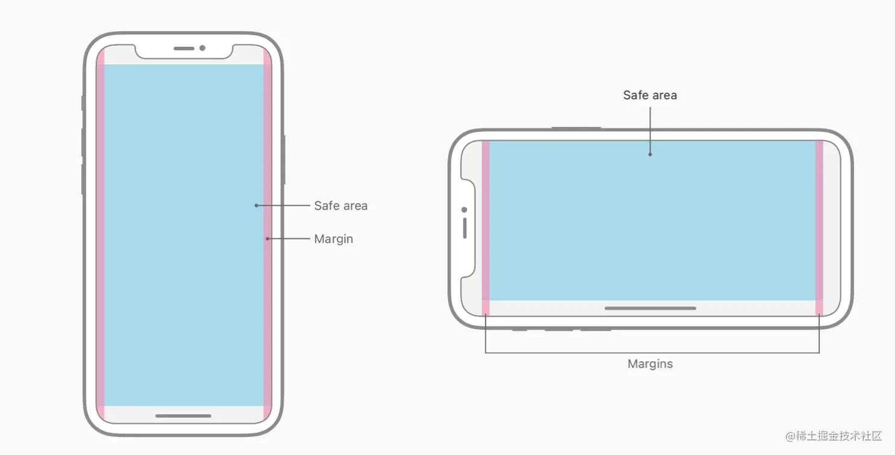

---
title: 企业级多端响应式适配方案
date: 2024-3-19
tags:
 - 进阶
categories:
 -  前端进阶
--- 

## 企业级多端响应式适配方案

1. JS监听屏幕尺寸变化
    ```js
        // 监听屏幕尺寸发生变化
        window.addEventListener('resize', (event) => {
          console.log(`当前屏幕宽度：${document.documentElement.clientWidth}`);
        })
    ```
2. CSS媒体查询监听屏幕尺寸变化
    ```css
        /* 构建响应式布局 遵循移动端优先方案(width < 640px) */ 
        /* 默认展示红色*/ 
        div {
          background-color: red;
        }

        /* 大于 640px 为 绿色 */
        @media screen and (min-width: 640px) {
          div {
            background-color: green;
          }
        }

        /* 大于 768px 为蓝色 */
        @media screen and (min-width: 768px) {
          div {
            background-color: blue;
          }
        }
    ```
3. rem移动端适配方案
    ```js
      const MAX_FONT_SIZE = 42;
      // 监听 html 文档被解析完成的事件
      document.addEventListener('DOMContentLoaded', () => {
        const html = document.querySelector('html');
        // 获取根元素 fontSize 标准，屏幕宽度 / 10
        let fontSize = window.innerWidth / 10;
        fontSize = fontSize > MAX_FONT_SIZE ? MAX_FONT_SIZE : fontSize;
        html.style.fontSize = fontSize + 'px';
      });
    ```
4. viewport移动端(vw)适配方案
   ```js
      // 视口为设备宽度，不允许缩放 
      <meta name="viewport" content="width=device-width, initial-scale=1.0, maximum-scale=1.0, user-scalable=no">
   ```
5. 企业异形屏适配方案
    **安全区域**

      > 安全区域指的是一个可视窗口范围，处于安全区域的内容不受圆角、齐刘海、小黑条的影响
    
    如下图所示，蓝色部分就是安全区域
    
    所以我们进行布局时，应该仅在安全区中进行布局，我们需要借助
    + `viewport属性`，我们需要为viewport增加viewport-fit属性（IOS11新增）
        - contain:可视窗口完全包含网页内容
        - cover:网页内容完全覆盖可视窗口
        - auto:默认值，和contain表现一致
    + 四个距离变量，IOS11新增了4个变量，表示安全区域与边界的距离
        - safe-area-inset-left:安全区域距离左边边界距离
        - safe-area-inset-right:安全区域距离右边边界距离
        - safe-area-inset-top:安全区域距离顶部边界距离
        - safe-area-inset-bottom:安全区域距离底部边界距离
    + 两个CSS函数： 这两个函数可以配合四个变量使用，来指定边距
        - constant: `constant(safe-area-inset-bottom)` IOS < 11.2
        - env: `env(safe-area-inset-bottom)` IOS >= 11.2
    + 示例
        ```css
          .safe-area-bottom {
            position: fixed;
            bottom: constant(safe-area-inset-bottom);
            bottom: env(safe-area-inset-bottom);
            width: 100%;
            height: 46px;
            line-height: 46px;
            text-align: center;
            background-color: aqua;
          }
        ```
        
