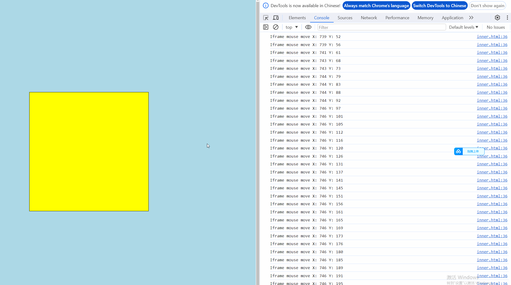

---
title: 解决iframe中的mousemove在parent window中延续的问题
date: 2024-3-21
tags:
 - 进阶
categories:
 -  前端进阶
--- 

## 解决iframe中的mousemove在parent window中延续的问题

业务背景：我们接入了一个iframe,在iframe中通过mousedown-mousemove来触发3D模型的旋转预览，但是，现在有个问题就是，如果鼠标移出了iframe，mousemove事件就会监听不到，所以导致可触发的范围太小，我们希望鼠标在parent window的移动能够把iframe中开始触发的mousemove事件延续下来并且能够传递正常的event坐标

在网上搜寻了很久，发现所有的解决方案都指向了iframe和parent window的通信问题
  ```js
      //在iframe内部页面中
      document.addEventListener('mousedown',function(event){
        window.parent.postMessage({type:"mousedown"},'*')
      })

      //在parent windown中
      window.addEventListener('message',function(event){
        if(event.data.type ==='mousedown'){
          window,addEventListener('mousemove', mouseMoveHandler);
          window.addEventListener('mouseup',mouseUpHandler);
        }
      })
  ```
可是我试想了一下：
  + 我需要在监听到iframe内部的mousedown之后，开启外部的mousemove监测
  + 当外部的mousemove开始工作的时候，我需要把坐标传回到iframe，并且这里要涉及到一些相对坐标的换算
  + 我需要在监听到iframe内部的mouseup之后，remove所有事件
  + 在监听到外部的mouseup之后要把信息传回到iframe，同时remove所有事件、
这样很麻烦(懒是天性)....

于是我写了一个demo，并且发现了一个诡异的现象

+ parent window
  ```html
      <!DOCTYPE html>
      <html lang="en">

      <head>
        <meta charset="UTF-8">
        <meta name="viewport" content="width=device-width, initial-scale=1.0">
        <title>Mouse Event Demo</title>
        <style>
          #outer-window {
            width: 100vw;
            height: 100vh;
            background-color: lightblue;
            overflow: hidden;
            position: relative;
          }

          #inner-iframe {
            position: absolute;
            left: 50%;
            top: 50%;
            transform: translate(-50%, -50%);
            width: 500px;
            height: 500px;
            background-color: yellow;
            border: 1px solid #000;
          }
        </style>
      </head>

      <body>
        <div id="outer-window">
          <iframe id="inner-iframe" src="./inner.html"></iframe>
        </div>

      </body>

      </html>
  ```

+ iframe window
  ```html
    <!DOCTYPE html>
    <html lang="en">

    <head>
      <meta charset="UTF-8">
      <meta name="viewport" content="width=device-width, initial-scale=1.0">
      <title>Inner Iframe</title>
      <style>
        html,
        body,
        .iframeBox {
          width: 100%;
          height: 100%;
          overflow: hidden;
        }
      </style>
    </head>

    <body>
      <canvas class="iframeBox"></canvas>
      <script>
        const parentWindow = window.parent;
        const iframeBox = document.querySelector('.iframeBox')
        iframeBox.addEventListener('mousedown', handleIframeMouseDown)
        // window.addEventListener('mousemove', handleIframeMouseMove) // demo 1
        // window.addEventListener('mouseup', handleIframeMouseUp)


        function handleIframeMouseDown() {
          window.onmousemove = handleIframeMouseMove //demo 2
          window.onmouseup = handleIframeMouseUp
        }

        function handleIframeMouseMove(e) {
          console.log(`Iframe mouse move X: ${e.clientX} Y: ${e.clientY}`);
        }

        function handleIframeMouseUp() {
          window.onmousemove = null
          window.onmouseup = null
        }
      </script>
    </body>

    </html>
  ```
  + demo1中是直接一开始就把mouse事件通过addEventListener绑定到window上，我们可以看见GIF中，当鼠标移出了iframe的时候，就会停止监听
  
  + demo2是当mousedown触发之后通过onmousemove挂载到window上，居然可以直接监听到移出iframe的鼠标事件！
  

  这是为什么？有没有大神解释一下
